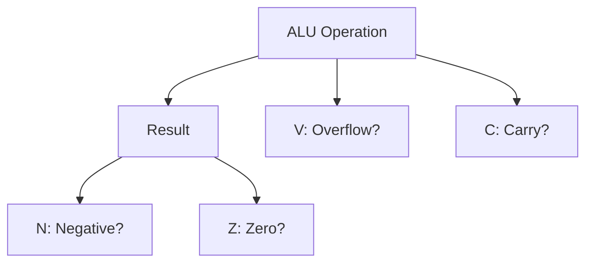

# Day 08: 算術演算とステータスフラグ

---

🌐 Available languages:
[English](./README.md) | [日本語](./README_ja.md)

## 📜 概要

今日はいよいよ CPU の計算能力の中核である**算術論理演算ユニット(ALU)**を構築します。また、フラグ・レジスタとしても知られる**プロセッサステータス(P)レジスタ**も実装します。

これにより、CPU は加算(`ADC`)と減算(`SBC`)を実行できるようになり、その結果がステータスフラグ（N、V、Z、C）にどのように影響するかを確認できます。これは、複雑な論理判断を行うための大きな一歩です。

## 🧠 メモリ構成の注意

Day 04〜10 はプログラム命令を `rom.sv` から供給します（簡易ROM）。RAM はデータ用で、プログラムを RAM に置く構成は Day 11 以降です。

## 🎯 学習目標

- **ALU の実装**: 8 ビットの加減算を行う組み合わせ回路を作成する。
- **ステータスレジスタ(P)の実装**: N, V, Z, C フラグを保持するロジックを追加。
- **`ADC` / `SBC` 命令の実装**: キャリーを考慮した演算の仕組みを学ぶ。
- **フラグ更新のロジック**: 演算結果からフラグ（Negative, Overflow, Zero, Carry）を計算する。

## 🏗️ ステータスフラグ



6502 のフラグは多くの命令によって自動的に更新されます。今回は、主要な 4 つの算術フラグに焦点を当てます。

- **N (Negative)**: 結果のビット 7 が 1（負数）の場合に 1。
- **V (Overflow)**: 符号付き演算の結果が ±127 を超えた（オーバーフロー）場合に 1。
- **Z (Zero)**: 結果が 0 の場合に 1。
- **C (Carry)**: 加算で桁あふれ、または減算でボローが*発生しなかった*場合に 1。

## 🏗️ 実装する命令

| オペコード | ニーモニック | 説明                                  | サイクル数 |
| :--------: | ------------ | ------------------------------------- | :--------: |
|   `0x69`   | `ADC #imm`   | A + operand + Carry を A に格納       |     2      |
|   `0xE9`   | `SBC #imm`   | A - operand - (1 - Carry) を A に格納 |     2      |
|   `0x18`   | `CLC`        | キャリーフラグ (C) をクリア (0)       |     2      |
|   `0x38`   | `SEC`        | キャリーフラグ (C) をセット (1)       |     2      |

## 🛠️ 実装ステップ

1. **フラグの宣言**:
    - `cpu.sv` に `logic N, V, Z, C;` を追加。
2. **ALU (組み合わせ回路) の作成**:
    - `always_comb` で演算ロジックを記述します。
    - `ADC`: `{C_out, result} = A + operand + C;`
    - `SBC`: 実際には `A + (~operand) + C` と等価です。
3. **フラグ更新ロジック**:
    - `Z = (result == 8'h00);`
    - `N = result[7];`
    - `V = (A[7] == operand[7]) && (A[7] != result[7]);` (ADC 時)
4. **LCD 表示の更新**:
    - 現在の A レジスタの値だけでなく、フラグの状態 (NVZC) を LCD に表示するようにします。

## 💡 6502 の減算とキャリー

6502 の `SBC` は、減算前に `SEC` (Set Carry) を呼ぶのが一般的です。これは `A - data - (1 - C)` という式に基づいているためで、`C=1` が「ボローなし」を意味します。

## 🧪 動作確認

- **テストプログラム**:

    ```asm
    SEC        ; C = 1
    LDA #$0A   ; A = 10
    SBC #$05   ; A = 5, C = 1 (ボローなし)

    CLC        ; C = 0
    LDA #$FF   ; A = -1
    ADC #$01   ; A = 0, C = 1, Z = 1 (桁あふれ)
    ```

- **実機 (FPGA)**: LCD で演算結果とフラグが正しく変化することを確認します。

## 🎯 次のステップ

Day 09 では、これらのフラグ（Z, C など）を使ってプログラムの実行順序を制御する **分岐命令 (Branch Instructions)** を実装します。
