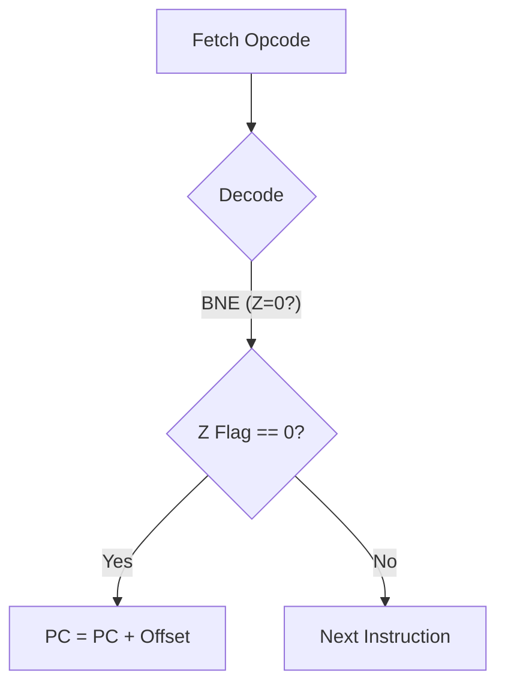

# Day 09: Branch Instructions & Control Flow

---

🌐 Available languages:
[English](./README.md) | [日本語](./README_ja.md)

## 📜 Overview

A CPU that only executes instructions in a straight line isn't very capable. Today, we give our CPU "decision-making" power by implementing **Branch Instructions**.

Instructions like `BNE` (Branch if Not Equal) and `BEQ` (Branch if Equal) check the status flags (specifically the Zero flag) and jump the execution point (Program Counter) if a condition is met. This is the foundation of loops and `if` statements.

## 🧠 Memory Model Note

Day 04–09 use a simple program ROM (`rom.sv`) to supply instructions. RAM is still used for data; the RAM-backed program flow starts in Day 11.

## 🔙 Review: Day 08

Before proceeding, make sure you understand:

- **ALU**: Performs addition (`ADC`) and subtraction (`SBC`)
- **Status Flags**: N (Negative), V (Overflow), Z (Zero), C (Carry)
- **Flag Updates**: How operations automatically set these flags

## 🎯 Learning Objectives

- **Implement Branch Instructions**: Learn conditional execution based on flag states.
- **Relative Addressing**: Implement position-independent code using PC-relative offsets.
- **Signed Offsets**: Achieve jumps from -128 to +127 using 8-bit values.
- **Pass Tests**: Pass the logic verification testbench (`sim/tb_cpu.sv`).

## 🏗️ Instructions to Implement



| Opcode | Mnemonic | Description                  | Condition |
| :----: | -------- | ---------------------------- | --------- |
| `0xD0` | `BNE`    | Branch if Not Equal (Zero=0) | Z = 0     |
| `0xF0` | `BEQ`    | Branch if Equal (Zero=1)     | Z = 1     |
| `0x10` | `BPL`    | Branch if Plus (Negative=0)  | N = 0     |
| `0x30` | `BMI`    | Branch if Minus (Negative=1) | N = 1     |

## 🛠️ Implementation Steps

1. **Relative Address Calculation**:
    - The second byte of a branch instruction is a **signed 8-bit offset**.
    - Target PC formula: `target_pc = (PC + 2) + $signed(offset);` (Wait until the offset byte is fetched).
2. **Condition Check**:
    - Inside your `always_ff` block, check the state of the relevant flag.
    - Example: `if (opcode == OP_BNE && !Z) PC <= target_pc;`
3. **State Machine Extension**:
    - Expand your FSM to handle the offset fetch cycle and then decide the next PC value in the following cycle.

## 💡 Why Relative Addressing?

Branch instructions use relative offsets rather than absolute addresses.

**Analogy:**

- **Absolute Addressing** is like a GPS coordinate: "Go to Latitude 35.6895, Longitude 139.6917."
- **Relative Addressing** is like walking directions: "Go forward 3 steps" or "Go back 5 steps."

This makes the code **position-independent**, meaning it can work correctly no matter where it's loaded in memory without being recompiled.

## 🧪 Verification

Starting from Day 05, **the testbench (`day09/sim/`) is provided in a complete state.** Use it to verify the correctness of your implementation.

- **Test Program**:

    ```asm
    CLC        ; C = 0
    LDA #$01
    ADC #$02   ; A = 3, C = 0, Z = 0
    SEC        ; C = 1
    ADC #$01   ; A = 5, C = 0
    ```

- **Simulation**: Run `make sim` and verify that the results and flags (NVZC) change as expected and the simulation outputs `PASS`.
- **FPGA**: Confirm on the LCD that the calculation results and flags change as expected.

## 🎯 Next Step

In Day 10, we will complete the core CPU features by implementing the **Stack** and **Stack Pointer (S)**, enabling function calls (subroutines).
