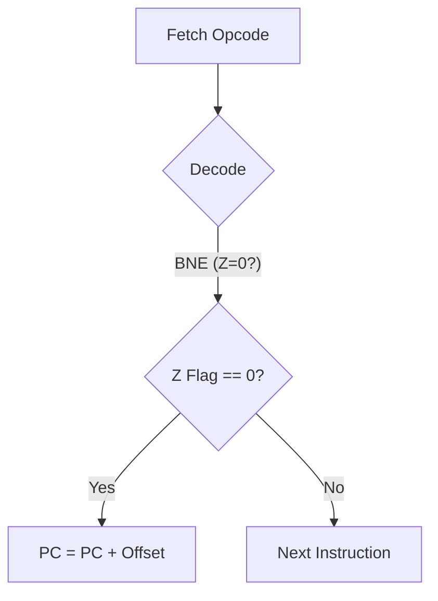

# Day 09: Branch Instructions & Control Flow

---

🌐 Available languages:
[English](./README.md) | [日本語](./README_ja.md)

## Lesson at a glance

Edit this day's starter workspace.

| Item | Details |
| --- | --- |
| Where to edit | Branch-condition and relative-PC-update TODOs in cpu.sv |
| Provided foundation | Binary arithmetic and flags |
| Expected test results | PC and A for taken and not-taken branches |
| What to observe on hardware | ROM BEQ skips LDA #$FF, leaving A=$00/X=$01, then executes NOPs; it does not loop |

## 📜 Overview

A CPU that only executes instructions in a straight line isn't very capable. Today, we give our CPU "decision-making" power by implementing **Branch Instructions**.

Instructions like `BNE` (Branch if Not Equal) and `BEQ` (Branch if Equal) check the status flags (specifically the Zero flag) and jump the execution point (Program Counter) if a condition is met. This is the foundation of loops and `if` statements.

## 🧠 Memory Model Note

Day 04–09 use a simple program ROM (`rom.sv`) to supply instructions. RAM, including Zero Page/Stack/Program RAM, is not used until Day 10.

## 🔙 Review: Day 08

Before proceeding, make sure you understand:

- **ALU**: Performs addition (`ADC`) and subtraction (`SBC`)
- **Status Flags**: N (Negative), V (Overflow), Z (Zero), C (Carry)
- **Flag Updates**: How operations automatically set these flags

## 🎯 Learning Objectives

- **Implement Branch Instructions**: Learn conditional execution based on flag states.
- **Relative Addressing**: Preserve branch distances using PC-relative offsets.
- **Signed Offsets**: Achieve jumps from -128 to +127 using 8-bit values.
- **Pass Tests**: Pass the logic verification testbench (`sim/tb_cpu.sv`).

## 🏗️ Instructions to Implement


```mermaid
graph TD
    Fetch[Fetch Opcode] --> Decode{Decode}
    Decode -- "BNE (Z=0?)" --> CheckZ{"Z Flag == 0?"}
    CheckZ -- Yes --> AddOffset[PC = PC + Offset]
    CheckZ -- No --> Next[Next Instruction]
```

| Opcode | Mnemonic | Description                  | Condition |
| :----: | -------- | ---------------------------- | --------- |
| `0xD0` | `BNE`    | Branch if Not Equal (Zero=0) | Z = 0     |
| `0xF0` | `BEQ`    | Branch if Equal (Zero=1)     | Z = 1     |
| `0x10` | `BPL`    | Branch if Plus (Negative=0)  | N = 0     |
| `0x30` | `BMI`    | Branch if Minus (Negative=1) | N = 1     |

## 🛠️ Implementation Steps

1. **Relative Address Calculation**:
    - The second byte of a branch instruction is a **signed 8-bit offset**.
    - Target PC formula: `target_pc = opcode_pc + 2 + 16'($signed(offset));` Here opcode_pc denotes the opcode address. During operand fetch the actual pc already addresses the operand, so use pc + 1 + the sign-extended offset.
2. **Condition Check**:
    - Inside your `always_ff` block, check the state of the relevant flag.
    - Example: `if (opcode == OP_BNE && !Z) PC <= target_pc;`
3. **State Machine Extension**:
    - Expand your FSM to handle the offset fetch cycle and then decide the next PC value in the following cycle.

## 💡 Why Relative Addressing?

Branch instructions use relative offsets rather than absolute addresses.

**Analogy:**

- **Absolute Addressing** is like a GPS coordinate: "Go to Latitude 35.6895, Longitude 139.6917."
- **Relative Addressing** is like walking directions: "Go forward 3 steps" or "Go back 5 steps."

The relative branch remains valid when both the branch and its target move by the same amount. This alone does not make the entire program position-independent: absolute loads, stores and jumps may still require relocation.

## 🧪 Verification

This Day includes a CPU testbench. If the starter TODOs are not yet implemented, it is expected and normal for the CPU test to fail. After implementing the TODOs, run `make test-cpu` and confirm the tests pass. Passing the tests verifies the tested scope only and does not guarantee untested instructions or real-hardware behavior.

- **Test Program**:

    ```asm
    LDA #$00   ; Z=1
    BEQ +2     ; taken
    LDA #$7F   ; (skipped)
    LDA #$01   ; Z=0
    BNE +2     ; taken
    LDA #$7F   ; (skipped)
    LDA #$80   ; N=1
    BMI +2     ; taken
    LDA #$7F   ; (skipped)
    LDA #$01   ; N=0
    BPL +2     ; taken
    LDA #$7F   ; (skipped)
    LDA #$05   ; Z=0
    BEQ +2     ; NOT taken (fall-through)
    ```

- **Simulation**: Run `make test-cpu` and verify the simulation outputs `PASS` (`make sim` additionally runs the TFT smoke test).
- **FPGA**: Confirm on the LCD that the calculation results and flags change as expected.

## 🎯 Next Step

In Day 10, we will complete the core CPU features by implementing the **Stack** and **Stack Pointer (S)**, enabling function calls (subroutines).

CPU unit tests and the hardware ROM use different inputs. The hardware expectations above are derived from `rom.sv` and the LCD wiring; they do not mean that operation has been verified on every board.

LCD VSync passes through a two-stage synchronizer into the display-write clock domain. Its rising edge starts a frame update. VRAM and font reads remain in the pixel-clock domain.
