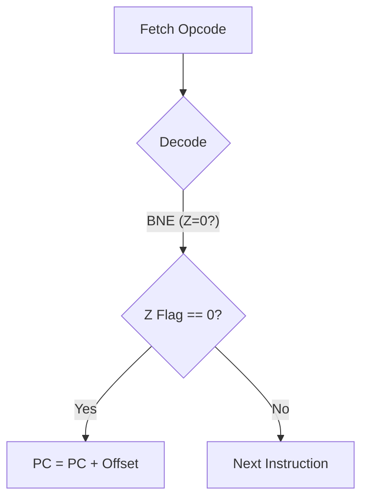

# Day 09: 分岐命令と制御フロー

---

🌐 Available languages:
[English](./README.md) | [日本語](./README_ja.md)

## 📜 概要

CPU が一直線に命令を実行するだけでは、複雑なプログラムは書けません。今日は、**分岐命令**を実装することで、CPU に「意思決定能力」を与えます。

`BNE` (Branch if Not Equal) や `BEQ` (Branch if Equal) などの命令は、ステータスフラグ（特に Z フラグ）をチェックし、条件が満たされた場合に実行の場所（プログラムカウンタ）を飛ばします。これがループや `if` 文の基礎となります。

## 🧠 メモリ構成の注意

Day 04〜09 はプログラム命令を `rom.sv` から供給します（簡易 ROM）。Zero Page/Stack/Program RAM を含む RAM は Day 10 まで使用しません。

## 🔙 復習: Day 08

次に進む前に、以下を理解しているか確認してください:

- **ALU**: 加算 (`ADC`) と減算 (`SBC`) を実行
- **ステータスフラグ**: N (Negative), V (Overflow), Z (Zero), C (Carry)
- **フラグ更新**: 演算結果によって自動的にフラグが設定される仕組み

## 🎯 学習目標

- **分岐命令の実装**: フラグの状態に基づく条件付き実行を学ぶ。
- **相対アドレッシング**: PC 相対オフセットによる位置独立コードの実装。
- **符号付きオフセット**: 8 ビット値で -128 ～ +127 のジャンプを実現する。
- **テストのパス**: ロジック検証用テストベンチ (`sim/tb_cpu.sv`) をパスさせる。

## 🏗️ 実装する命令



| オペコード | ニーモニック | 説明                                      | 条件  |
| :--------: | ------------ | ----------------------------------------- | ----- |
|   `0xD0`   | `BNE`        | 等しくない（Zero フラグ=0）場合に分岐     | Z = 0 |
|   `0xF0`   | `BEQ`        | 等しい（Zero フラグ=1）場合に分岐         | Z = 1 |
|   `0x10`   | `BPL`        | プラス（Negative フラグ=0）の場合に分岐   | N = 0 |
|   `0x30`   | `BMI`        | マイナス（Negative フラグ=1）の場合に分岐 | N = 1 |

## 🛠️ 実装ステップ

1. **相対アドレッシングの計算**:
    - 分岐命令の 2 バイト目は **符号付き 8 ビットオフセット** です。
    - 移動先の計算式: `target_pc = (PC + 2) + $signed(offset);`
2. **条件チェック**:
    - `always_ff` 内で、フラグの状態をチェックします。
3. **ステートマシンの拡張**:
    - 命令フェッチ、オペランドフェッチの後に、条件判定とジャンプを行う処理を実装します。

## 🧪 動作確認

Day 05 以降、**テストベンチ (`day09/sim/`) は完成した状態で提供されています。** 自分で作成したコードの正しさを検証するために活用してください。

- **テストプログラム**:

    ```asm
    LDX #$05

loop:
    DEX
    BNE loop   ; X が 0 になるまで繰り返す (5 回)
    ```

- **シミュレーション**: `make sim` を実行し、分岐が正しく行われてループが 5 回実行され、最終的に `PASS` と表示されることを確認します。
- **実機 (FPGA)**: LCD で PC がジャンプし、ループしている様子を確認します。

## 🎯 次のステップ

Day 10 では、関数呼び出し（サブルーチン）を実現するために **スタック** と **スタックポインタ (S)** を実装し、プロセッサとしての基本機能を完成させます。
