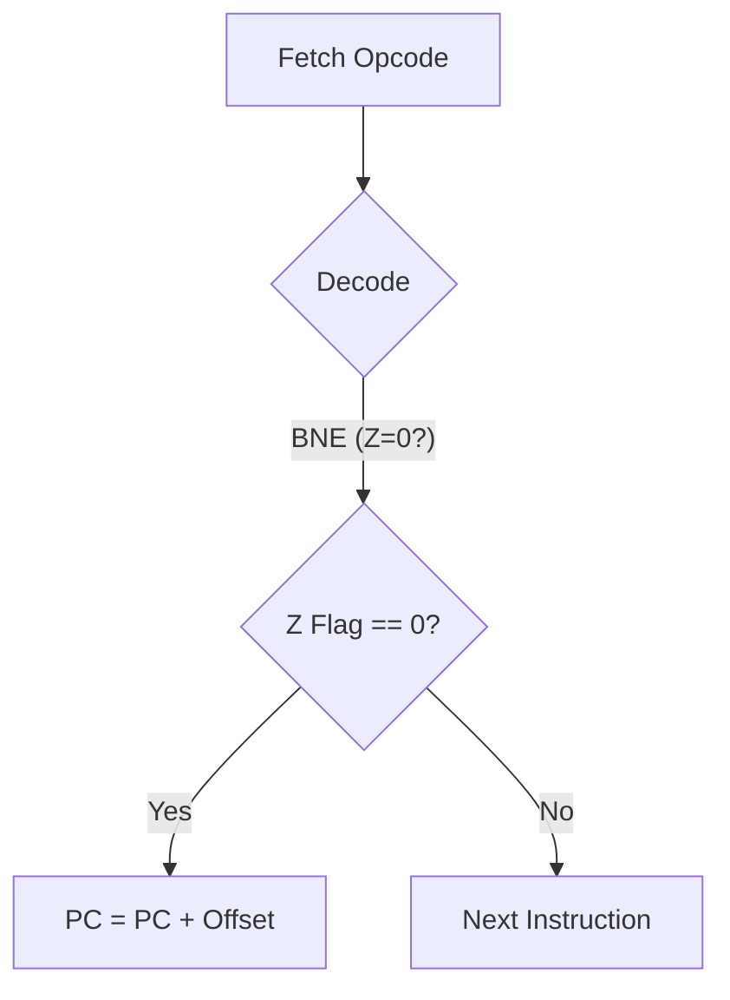

# Day 09: 分岐命令と制御フロー

---

🌐 Available languages:
[English](./README.md) | [日本語](./README_ja.md)

## 実習の見取り図

この Day のスターターを編集します。

| 項目               | 内容                                                             |
| ------------------ | ---------------------------------------------------------------- |
| 編集する箇所       | cpu.sv の分岐条件判定と相対 PC 更新処理の TODO                   |
| 用意されているもの | 二進演算とフラグ                                                 |
| テストの期待値     | CPUテストの分岐成立時と不成立時のPCとA                           |
| 実機で見るもの     | ROMのBEQがLDA #$FFを飛ばしA=$00/X=$01。以降NOP（ループではない） |

## 📜 概要

CPU が一直線に命令を実行するだけでは、複雑なプログラムは書けません。今日は、**分岐命令**を実装することで、CPU に「意思決定能力」を与えます。

`BNE` (Branch if Not Equal) や `BEQ` (Branch if Equal) などの命令は、ステータスフラグ（特に Z フラグ）をチェックし、条件が満たされた場合に実行の場所（プログラムカウンタ）を飛ばします。これがループや `if` 文の基礎となります。

## 🧠 メモリ構成の注意

Day 04〜09 はプログラム命令を `rom.sv` から供給します（簡易 ROM）。Zero Page/Stack/Program RAM を含む RAM は Day 10 まで使用しません。

## 🔙 復習: Day 08

次に進む前に、以下を理解しているか確認してください:

- **ALU**: 加算 (`ADC`) と減算 (`SBC`) を実行
- **ステータスフラグ**: N (Negative), V (Overflow), Z (Zero), C (Carry)
- **フラグ更新**: 演算結果によって自動的にフラグが設定される仕組み

## 🎯 学習目標

- **分岐命令の実装**: フラグの状態に基づく条件付き実行を学ぶ。
- **相対アドレッシング**: PC 相対オフセットによる分岐距離の保持。
- **符号付きオフセット**: 8 ビット値で -128 ～ +127 のジャンプを実現する。
- **テストの合格**: ロジック検証用テストベンチ (`sim/tb_cpu.sv`) を実行し、合格することを確認する。

## 🏗️ 実装する命令


```mermaid
graph TD
    Fetch[Fetch Opcode] --> Decode{Decode}
    Decode -- "BNE (Z=0?)" --> CheckZ{"Z Flag == 0?"}
    CheckZ -- Yes --> AddOffset[PC = PC + Offset]
    CheckZ -- No --> Next[Next Instruction]
```

| オペコード | ニーモニック | 説明                                      | 条件  |
| :--------: | ------------ | ----------------------------------------- | ----- |
| `0xD0`     | `BNE`        | 等しくない（Zero フラグ=0）場合に分岐     | Z = 0 |
| `0xF0`     | `BEQ`        | 等しい（Zero フラグ=1）場合に分岐         | Z = 1 |
| `0x10`     | `BPL`        | プラス（Negative フラグ=0）の場合に分岐   | N = 0 |
| `0x30`     | `BMI`        | マイナス（Negative フラグ=1）の場合に分岐 | N = 1 |

## 🛠️ 実装ステップ

1. **相対アドレッシングの計算**:
    - 分岐命令の 2 バイト目は**符号付き 8 ビットオフセット**です。
    - opcode 番地を `opcode_pc` とすると `target_pc = opcode_pc + 2 + 16'($signed(offset));`。現行 FSM のオペランド処理時には `pc` は既にオペランド番地なので、`pc + 1 + 16'($signed(data_in))` とします。
2. **条件チェック**:
    - `always_ff` 内で、フラグの状態をチェックします。
3. **ステートマシンの拡張**:
    - 命令フェッチ、オペランドフェッチの後に、条件判定とジャンプを行う処理を実装します。

## 💡 なぜ相対アドレッシングなのか？

分岐命令は、絶対アドレスではなく相対オフセットを使います。

**例え話:**

- **絶対アドレッシング (Absolute Addressing)**は GPS 座標のようなものです。「北緯 35.6895、東経 139.6917 へ行け」
- **相対アドレッシング (Relative Addressing)**は道順のようなものです。「3 歩前へ」「5 歩戻れ」

分岐命令と分岐先を同じ距離だけ移動しても、相対分岐の距離は変わりません。ただし、これだけでプログラム全体が位置独立になるわけではありません。絶対アドレスを使うロード・ストア・ジャンプには、移動に伴うアドレス修正が必要な場合があります。

## 🧪 動作確認

この Day には CPU テストベンチが含まれます。スターターの TODO が未実装なら CPU テストは失敗するのが正常です。実装後に `make test-cpu` を実行し、対応するテストが通ることを確認してください。テストの合格によって確認できるのは、テストした範囲だけです。未テストの命令や実機での動作を保証するものではありません。

- **テストプログラム**:

    ```asm
    LDA #$00   ; Z=1
    BEQ +2     ; taken
    LDA #$7F   ; (skipped)
    LDA #$01   ; Z=0
    BNE +2     ; taken
    LDA #$7F   ; (skipped)
    LDA #$80   ; N=1
    BMI +2     ; taken
    LDA #$7F   ; (skipped)
    LDA #$01   ; N=0
    BPL +2     ; taken
    LDA #$7F   ; (skipped)
    LDA #$05   ; Z=0
    BEQ +2     ; NOT taken (fall-through)
    ```

- **シミュレーション**: `make test-cpu` を実行し、最終的に `PASS` と表示されることを確認します (`make sim` は CPU テストに加えて TFT smoke test も実行します)。
- **実機 (FPGA)**: LCD で BEQ が分岐し、A=$00/X=$01 になることを確認します。実機 ROM はループしません。

## 🎯 次のステップ

Day 10 では、関数呼び出し（サブルーチン）を実現するために**スタック**と**スタックポインタ (S)**を実装し、プロセッサとしての基本機能を完成させます。

CPU 単体テストと実機 ROM では、実行するプログラムが異なります。表に示した実機での期待値は `rom.sv` と LCD の配線から判断した値であり、すべてのボードで実機確認を済ませたという意味ではありません。

LCD の VSync は表示書き込み側のクロックに 2 段のフリップフロップで同期させ、その立ち上がりでフレーム更新を開始します。VRAM とフォントの読み出しは、画素クロックの領域内で処理します。
