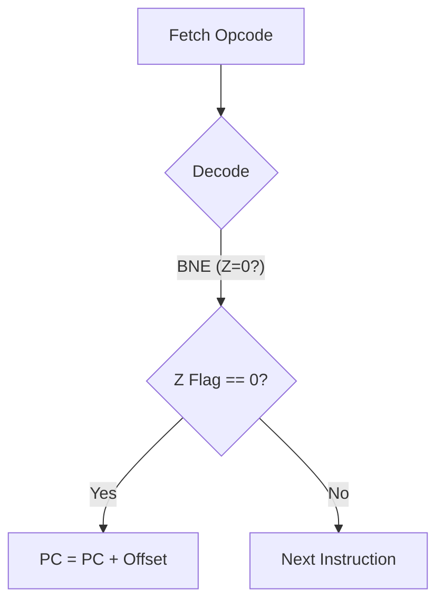

# Day 09: 分岐命令と制御フロー

---

🌐 Available languages:
[English](./README.md) | [日本語](./README_ja.md)

## 📜 概要

CPU が一直線に命令を実行するだけでは、複雑なプログラムは書けません。今日は、**分岐命令**を実装することで、CPU に「意思決定能力」を与えます。

`BNE` (Branch if Not Equal) や `BEQ` (Branch if Equal) などの命令は、ステータスフラグ（特に Z フラグ）をチェックし、条件が満たされた場合に実行の場所（プログラムカウンタ）を飛ばします。これがループや `if` 文の基礎となります。

## 🧠 メモリ構成の注意

Day 04〜09 はプログラム命令を `rom.sv` から供給します（簡易ROM）。Zero Page/Stack/Program RAM を含むRAM は Day 10 まで使用しません。

## 🎯 学習目標

- **制御フローの理解**: ループや条件分岐がハードウェアレベルでどう実現されるか。
- **相対アドレッシングの実装**: 現在の PC から「どれくらい移動するか」を計算する仕組み。
- **条件付き PC 更新**: Z フラグの状態に基づき、ジャンプするか次の命令に進むかを判断する。

## 🏗️ 実装する命令



| オペコード | ニーモニック | 説明                                      | 条件  |
| :--------: | ------------ | ----------------------------------------- | ----- |
|   `0xD0`   | `BNE`        | 等しくない（Zero フラグ=0）場合に分岐     | Z = 0 |
|   `0xF0`   | `BEQ`        | 等しい（Zero フラグ=1）場合に分岐         | Z = 1 |
|   `0x10`   | `BPL`        | プラス（Negative フラグ=0）の場合に分岐   | N = 0 |
|   `0x30`   | `BMI`        | マイナス（Negative フラグ=1）の場合に分岐 | N = 1 |

## 🛠️ 実装ステップ

1. **相対アドレッシングの計算**:
    - 分岐命令の 2 バイト目は **符号付き 8 ビットオフセット** です。
    - 移動先の計算式: `target_pc = (PC + 2) + $signed(offset);`
2. **条件チェック**:
    - `always_ff` 内で、フラグの状態をチェックします。
    - 例: `if (opcode == OP_BNE && !Z) PC <= target_pc;`
3. **ステートマシンの拡張**:
    - 命令フェッチ、オペランドフェッチの後に、条件判定とジャンプを行うステートを追加、あるいは命令フェッチサイクル中にジャンプ先を決定します。

## 💡 相対アドレッシングのポイント

分岐命令は「絶対アドレス」を指定せず、現在地からの「相対距離」を指定します。これにより、プログラムをメモリ上のどこに配置しても（再配置可能）正しく動作するという利点があります。

## 🧪 動作確認

- **テストプログラム**:

    ```asm
    LDA #$00   ; A = 0, Z = 1
    BEQ SKIP   ; Z=1 なのでジャンプするはず
    LDA #$FF   ; これは実行されない
    SKIP:
    INX        ; ここへ飛んでくる
    ```

- **実機 (FPGA)**: LCD 上で PC の値が連続したカウントアップではなく、特定のアドレスをスキップ（ジャンプ）することを確認します。

## 🎯 次のステップ

Day 10 では、関数呼び出し（サブルーチン）を実現するために **スタック** と **スタックポインタ (S)** を実装し、プロセッサとしての基本機能を完成させます。
