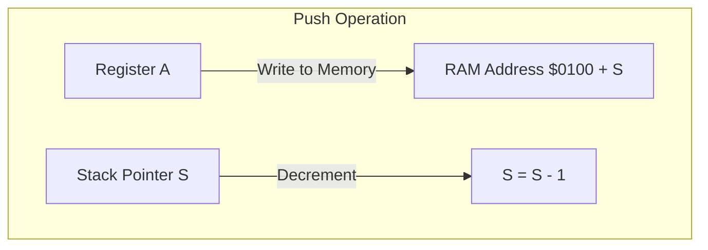

# Day 10: Stack & Subroutines

---

🌐 Available languages:
[English](./README.md) | [日本語](./README_ja.md)

## 📜 Overview

Today, we implement **Subroutines (Functions)**, a fundamental feature for organized programming. To achieve this, we introduce the **Stack**— a temporary storage area in memory— and the **Stack Pointer (S)** register.

The stack allows the CPU to save its "return address" before jumping to a function and to temporarily store register values (preserve state) during execution.

## 🧠 Memory Model Note

From Day 10 onward, the program runs from RAM backed by Gowin BSRAM (`ram.sv`). A small boot copy loads the `rom.sv` program into RAM before execution.

## 🔙 Review: Day 09

Before proceeding, make sure you understand:

- **Branch Instructions**: Conditional jumps based on flag states
- **Relative Addressing**: PC-relative offsets for position-independent code
- **Signed Offsets**: How 8-bit values can represent -128 to +127

## 🎯 Learning Objectives

- **Stack Mechanism**: Understand Last-In, First-Out (LIFO) structures.
- **Stack Pointer (S)**: Implement an 8-bit register to manage Page 1 ($0100-$01FF).
- **Memory Writing**: Implement logic to save data from the CPU to RAM.
- **Basic Subroutine Instructions**: Implement the behavior of `JSR`, `RTS`, `PHA`, and `PLA`.
- **Pass Tests**: Pass the logic verification testbench (`sim/tb_cpu.sv`).

## 🏗️ 6502 Stack Structure



- **Location**: Fixed at addresses `$0100` to `$01FF` (Page 1).
- **Growth**: The stack grows **downwards** (towards lower addresses).
- **Pointer (S)**: Holds the offset within Page 1. It typically starts at `$FF` after reset.
  - **Push**: Write to `$0100 + S`, then decrement `S`.
  - **Pull**: Increment `S`, then read from `$0100 + S`.

## 🏗️ Instructions to Implement

| Opcode | Mnemonic  | Description                        | Cycles |
| :----: | --------- | ---------------------------------- | :----: |
| `0x20` | `JSR abs` | Push PC and Jump to Subroutine     |   6    |
| `0x60` | `RTS`     | Pull PC and Return from Subroutine |   6    |
| `0x08` | `PHP`     | Push Processor Status (P)          |   3    |
| `0x28` | `PLP`     | Pull Processor Status (P)          |   4    |
| `0x48` | `PHA`     | Push Accumulator (A)               |   3    |
| `0x68` | `PLA`     | Pull Accumulator (A)               |   4    |
| `0x4C` | `JMP abs` | Jump to Absolute Address           |   3    |
| `0xFF` | `HLT`     | Halt CPU execution (Custom Ext.)   |   -    |

## 🛠️ Implementation Steps

1. **Add Stack Pointer**:
    - Declare `logic [7:0] S;` in `cpu.sv`. Initialize to `8'hFF`.
2. **RAM Write Enable**:
    - Add a `write_en` signal to the memory bus. Ensure the ROM/RAM decoder allows writing to the `$0000-$01FF` region.
3. **JSR/RTS Multi-cycle Logic**:
    - These instructions require several cycles to complete (e.g., pushing two bytes of return address).
    - Add intermediate states like `STATE_PUSH_PCL` and `STATE_PUSH_PCH` to your FSM.
4. **Update LCD Display**:
    - Display the value of `S` on the LCD. Watch it change during pushes and pulls.

## 🧪 Verification

Starting from Day 05, **the testbench (`day10/sim/`) is provided in a complete state.** Use it to verify the correctness of your implementation.

- **Test Program**:

    ```asm
    LDA #$AA
    PHA        ; Push to stack
    LDA #$00   ; Overwrite A
    PLA        ; Restore from stack (A should be $AA)
    JSR SUB    ; Call subroutine
    HLT        ; Should return here
    SUB:
      INX
      RTS
    ```

- **Simulation**: Run `make sim` and verify that the stack and subroutine instructions behave as expected and the simulation outputs `PASS`.
- **FPGA**: Confirm on the LCD that the Accumulator value is correctly restored and the CPU returns from the subroutine (PC moves to the correct next instruction).

## 🏁 Phase 2 Complete

Congratulations! You have built a CPU core with registers, arithmetic, branching, and subroutines. Starting from Day 11, we enter **Phase 3**, where we explore more advanced addressing modes and memory utilization.
