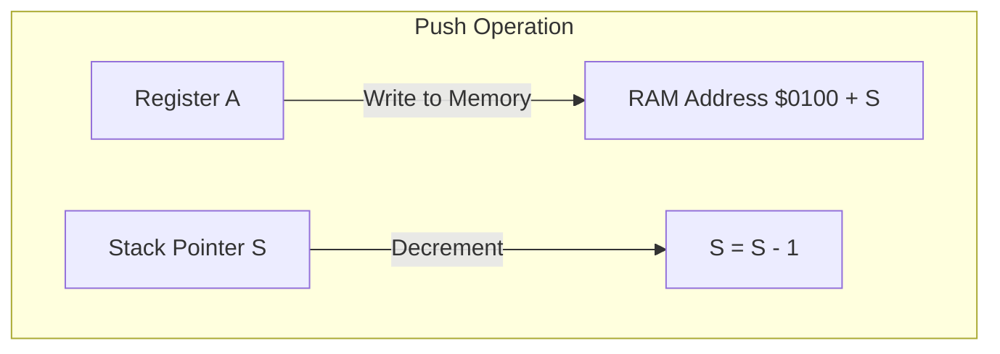

# Day 10: Stack & Subroutines

---

🌐 Available languages:
[English](./README.md) | [日本語](./README_ja.md)

## Lesson at a glance

Edit this day's starter workspace.

| Item | Details |
| --- | --- |
| Where to edit | PHA/PLA TODOs in cpu.sv |
| Provided foundation | Synchronous RAM, boot, JSR/RTS, JMP and HLT |
| Expected test results | PHA/PLA restores A=$42 and SP=$FF |
| What to observe on hardware | ROM restores A=$AA with PHA/PLA, reaches X=$01 after JSR/RTS, and halts at PC=$0209 |

## 📜 Overview

Today, we implement **Subroutines (Functions)**, a fundamental feature for organized programming. To achieve this, we introduce the **Stack**— a temporary storage area in memory— and the **Stack Pointer (S)** register.

The stack allows the CPU to save its "return address" before jumping to a function and to temporarily store register values (preserve state) during execution.

## 🧠 Memory Model Note

From Day 10 onward, the program runs from RAM backed by Gowin BSRAM (`ram.sv`). A small boot copy loads the `rom.sv` program into RAM before execution.
This happens in `day10/boot_loader.sv`: `boot_index` iterates over `0x0200 + boot_index`, `rom_addr` selects ROM during boot, and `ram_we/ram_din` write the ROM bytes into RAM before releasing `cpu_rst_n`.

From Day 10 onward, Zero Page, Stack, and Program RAM are all RAM-backed, so the CPU can read and write across `0x0000-0x7FFF`.

### 6502 System Memory Map (used in this Training)

| Address Range     | Purpose              | Description                                                                                                                                     |
| :---------------- | :------------------- | :---------------------------------------------------------------------------------------------------------------------------------------------- |
| `0x0000 - 0x00FF` | Zero Page            | Fast-access 256-byte memory area                                                                                                                |
| `0x0100 - 0x01FF` | Stack                | Area used by the Stack Pointer (SP)                                                                                                             |
| `0x0200 - 0x7FFF` | Program/Data RAM     | 31.5KiB (0x7E00 bytes; range 0x0200-0x7FFF within the 32KB BSRAM). The boot loader copies the `rom.sv` program to `$0200` before the CPU starts |
| `0x8000 - 0xFFFF` | Demo ROM (read-only) | Selected by address bit 15: CPU reads return `rom.sv` bytes (`$EA` fill outside the program); CPU writes to this range are ignored              |

Note: In Day 10-18, the LCD text VRAM is written only by the debug display logic inside `lcd_demo.sv` and is not mapped into the CPU address space. The Day 99 shadow/text VRAM map (`$7C00`, `$E000`) does not apply to this build.

## 🔙 Review: Day 09

Before proceeding, make sure you understand:

- **Branch Instructions**: Conditional jumps based on flag states
- **Relative Addressing**: PC-relative offsets for position-independent code
- **Signed Offsets**: How 8-bit values can represent -128 to +127

## 🎯 Learning Objectives

- **Stack Mechanism**: Understand Last-In, First-Out (LIFO) structures.
- **Stack Pointer (S)**: Implement an 8-bit register to manage Page 1 ($0100-$01FF).
- **Memory Writing**: Implement logic to save data from the CPU to RAM.
- **Basic Subroutine Instructions**: Implement the behavior of `JSR`, `RTS`, `PHA`, and `PLA`.
- **Pass Tests**: Pass the logic verification testbench (`sim/tb_cpu.sv`).

## 🏗️ 6502 Stack Structure


```mermaid
graph TD
    subgraph Push Operation
        A[Register A] -->|Write to Memory| RAM[RAM Address $0100 + S]
        S[Stack Pointer S] -->|Decrement| S_new[S = S - 1]
    end
```

- **Location**: Fixed at addresses `$0100` to `$01FF` (Page 1).
- **Growth**: The stack grows **downwards** (towards lower addresses).
- **Pointer (S)**: Holds the offset within Page 1. It typically starts at `$FF` after reset.
  - **Push**: Write to `$0100 + S`, then decrement `S`.
  - **Pull**: Increment `S`, then read from `$0100 + S`.

## 🏗️ Instructions to Implement

| Opcode | Mnemonic  | Description                        | Cycles |
| :----: | --------- | ---------------------------------- | :----: |
| `0x20` | `JSR abs` | Push PC and Jump to Subroutine     | 6      |
| `0x60` | `RTS`     | Pull PC and Return from Subroutine | 6      |
| `0x08` | `PHP`     | Push Processor Status (P)          | 3      |
| `0x28` | `PLP`     | Pull Processor Status (P)          | 4      |
| `0x48` | `PHA`     | Push Accumulator (A)               | 3      |
| `0x68` | `PLA`     | Pull Accumulator (A)               | 4      |
| `0x4C` | `JMP abs` | Jump to Absolute Address           | 3      |
| `0xEF` | `HLT`     | Halt CPU execution (Custom Ext.)   | -      |

## 🛠️ Implementation Steps

The starter `cpu.sv` already contains the Day 10 frame: the stack pointer `s` (reset to `8'hFF`), the `write_en` output, the `STATE_PUSH_*` / `STATE_PULL_*` FSM states, and the LCD debug wiring. Your TODOs are limited to the stack operations `PHA` and `PLA`.

1. **Understand the provided step timing**:
    - The CPU advances one FSM step per two memory clocks: a *request* step that issues `address_bus`/`write_en`, followed by a *data* step where `memory_ready` is set so the synchronous BSRAM read data is valid.
    - `pc_enable` requests are latched into `step_pending` and consumed on the next `memory_ready` window, so manual stepping works independently of the settle logic.
2. **Implement PHA (push)**:
    - In `STATE_FETCH_OPCODE`, decode `OP_PHA`: assert `write_en`, drive `address_bus = 16'h0100 + s`, put `a` on `data_out`, and go to `STATE_PUSH_LOW`.
    - In `STATE_PUSH_LOW`, decrement `s`, advance PC, and return to `STATE_FETCH_OPCODE`.
3. **Implement PLA (pull)**:
    - In `STATE_FETCH_OPCODE`, decode `OP_PLA`: drive `address_bus = 16'h0100 + (s + 1)` and go to `STATE_PULL_LOW`.
    - In `STATE_PULL_LOW`, increment `s`, load `data_in` into `a` (update Z/N), advance PC, and return to `STATE_FETCH_OPCODE`.
4. **Observe on the LCD**:
    - The debug display already shows `PC/A/X/Y/S/P`; watch `S` change during pushes and pulls.

## 🧪 Verification

This Day includes a CPU testbench. If the starter TODOs are not yet implemented, it is expected and normal for the CPU test to fail. After implementing the TODOs, run `make test-cpu` and confirm the tests pass. Passing the tests verifies the tested scope only and does not guarantee untested instructions or real-hardware behavior.

- **Test Program**:

    ```asm
    LDA #$42
    PHA        ; Push 0x42 to $01FF, S: 0xFF -> 0xFE
    LDA #$00
    PLA        ; A = 0x42, S: 0xFE -> 0xFF
    HLT
    ```

- **Simulation**: Run `make test-cpu` and verify the simulation outputs `PASS` (`make sim` additionally runs the TFT smoke test).
- **FPGA**: Confirm on the LCD that the Accumulator value is correctly restored and the CPU returns from the subroutine (PC moves to the correct next instruction).

## 🏁 Phase 2 Complete

Congratulations! You have built a CPU core with registers, arithmetic, branching, and subroutines. Starting from Day 11, we enter **Phase 3**, where we explore more advanced addressing modes and memory utilization.

Instruction-table cycles are reference values for the standard 6502, not clock counts for this FSM including memory waits.

CPU unit tests and the hardware ROM use different inputs. The hardware expectations above are derived from `rom.sv` and the LCD wiring; they do not mean that operation has been verified on every board.

See [synchronous RAM timing](../docs/DAY18_TO_DAY99.md#synchronous-ram-read-timing) for request and capture timing. At startup, PLL LOCK is synchronized and must remain stable for 16 clocks before boot begins.

LCD VSync passes through a two-stage synchronizer into the display-write clock domain. Its rising edge starts a frame update. VRAM and font reads remain in the pixel-clock domain.
