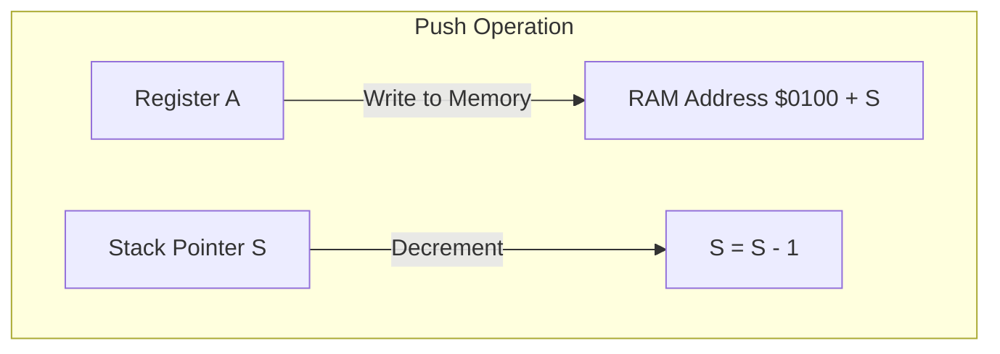

# Day 10: スタックとサブルーチン

---

🌐 Available languages:
[English](./README.md) | [日本語](./README_ja.md)

## 実習の見取り図

この Day のスターターで編集します。

| 項目           | 内容                                               |
| -------------- | -------------------------------------------------- |
| 編集する箇所   | cpu.svのPHA/PLA TODO                               |
| 提供済みの前提 | 同期RAM、boot、JSR/RTS、JMP、HLT                   |
| テストの期待値 | PHA/PLAでA=$42、SP=$FFへ復帰                       |
| 実機で見るもの | ROMはPHA/PLA後A=$AA、JSR/RTS後X=$01、PC=$0209でHLT |

## 📜 概要

今日はプログラミングにおいて不可欠な**サブルーチン（関数）**の仕組みを実装します。これを実現するために、一時的なデータを保存する**スタック**と、その場所を指し示す**スタックポインタ (S) レジスタ**を導入します。

スタックを使うことで、関数を呼び出した後に元の場所へ戻ったり、レジスタの値を一時的に退避させたりすることが可能になります。

## 🧠 メモリ構成の注意

Day 10 以降はプログラムを Gowin BSRAM で実装した RAM (`ram.sv`) から実行します。`rom.sv` の内容は起動時に RAM へコピーされます。
これは `day10/boot_loader.sv` で行っており、`boot_index` で `0x0200 + boot_index` を走査し、ブート中は `rom_addr` で ROM を選択、`ram_we/ram_din` で RAM に書き込み、完了後に `cpu_rst_n` を解除します。

Day 10 以降は Zero Page/Stack/Program RAM がすべて RAM になるため、CPU は `0x0000-0x7FFF` を読み書きできます。

### 6502 システムのメモリマップ（この教材で使用）

| アドレス範囲      | 用途                     | 説明                                                                                                                                |
| :---------------- | :----------------------- | :---------------------------------------------------------------------------------------------------------------------------------- |
| `0x0000 - 0x00FF` | Zero Page                | 高速アクセス用の 256 バイト領域                                                                                                     |
| `0x0100 - 0x01FF` | Stack                    | スタックポインタ (SP) が使う領域                                                                                                    |
| `0x0200 - 0x7FFF` | プログラム/データ RAM    | 31.5KiB（0x7E00 バイト。32KB BSRAM のうち 0x0200-0x7FFF）。起動時に `rom.sv` のプログラムを `$0200` へコピーしてから CPU が開始する |
| `0x8000 - 0xFFFF` | デモ用ROM (読み出し専用) | アドレスbit15で選択。読み出しは `rom.sv` の内容（プログラム外は `$EA`）、CPUからの書き込みは無視される                              |

注: Day 10〜18 の LCD テキスト VRAM は `lcd_demo.sv` 内のデバッグ表示ロジックのみが書き込むもので、CPU のアドレス空間にはマップされない。Day 99 のシャドウ/テキスト VRAM ($7C00, $E000) のマップはこの実装には適用されない。

## 🔙 復習: Day 09

次に進む前に、以下を理解しているか確認してください:

- **分岐命令**: フラグの状態に基づく条件付きジャンプ
- **相対アドレッシング**: PC 相対オフセットによる位置独立コード
- **符号付きオフセット**: 8 ビット値で-128 ～+127 を表現する方法

## 🎯 学習目標

- **スタックの仕組み**: 後入れ先出し (LIFO) 構造の理解。
- **スタックポインタ (S)**: ページ 1 ($0100-$01FF) を管理する 8 ビットレジスタの実装。
- **メモリへの書き込み**: CPU から RAM へデータを保存するロジックの実装。
- **基本サブルーチン命令**: `JSR`, `RTS`, `PHA`, `PLA` の動作。
- **テストのパス**: ロジック検証用テストベンチ (`sim/tb_cpu.sv`) をパスさせる。

## 🏗️ 6502 のスタック構造



- **場所**: メモリのアドレス `$0100` ～ `$01FF`（ページ 1）に固定されています。
- **向き**: スタックは**下方**（アドレスが減る方向）に成長します。
- **スタックポインタ (S)**: ページ内のオフセットを保持します。リセット時は `$FF` が一般的です。
  - **Push**: `$0100 + S` に書き込み、`S` をデクリメント。
  - **Pull**: `S` をインクリメントし、`$0100 + S` から読み出し。

## 🏗️ 実装する命令

| オペコード | ニーモニック | 説明                                             | サイクル数 |
| :--------: | ------------ | ------------------------------------------------ | :--------: |
| `0x20`     | `JSR abs`    | 戻りアドレスをプッシュしてサブルーチンへジャンプ | 6          |
| `0x60`     | `RTS`        | スタックからアドレスを戻して復帰                 | 6          |
| `0x08`     | `PHP`        | ステータスレジスタ (P) をスタックに退避          | 3          |
| `0x28`     | `PLP`        | スタックから P レジスタを復旧                    | 4          |
| `0x48`     | `PHA`        | アキュムレータ (A) をスタックに退避              | 3          |
| `0x68`     | `PLA`        | スタックから A レジスタを復旧                    | 4          |
| `0x4C`     | `JMP abs`    | 指定したアドレスへジャンプ                       | 3          |
| `0xEF`     | `HLT`        | CPU を停止し、その場で留まる（独自拡張）         | -          |

## 🛠️ 実装ステップ

スターター版 `cpu.sv` には Day 10 の枠組み（スタックポインタ `s`（リセット値 `8'hFF`）、`write_en` 出力、`STATE_PUSH_*` / `STATE_PULL_*` の FSM 状態、LCD デバッグ配線）が実装済みです。TODO はスタック命令 `PHA` と `PLA` のみです。

1. **ステップタイミングの理解**:
    - CPU はメモリクロック 2 サイクルで 1 ステップ進みます。*リクエスト*ステップで `address_bus`/`write_en` を発行し、次の*データ取得*ステップで `memory_ready` が立ち、同期 BSRAM の読み出しデータが有効になります。
    - `pc_enable` によるリクエストは `step_pending` にラッチされ、次の `memory_ready` ウィンドウで消費されるため、手動ステップ実行はセトル logic と独立して動作します。
2. **PHA（プッシュ）の実装**:
    - `STATE_FETCH_OPCODE` で `OP_PHA` をデコード: `write_en` をアサートし、`address_bus = 16'h0100 + s` を設定、`data_out` に `a` を出力して `STATE_PUSH_LOW` へ遷移。
    - `STATE_PUSH_LOW` で `s` をデクリメントし、PC を進めて `STATE_FETCH_OPCODE` へ戻る。
3. **PLA（プル）の実装**:
    - `STATE_FETCH_OPCODE` で `OP_PLA` をデコード: `address_bus = 16'h0100 + (s + 1)` を設定して `STATE_PULL_LOW` へ遷移。
    - `STATE_PULL_LOW` で `s` をインクリメントし、`data_in` を `a` にロード（Z/N 更新）、PC を進めて `STATE_FETCH_OPCODE` へ戻る。
4. **LCDでの観察**:
    - デバッグ表示は `PC/A/X/Y/S/P` を表示済みです。プッシュ/プルで `S` が変わることを確認します。

## 🧪 動作確認

この Day には CPU テストベンチが含まれます。スターターの TODO が未実装なら CPU テストは失敗するのが正常です。実装後に `make test-cpu` を実行し、対応するテストが通ることを確認してください。テスト合格はテスト対象範囲の確認であり、未テストの命令や実機動作は保証しません。

- **テストプログラム**:

    ```asm
    LDA #$42
    PHA        ; Push 0x42 to $01FF, S: 0xFF -> 0xFE
    LDA #$00
    PLA        ; A = 0x42, S: 0xFE -> 0xFF
    HLT
    ```

- **シミュレーション**: `make test-cpu` を実行し、最終的に `PASS` と表示されることを確認します (`make sim` は CPU テストに加えて TFT smoke test も実行します)。
- **実機 (FPGA)**: LCD で A レジスタの値が正しく復元され、サブルーチンから戻ってくる（PC が適切に移動する）ことを確認します。

## 🏁 Phase 2 完了

おめでとうございます！これでレジスタ、算術、分岐、サブルーチンを備えた CPU のコアが完成しました。Day 11 からは**Phase 3**に入り、より多様なアドレッシングモードとメモリ活用を学んでいきます。

命令表のサイクル数は標準 6502 の参考値です。この教材の FSM 状態数・メモリ待ちを含むクロック数とは異なります。

CPU 単体テストと実機 ROM は別の入力です。表の実機期待値は `rom.sv` / LCD 配線から読み取った値であり、全ボードでの実機確認済みという意味ではありません。

同期 RAM の要求・取込みタイミングは[同期RAMの説明](../docs/DAY18_TO_DAY99_ja.md#同期ramを読むときの時間)を参照してください。起動時は PLL LOCK を同期し 16 クロック安定してから boot を開始します。

LCD の VSync は表示書込みクロックへ 2 段同期し、立上りでフレーム更新を開始します。VRAM 読出しと font 読出しは画素クロック内で処理します。
