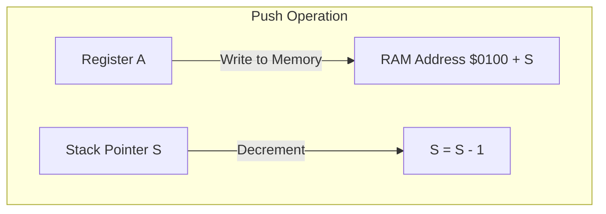

# Day 10: Stack & Subroutines

---

🌐 Available languages:
[English](./README.md) | [日本語](./README_ja.md)

## Lesson at a glance

The reference solution already implements the tasks below.

| Item | Details |
| --- | --- |
| Where to edit | PHA/PLA TODOs in cpu.sv |
| Provided foundation | Synchronous RAM, boot, JSR/RTS, JMP and HLT |
| Expected test results | PHA/PLA restores A=$42 and SP=$FF |
| What to observe on hardware | ROM restores A=$AA with PHA/PLA, reaches X=$01 after JSR/RTS, and halts at PC=$0209 |

## 📜 Overview

Today, we implement **Subroutines (Functions)**, a fundamental feature for organized programming. To achieve this, we introduce the **Stack**— a temporary storage area in memory— and the **Stack Pointer (S)** register.

The stack allows the CPU to save its "return address" before jumping to a function and to temporarily store register values (preserve state) during execution.

## 🧠 Memory Model Note

From Day 10 onward, the program runs from RAM backed by Gowin BSRAM (`ram.sv`). A small boot copy loads the `rom.sv` program into RAM before execution.
This happens in `day10_completed/boot_loader.sv`: `boot_index` iterates over `0x0200 + boot_index`, `rom_addr` selects ROM during boot, and `ram_we/ram_din` write the ROM bytes into RAM before releasing `cpu_rst_n`.

From Day 10 onward, Zero Page, Stack, and Program RAM are all RAM-backed, so the CPU can read and write across `0x0000-0x7FFF`.

### 6502 System Memory Map (used in this Training)

| Address Range     | Purpose              | Description                                                                                                                                     |
| :---------------- | :------------------- | :---------------------------------------------------------------------------------------------------------------------------------------------- |
| `0x0000 - 0x00FF` | Zero Page            | Fast-access 256-byte memory area                                                                                                                |
| `0x0100 - 0x01FF` | Stack                | Area used by the Stack Pointer (SP)                                                                                                             |
| `0x0200 - 0x7FFF` | Program/Data RAM     | 31.5KiB (0x7E00 bytes; range 0x0200-0x7FFF within the 32KB BSRAM). The boot loader copies the `rom.sv` program to `$0200` before the CPU starts |
| `0x8000 - 0xFFFF` | Demo ROM (read-only) | Selected by address bit 15: CPU reads return `rom.sv` bytes (`$EA` fill outside the program); CPU writes to this range are ignored              |

Note: In Day 10-18, the LCD text VRAM is written only by the debug display logic inside `lcd_demo.sv` and is not mapped into the CPU address space. The Day 99 shadow/text VRAM map (`$7C00`, `$E000`) does not apply to this build.

## 🎯 Learning Objectives

- **The Stack Mechanism**: Understand Last-In, First-Out (LIFO) structures.
- **Stack Pointer (S)**: Implement an 8-bit register to manage memory page 1 ($0100-$01FF).
- **RAM Writing**: Implement the first CPU-to-memory write logic.
- **Subroutine Instructions**: Master the behavior of `JSR`, `RTS`, `PHA`, and `PLA`.

## 🏗️ 6502 Stack Structure



- **Location**: Fixed at addresses `$0100` to `$01FF` (Page 1).
- **Growth**: The stack grows **downwards** (towards lower addresses).
- **Pointer (S)**: Holds the offset within Page 1. It typically starts at `$FF` after reset.
  - **Push**: Write to `$0100 + S`, then decrement `S`.
  - **Pull**: Increment `S`, then read from `$0100 + S`.

## 🏗️ Instructions to Implement

| Opcode | Mnemonic  | Description                        | Cycles |
| :----: | --------- | ---------------------------------- | :----: |
| `0x20` | `JSR abs` | Push PC and Jump to Subroutine     | 6      |
| `0x60` | `RTS`     | Pull PC and Return from Subroutine | 6      |
| `0x08` | `PHP`     | Push Processor Status (P)          | 3      |
| `0x28` | `PLP`     | Pull Processor Status (P)          | 4      |
| `0x48` | `PHA`     | Push Accumulator (A)               | 3      |
| `0x68` | `PLA`     | Pull Accumulator (A)               | 4      |
| `0x4C` | `JMP abs` | Jump to Absolute Address           | 3      |
| `0xEF` | `HLT`     | Halt CPU execution (Custom Ext.)   | -      |

## 🛠️ Implementation Steps

The completed `cpu.sv` advances one FSM step per two memory clocks: a *request* step that issues `address_bus`/`write_en`, followed by a *data* step where `memory_ready` is set so the synchronous BSRAM read data is valid. `pc_enable` requests are latched into `step_pending` and consumed on the next `memory_ready` window.

1. **Stack Pointer**:
    - `logic [7:0] s;` is declared in `cpu.sv` and reset to `8'hFF`.
2. **RAM Write Enable**:
    - The CPU pulses `write_en` on the memory bus; `boot_loader.sv` gates writes so only addresses below `$8000` (RAM) are written.
3. **Multi-cycle Subroutine Logic**:
    - `JSR`/`JMP abs` fetch the 2-byte target through `STATE_FETCH_LOW`/`STATE_FETCH_HIGH`.
    - `JSR` pushes the return address via `STATE_PUSH_HIGH`/`STATE_PUSH_LOW`; `RTS` pulls it back via `STATE_PULL_LOW`/`STATE_PULL_HIGH` (`+1` correction on return).
    - `PHA`/`PHP` use `STATE_PUSH_LOW`; `PLA`/`PLP` use `STATE_PULL_LOW`.
4. **LCD Display**:
    - The debug display shows `PC/A/X/Y/S/P`; watch `S` change during pushes and pulls.

## 🧪 Verification

The completed CPU test is `make test-cpu`; run it from this directory. `make sim` separately runs only the LCD/TFT smoke test. Passing these tests covers their assertions only, not every instruction or hardware behavior.

- **Default completed ROM sequence (`rom.sv`)**:

    ```asm
    LDA #$AA
    PHA
    ADC #$01   ; A = $AB while the saved $AA remains on stack
    PLA        ; A = $AA
    JSR SUB
    HLT
    SUB:
      INX
      RTS
    ```

`make test-cpu` runs the shared testbench from `../day10/sim/tb_cpu.sv`, which injects a separate `$42` stack test ending at HLT; it does not execute this ROM sequence.

- **FPGA**: Confirm on the LCD that A is restored correctly and the Program Counter returns to the address after `JSR`.

## 🏁 Phase 2 Complete

Congratulations! You have built a CPU core with registers, arithmetic, branching, and subroutines. Starting from Day 11, we enter **Phase 3**, where we explore more advanced addressing modes and memory utilization.

Instruction-table cycles are reference values for the standard 6502, not clock counts for this FSM including memory waits.

CPU unit tests and the hardware ROM use different inputs. The hardware expectations above are derived from `rom.sv` and the LCD wiring; they do not mean that operation has been verified on every board.

See [synchronous RAM timing](../docs/DAY18_TO_DAY99.md#synchronous-ram-read-timing) for request and capture timing. At startup, PLL LOCK is synchronized and must remain stable for 16 clocks before boot begins.

LCD VSync passes through a two-stage synchronizer into the display-write clock domain. Its rising edge starts a frame update. VRAM and font reads remain in the pixel-clock domain.
