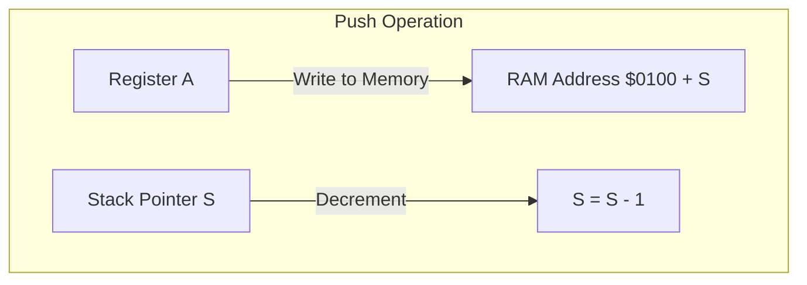

# Day 10: スタックとサブルーチン

---

🌐 Available languages:
[English](./README.md) | [日本語](./README_ja.md)

## 📜 概要

今日はプログラミングにおいて不可欠な **サブルーチン（関数）** の仕組みを実装します。これを実現するために、一時的なデータを保存する **スタック** と、その場所を指し示す **スタックポインタ (S) レジスタ** を導入します。

スタックを使うことで、関数を呼び出した後に元の場所へ戻ったり、レジスタの値を一時的に退避させたりすることが可能になります。

## 🧠 メモリ構成の注意

Day 10 以降はプログラムを Gowin BSRAM で実装した RAM (`ram.sv`) から実行します。`rom.sv` の内容は起動時に RAM へコピーされます。
これは `day10_completed/boot_loader.sv` で行っており、`boot_index` で `0x0200 + boot_index` を走査し、ブート中は `rom_addr` で ROM を選択、`ram_we/ram_din` で RAM に書き込み、完了後に `cpu_rst_n` を解除します。

Day 10 以降は Zero Page/Stack/Program RAM がすべて RAM になるため、CPU は `0x0000-0x7FFF` を読み書きできます。

### 6502 システムのメモリマップ（この教材で使用）

| アドレス範囲 | 用途 | 説明 |
| :--- | :--- | :--- |
| `0x0000 - 0x00FF` | Zero Page | 高速アクセス用の 256 バイト領域 |
| `0x0100 - 0x01FF` | Stack | スタックポインタ (SP) が使う領域 |
| `0x0200 - 0x7BFF` | Program RAM | プログラム/データの主記憶 (30.5KB) |
| `0x7C00 - 0x7FFF` | Shadow VRAM | CPU 読み取り用 VRAM (シャドウ領域), 1KB |
| `0x8000 - 0xDFFF` | (未使用) | 将来拡張のために予約 |
| `0xE000 - 0xE3FF` | Text VRAM | LCD 表示用文字コード (ASCII), 1KB |
| `0xE400 - 0xFFFF` | (未使用) | I/O または拡張用に予約 |

## 🎯 学習目標

- **スタックの仕組み**: 後入れ先出し (LIFO) 構造の理解。
- **スタックポインタ (S)**: ページ 1 ($0100-$01FF) を管理する 8 ビットレジスタの実装。
- **メモリへの書き込み**: CPU から RAM へデータを保存するロジックの実装。
- **基本サブルーチン命令**: `JSR`, `RTS`, `PHA`, `PLA` の動作。

## 🏗️ 6502 のスタック構造



- **場所**: メモリのアドレス `$0100` ～ `$01FF`（ページ 1）に固定されています。
- **向き**: スタックは **下方**（アドレスが減る方向）に成長します。
- **スタックポインタ (S)**: ページ内のオフセットを保持します。リセット時は `$FF` が一般的です。
  - **Push**: `$0100 + S` に書き込み、`S` をデクリメント。
  - **Pull**: `S` をインクリメントし、`$0100 + S` から読み出し。

## 🏗️ 実装する命令

| オペコード | ニーモニック | 説明                                             | サイクル数 |
| :--------: | ------------ | ------------------------------------------------ | :--------: |
|   `0x20`   | `JSR abs`    | 戻りアドレスをプッシュしてサブルーチンへジャンプ |     6      |
|   `0x60`   | `RTS`        | スタックからアドレスを戻して復帰                 |     6      |
|   `0x08`   | `PHP`        | ステータスレジスタ (P) をスタックに退避          |     3      |
|   `0x28`   | `PLP`        | スタックから P レジスタを復旧                    |     4      |
|   `0x48`   | `PHA`        | アキュムレータ (A) をスタックに退避              |     3      |
|   `0x68`   | `PLA`        | スタックから A レジスタを復旧                    |     4      |
|   `0x4C`   | `JMP abs`    | 指定したアドレスへジャンプ                       |     3      |
|   `0xEF`   | `HLT`        | CPU を停止し、その場で留まる（独自拡張）         |     -      |

## 🛠️ 実装ステップ

1. **スタックポインタの定義**:
    - `cpu.sv` に `logic [7:0] S;` を追加。リセット時に `8'hFF`。
2. **RAM 書き込みロジック**:
    - `write_en` 信号を追加し、メモリが書き込み可能な状態（RAM 領域など）を制御します。
3. **JSR / RTS のステート制御**:
    - これらは多くのサイクルを必要とします（戻りアドレス 2 バイトの保存など）。
    - `STATE_PUSH_PCL`, `STATE_PUSH_PCH` などの一時的な状態を追加して実装します。
4. **LCD 表示の更新**:
    - スタックポインタ `S` の値を LCD に表示し、プッシュ/プルで値が変わることを確認します。

## 🧪 動作確認

- **テストプログラム**:

    ```asm
    LDA #$AA
    PHA        ; スタックへ退避
    LDA #$00   ; Aを汚染
    PLA        ; スタックから復旧 (A=$AA)
    JSR SUB    ; サブルーチン呼び出し
    HLT        ; ここへ戻ってくる
    SUB:
      INX
      RTS
    ```

- **実機 (FPGA)**: LCD で A レジスタの値が正しく復元され、サブルーチンから戻ってくる（PC が適切に移動する）ことを確認します。

## 🏁 Phase 2 完了

おめでとうございます！これでレジスタ、算術、分岐、サブルーチンを備えた CPU のコアが完成しました。Day 11 からは **Phase 3** に入り、より多様なアドレッシングモードとメモリ活用を学んでいきます。
