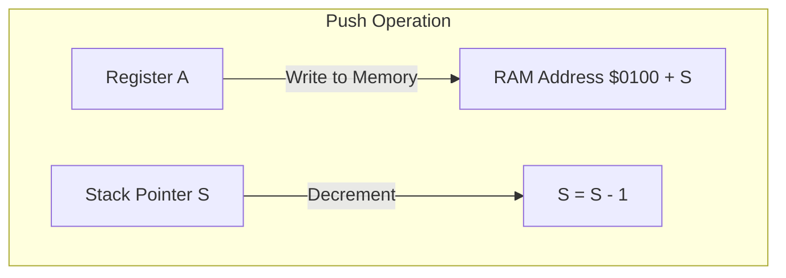

# Day 10: スタックとサブルーチン

---

🌐 Available languages:
[English](./README.md) | [日本語](./README_ja.md)

## 📜 概要

今日はプログラミングにおいて不可欠な**サブルーチン（関数）**の仕組みを実装します。これを実現するために、一時的なデータを保存する**スタック**と、その場所を指し示す**スタックポインタ (S) レジスタ**を導入します。

スタックを使うことで、関数を呼び出した後に元の場所へ戻ったり、レジスタの値を一時的に退避させたりすることが可能になります。

## 🧠 メモリ構成の注意

Day 10 以降はプログラムを Gowin BSRAM で実装した RAM (`ram.sv`) から実行します。`rom.sv` の内容は起動時に RAM へコピーされます。
これは `day10_completed/boot_loader.sv` で行っており、`boot_index` で `0x0200 + boot_index` を走査し、ブート中は `rom_addr` で ROM を選択、`ram_we/ram_din` で RAM に書き込み、完了後に `cpu_rst_n` を解除します。

Day 10 以降は Zero Page/Stack/Program RAM がすべて RAM になるため、CPU は `0x0000-0x7FFF` を読み書きできます。

### 6502 システムのメモリマップ（この教材で使用）

| アドレス範囲 | 用途 | 説明 |
| :--- | :--- | :--- |
| `0x0000 - 0x00FF` | Zero Page | 高速アクセス用の 256 バイト領域 |
| `0x0100 - 0x01FF` | Stack | スタックポインタ (SP) が使う領域 |
| `0x0200 - 0x7FFF` | プログラム/データ RAM | 30.5KB（0x7E00 バイト。32KB BSRAM のうち 0x0200-0x7FFF）起動時に `rom.sv` のプログラムを `$0200` へコピーしてから CPU が開始する |
| `0x8000 - 0xFFFF` | デモ用ROM (読み出し専用) | アドレスbit15で選択。読み出しは `rom.sv` の内容（プログラム外は `$EA`）、CPUからの書き込みは無視される |

注: Day 10〜18 の LCD テキスト VRAM は `lcd_demo.sv` 内のデバッグ表示ロジックのみが書き込むもので、CPU のアドレス空間にはマップされない。Day 99 のシャドウ/テキスト VRAM ($7C00, $E000) のマップはこの実装には適用されない。

## 🎯 学習目標

- **スタックの仕組み**: 後入れ先出し (LIFO) 構造の理解。
- **スタックポインタ (S)**: ページ 1 ($0100-$01FF) を管理する 8 ビットレジスタの実装。
- **メモリへの書き込み**: CPU から RAM へデータを保存するロジックの実装。
- **基本サブルーチン命令**: `JSR`, `RTS`, `PHA`, `PLA` の動作。

## 🏗️ 6502 のスタック構造


```mermaid
graph TD
    subgraph Push Operation
        A[Register A] -->|Write to Memory| RAM[RAM Address $0100 + S]
        S[Stack Pointer S] -->|Decrement| S_new[S = S - 1]
    end
```

- **場所**: メモリのアドレス `$0100` ～ `$01FF`（ページ 1）に固定されています。
- **向き**: スタックは**下方**（アドレスが減る方向）に成長します。
- **スタックポインタ (S)**: ページ内のオフセットを保持します。リセット時は `$FF` が一般的です。
  - **Push**: `$0100 + S` に書き込み、`S` をデクリメント。
  - **Pull**: `S` をインクリメントし、`$0100 + S` から読み出し。

## 🏗️ 実装する命令

| オペコード | ニーモニック | 説明                                             | サイクル数 |
| :--------: | ------------ | ------------------------------------------------ | :--------: |
|   `0x20`   | `JSR abs`    | 戻りアドレスをプッシュしてサブルーチンへジャンプ |     6      |
|   `0x60`   | `RTS`        | スタックからアドレスを戻して復帰                 |     6      |
|   `0x08`   | `PHP`        | ステータスレジスタ (P) をスタックに退避          |     3      |
|   `0x28`   | `PLP`        | スタックから P レジスタを復旧                    |     4      |
|   `0x48`   | `PHA`        | アキュムレータ (A) をスタックに退避              |     3      |
|   `0x68`   | `PLA`        | スタックから A レジスタを復旧                    |     4      |
|   `0x4C`   | `JMP abs`    | 指定したアドレスへジャンプ                       |     3      |
|   `0xEF`   | `HLT`        | CPU を停止し、その場で留まる（独自拡張）         |     -      |

## 🛠️ 実装ステップ

完成版 `cpu.sv` はメモリクロック 2 サイクルで 1 ステップ進みます。*リクエスト*ステップで `address_bus`/`write_en` を発行し、次の*データ取得*ステップで `memory_ready` が立ち、同期 BSRAM の読み出しデータが有効になります。`pc_enable` によるリクエストは `step_pending` にラッチされ、次の `memory_ready` ウィンドウで消費されます。

1. **スタックポインタの定義**:
    - `cpu.sv` に `logic [7:0] s;` を定義。リセット時に `8'hFF`。
2. **RAM 書き込みロジック**:
    - CPU が `write_en` をパルス出力し、`boot_loader.sv` が `$8000` 未満（RAM 領域）のみ書き込み可能にゲートします。
3. **サブルーチンのマルチサイクル制御**:
    - `JSR`/`JMP abs` は `STATE_FETCH_LOW`/`STATE_FETCH_HIGH` で 2 バイトのターゲットアドレスを取得します。
    - `JSR` は `STATE_PUSH_HIGH`/`STATE_PUSH_LOW` で戻りアドレスをプッシュ、`RTS` は `STATE_PULL_LOW`/`STATE_PULL_HIGH` で取り出して `+1` 補正して復帰します。
    - `PHA`/`PHP` は `STATE_PUSH_LOW`、`PLA`/`PLP` は `STATE_PULL_LOW` を使用します。
4. **LCD 表示の更新**:
    - デバッグ表示は `PC/A/X/Y/S/P` を表示します。プッシュ/プルで `S` が変わることを確認します。

## 🧪 動作確認

完成版 CPU テストはこのディレクトリで `make test-cpu` を実行します。`make sim` は LCD/TFT smoke test も実行します。テスト合格は各テストの assertion 範囲だけを確認するもので、全命令や実機動作を保証しません。

- **完成版 `rom.sv` の実行列**:

    ```asm
    LDA #$AA
    PHA
    ADC #$01   ; スタックには $AA を残したまま A = $AB
    PLA        ; A = $AA に復元
    JSR SUB
    HLT
    SUB:
      INX
      RTS
    ```

`make test-cpu` は共有テストベンチ `../day10/sim/tb_cpu.sv` を実行します。テストベンチは別の `$42` を使ったスタックテストを注入して HLT で終わるため、ここに示した完成版 ROM の列とは別です。

- **実機 (FPGA)**: LCD で A レジスタの値が正しく復元され、サブルーチンから戻ってくる（PC が適切に移動する）ことを確認します。

## 🏁 Phase 2 完了

おめでとうございます！これでレジスタ、算術、分岐、サブルーチンを備えた CPU のコアが完成しました。Day 11 からは**Phase 3**に入り、より多様なアドレッシングモードとメモリ活用を学んでいきます。
