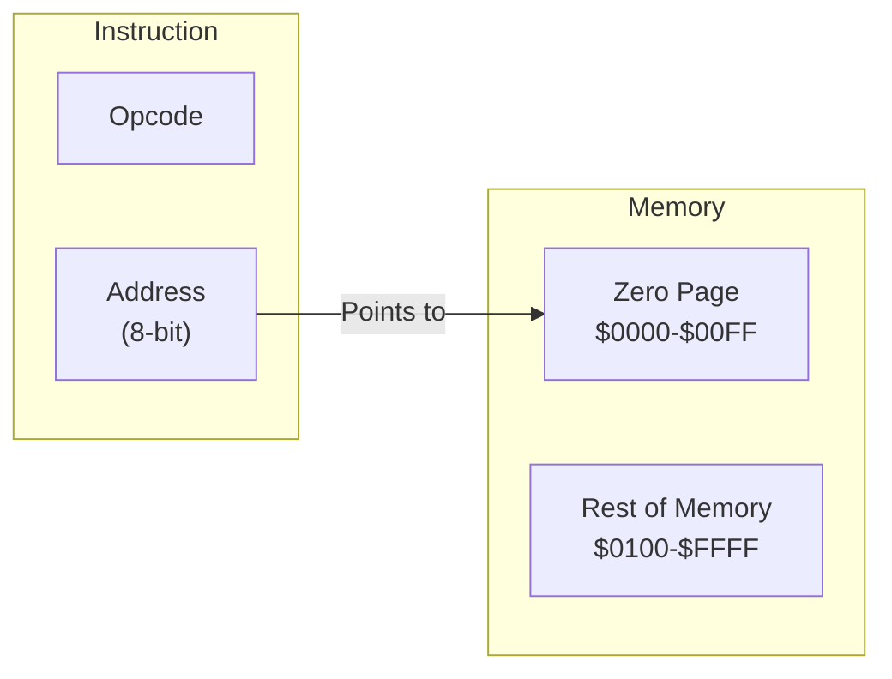

# Day 11: ゼロページ・アドレッシングと RAM

---

🌐 Available languages:
[English](./README.md) | [日本語](./README_ja.md)

## 📜 概要

これまでのプログラムはすべて「即値 (`#imm`)」か「レジスタ間」の操作でした。今日からは **メモリ** を本格的に活用します。

その第一歩として、6502 の特徴的な機能である **ゼロページ・アドレッシング** を実装します。これはメモリの最初の 256 バイト (`$0000` ～ `$00FF`) を高速に読み書きするモードで、変数の保存に最適です。

## 🧠 メモリ構成の注意

Day 10 以降はプログラムを Gowin BSRAM で実装した RAM (`ram.sv`) から実行します。Day 04〜09 の簡易 ROM とは構成が異なります。

## 🎯 学習目標

- **ゼロページの仕組み**: ページ 0 (`$0000` ～ `$00FF`) へのアクセスの高速性と利便性を学ぶ。
- **RAM の制御**: 実行中にデータを読み書きできるメモリ領域の実装。
- **Load/Store 命令**: `LDA zp`, `STA zp` などの基本的なメモリアクセス命令の実装。
- **テストのパス**: ロジック検証用テストベンチ (`sim/tb_cpu.sv`) をパスさせる。

## 🏗️ ゼロページ・アドレッシングとは



- **アドレス範囲**: `$0000` ～ `$00FF`。
- **メリット**: アドレス指定に 1 バイト（オフセット）しか使わないため、命令が短く、実行も高速です。

**例え:**
ゼロページは、メモリにおける **「VIP セクション」** や **「L1 キャッシュ」** のようなものだと考えてください。

- **通常のメモリ (Absolute)**: 住所（16bit）をフルネームで指定する必要があります。「東京都千代田区1-1-1」
- **ゼロページ**: 近所なのでニックネーム（8bit）だけで指定できます。「1丁目の田中さん」

プログラミング言語における「高速な変数（擬似レジスタ）」として機能します。

## 🏗️ 実装する命令

| オペコード | ニーモニック | 説明                              | サイクル数 |
| :--------: | ------------ | --------------------------------- | :--------: |
|   `0xA5`   | `LDA zp`     | ゼロページアドレスから A にロード |     3      |
|   `0x85`   | `STA zp`     | A の値をゼロページアドレスに保存  |     3      |
|   `0xA6`   | `LDX zp`     | ゼロページアドレスから X にロード |     3      |
|   `0x86`   | `STX zp`     | X の値をゼロページアドレスに保存  |     3      |

## 🛠️ 実装ステップ

1. **RAM 領域の定義**:
    - メモリマップを確認し、`$0000`～`$00FF` への書き込みが実体のある RAM（FPGA 内のブロック RAM など）に反映されるようにします。
2. **アドレッシング・ステートの追加**:
    - 命令の 2 バイト目（アドレス下位 8 ビット）をフェッチし、上位 8 ビットを `$00` としてアクセスするステートを実装します。
3. **Read/Write タイミングの調整**:
    - `STA` 命令時に、正しいタイミングで `write_en` を有効にし、データをバスに流すロジックを記述します。

## 🧪 動作確認

Day 05 以降、**テストベンチ (`day11/sim/`) は完成した状態で提供されています。** 自分で作成したコードの正しさを検証するために活用してください。

- **テストプログラム**:

    ```asm
    LDA #$42
    STA $10    ; $0010 番地に 0x42 を書き込む
    LDA #$00
    LDA $10    ; $0010 番地からロード (A = 0x42)
    ```

- **シミュレーション**: `make sim` を実行し、RAM への書き込みと読み出しが正しく行われ、最終的に `PASS` と表示されることを確認します。
- **実機 (FPGA)**: LCD で A レジスタの値が期待通りに変化することを確認します。

## 🎯 次のステップ

Day 12 では、メモリの全範囲（$0000 - $FFFF）にアクセスできる **アブソリュート (Absolute) ・アドレッシング** を実装し、大規模なデータ扱えるようにします。
