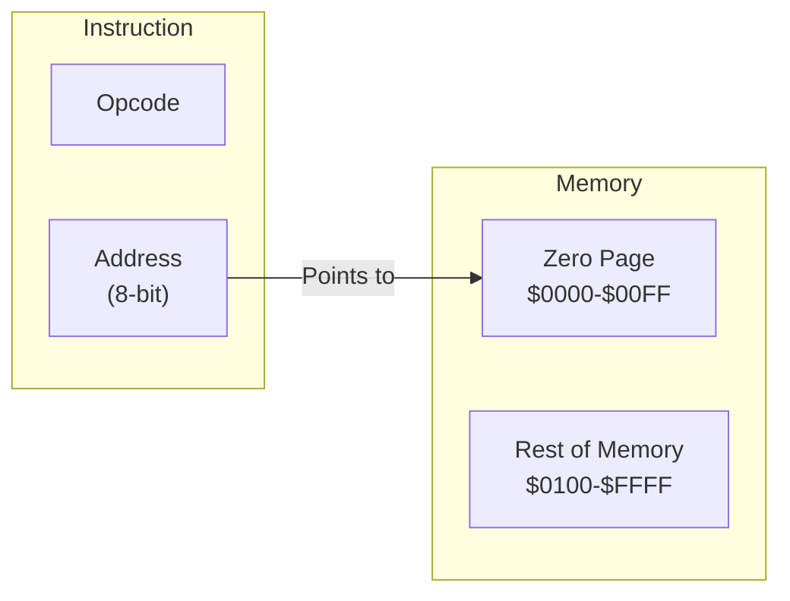

# Day 11: ゼロページ・アドレッシングと RAM

---

🌐 Available languages:
[English](./README.md) | [日本語](./README_ja.md)

## 実習の見取り図

この Day のスターターを編集します。

| 項目               | 内容                                     |
| ------------------ | ---------------------------------------- |
| 編集する箇所       | cpu.sv のゼロページの読み書き処理の TODO |
| 用意されているもの | 同期 RAM とブート処理は Day10 から用意   |
| テストの期待値     | STA後のメモリ値とLDAでA=$42へ復元        |
| 実機で見るもの     | ROMはRAM[$10]=$42、A=$42、PC=$0208でHLT  |

## 📜 概要

これまでのプログラムはすべて「即値 (`#imm`)」か「レジスタ間」の操作でした。今日からは**メモリ**を本格的に活用します。

その第一歩として、6502 の特徴的な機能である**ゼロページ・アドレッシング**を実装します。これはメモリの最初の 256 バイト (`$0000` ～ `$00FF`) を高速に読み書きするモードで、変数の保存に最適です。

## 🧠 メモリ構成の注意

Day 10 以降はプログラムを Gowin BSRAM で実装した RAM (`ram.sv`) から実行します。Day 04〜09 の簡易 ROM とは構成が異なります。

## 🎯 学習目標

- **ゼロページの仕組み**: ページ 0 (`$0000` ～ `$00FF`) へのアクセスの高速性と利便性を学ぶ。
- **RAM の制御**: 実行中にデータを読み書きできるメモリ領域の実装。
- **Load/Store 命令**: `LDA zp`, `STA zp` などの基本的なメモリアクセス命令の実装。
- **テストの合格**: ロジック検証用テストベンチ (`sim/tb_cpu.sv`) を実行し、合格することを確認する。

## 🏗️ ゼロページ・アドレッシングとは


```mermaid
graph LR
    subgraph Instruction
        OP[Opcode]
        ADDR["Address<br/>(8-bit)"]
    end
    
    subgraph Memory
        ZP["Zero Page<br/>$0000-$00FF"]
        Rest["Rest of Memory<br/>$0100-$FFFF"]
    end

    ADDR -->|Points to| ZP
```

- **アドレス範囲**: `$0000` ～ `$00FF`。
- **メリット**: アドレス指定に 1 バイト（オフセット）しか使わないため、命令が短く、実行も高速です。

**例え:**
ゼロページは特別なキャッシュではなく、アドレス上位バイトを省略できるメモリ領域です。6502 では命令長が短く一部命令が高速ですが、この教材の実装での実測速度を意味するものではありません。

- **通常のメモリ (Absolute)**: 住所（16bit）をフルネームで指定する必要があります。「東京都千代田区 1-1-1」
- **ゼロページ**: 近所なのでニックネーム（8bit）だけで指定できます。「1 丁目の田中さん」

短い命令で参照できる変数領域として使えます。

## 🏗️ 実装する命令

| オペコード | ニーモニック | 説明                              | サイクル数 |
| :--------: | ------------ | --------------------------------- | :--------: |
| `0xA5`     | `LDA zp`     | ゼロページアドレスから A にロード | 3          |
| `0x85`     | `STA zp`     | A の値をゼロページアドレスに保存  | 3          |
| `0xA6`     | `LDX zp`     | ゼロページアドレスから X にロード | 3          |
| `0x86`     | `STX zp`     | X の値をゼロページアドレスに保存  | 3          |

## 🛠️ 実装ステップ

1. **RAM 領域の定義**:
    - メモリマップを確認し、`$0000`～`$00FF` への書き込みが実体のある RAM（FPGA 内のブロック RAM など）に反映されるようにします。
2. **アドレッシング・ステートの追加**:
    - 命令の 2 バイト目（アドレス下位 8 ビット）をフェッチし、上位 8 ビットを `$00` としてアクセスするステートを実装します。
3. **Read/Write タイミングの調整**:
    - `STA` 命令時に、正しいタイミングで `write_en` を有効にし、データをバスに流すロジックを記述します。

## 🧪 動作確認

この Day には CPU テストベンチが含まれます。スターターの TODO が未実装なら CPU テストは失敗するのが正常です。実装後に `make test-cpu` を実行し、対応するテストが通ることを確認してください。テストの合格によって確認できるのは、テストした範囲だけです。未テストの命令や実機での動作を保証するものではありません。

- **テストプログラム**:

    ```asm
    LDA #$42
    STA $10    ; $0010 番地に 0x42 を書き込む
    LDA #$00
    LDA $10    ; $0010 番地からロード (A = 0x42)
    ```

- **シミュレーション**: `make test-cpu` で CPU テストを実行します。RAM の読み書きはテストプログラムで個別に確認し、テストで確認できる範囲は、README で案内しているテストのアサーションが検査する内容に限られます。
- **実機 (FPGA)**: LCD で A レジスタの値が期待通りに変化することを確認します。

## 🎯 次のステップ

Day 12 では、16bit の番地（$0000 - $FFFF）を指定できる**アブソリュート (Absolute) ・アドレッシング**を実装し、大規模なデータを扱えるようにします。実際にマップされるメモリ範囲は実装に依存します。

命令表のサイクル数は標準 6502 の参考値です。この教材の FSM 状態数・メモリ待ちを含むクロック数とは異なります。

CPU 単体テストと実機 ROM では、実行するプログラムが異なります。表に示した実機での期待値は `rom.sv` と LCD の配線から判断した値であり、すべてのボードで実機確認を済ませたという意味ではありません。

同期 RAM に読み出しを要求してからデータを取り込むまでのタイミングは[同期RAMの説明](../docs/DAY18_TO_DAY99_ja.md#同期ramを読むときの時間)を参照してください。起動時は PLL LOCK を同期し、16 クロック連続で安定したことを確認してからブート処理を開始します。

LCD の VSync は表示書き込み側のクロックに 2 段のフリップフロップで同期させ、その立ち上がりでフレーム更新を開始します。VRAM とフォントの読み出しは、画素クロックの領域内で処理します。
