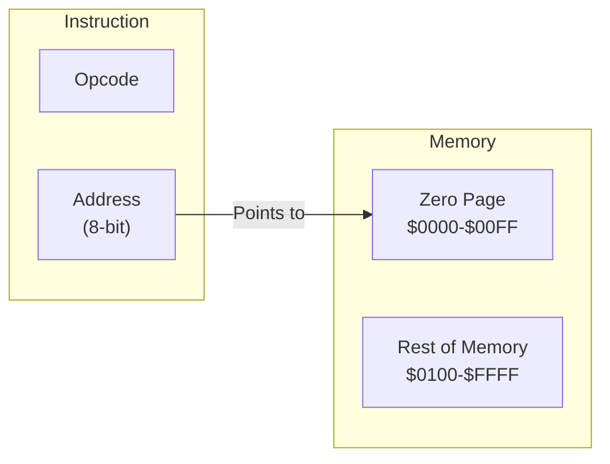

# Day 11: Zero Page Addressing & RAM

---

🌐 Available languages:
[English](./README.md) | [日本語](./README_ja.md)

## Lesson at a glance

The reference solution already implements the tasks below.

| Item | Details |
| --- | --- |
| Where to edit | Zero-page load/store TODOs in cpu.sv |
| Provided foundation | Synchronous RAM and boot provided since Day10 |
| Expected test results | Stored memory value after STA, and A=$42 restored by LDA |
| What to observe on hardware | ROM ends with RAM[$10]=$42, A=$42 and HLT at PC=$0208 |

## 📜 Overview

So far, all our programs have used "Immediate (`#imm`)" or "Register-to-Register" operations. From today, we start working with **Memory** in earnest.

Our first step is implementing a key 6502 feature: **Zero Page Addressing**. This mode allows the CPU to quickly read/write to the first 256 bytes of memory (`$0000` to `$00FF`), making it perfect for storing variables.

## 🧠 Memory Model Note

From Day 10 onward, the program runs from RAM backed by Gowin BSRAM (`ram.sv`), not the simple ROM used in earlier days.

## 🎯 Learning Objectives

- **Zero Page Concept**: Understand the speed and convenience of accessing Page 0 (`$00xx`).
- **RAM Control**: Implement a memory region where data can be read and written during execution.
- **Load/Store**: Implement basic memory access instructions like `LDA zp` and `STA zp`.

## 🏗️ What is Zero Page?



- **Address Range**: `$0000` to `$00FF`.
- **Advantages**: It only requires 1 byte for the address, making instructions shorter and execution faster.
- **Role**: Functionally acts like "extra registers" or high-speed variables for your programs.

## 🏗️ Instructions to Implement

| Opcode | Mnemonic | Description                   | Cycles |
| :----: | -------- | ----------------------------- | :----: |
| `0xA5` | `LDA zp` | Load A from Zero Page address | 3      |
| `0x85` | `STA zp` | Store A to Zero Page address  | 3      |
| `0xA6` | `LDX zp` | Load X from Zero Page address | 3      |
| `0x86` | `STX zp` | Store X to Zero Page address  | 3      |

## 🛠️ Implementation Steps

1. **Define RAM Region**:
    - Verify your memory map so that writes to `$0000-$00FF` are handled by physical RAM (e.g., Block RAM inside the FPGA).
2. **Add Addressing States**:
    - Fetch the second byte (lower 8 bits of the address).
    - Access memory by setting the upper 8 bits to `$00`.
3. **Read/Write Timing**:
    - For `STA`, ensure `write_en` is pulsed at the correct clock edge while valid data is on the bus.

## 🧪 Verification

The completed CPU test is `make test-cpu`; run it from this directory. `make sim` separately runs only the LCD/TFT smoke test. Passing these tests covers their assertions only, not every instruction or hardware behavior.

- **Test Program**:

    ```asm
    LDA #$42
    STA $10    ; Store 0x42 at address $0010
    LDA #$00   ; Clear A
    LDA $10    ; Load from $0010 (A should become 0x42 again)
    ```

- **FPGA**: Confirm on the LCD that A is restored correctly after the load operation.

## 🎯 Next Step

In Day 12, we will implement **Absolute Addressing**, allowing the CPU to specify a 16-bit address ($0000–$FFFF); actual mapped memory depends on the hardware.

Instruction-table cycles are reference values for the standard 6502, not clock counts for this FSM including memory waits.

CPU unit tests and the hardware ROM use different inputs. The hardware expectations above are derived from `rom.sv` and the LCD wiring; they do not mean that operation has been verified on every board.

See [synchronous RAM timing](../docs/DAY18_TO_DAY99.md#synchronous-ram-read-timing) for request and capture timing. At startup, PLL LOCK is synchronized and must remain stable for 16 clocks before boot begins.

LCD VSync passes through a two-stage synchronizer into the display-write clock domain. Its rising edge starts a frame update. VRAM and font reads remain in the pixel-clock domain.
