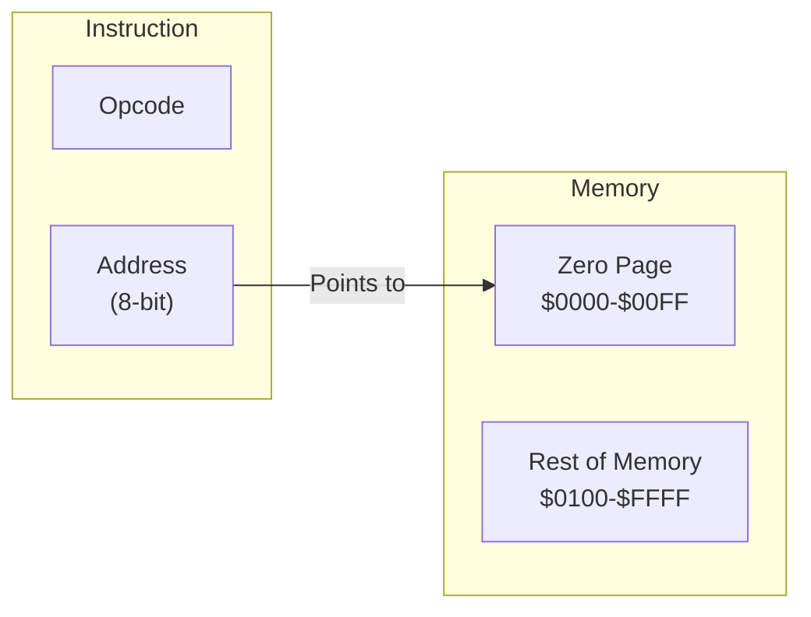

# Day 11: ゼロページ・アドレッシングと RAM

---

🌐 Available languages:
[English](./README.md) | [日本語](./README_ja.md)

## 実習の見取り図

完成例では下記の課題が実装済みです。

| 項目           | 内容                                    |
| -------------- | --------------------------------------- |
| 編集する箇所   | cpu.svのzero-page load/store TODO       |
| 提供済みの前提 | 同期RAMとbootはDay10から提供            |
| テストの期待値 | STA後のメモリ値とLDAでA=$42へ復元       |
| 実機で見るもの | ROMはRAM[$10]=$42、A=$42、PC=$0208でHLT |

## 📜 概要

これまでのプログラムはすべて「即値 (`#imm`)」か「レジスタ間」の操作でした。今日からは**メモリ**を本格的に活用します。

その第一歩として、6502 の特徴的な機能である**ゼロページ・アドレッシング**を実装します。これはメモリの最初の 256 バイト (`$0000` ～ `$00FF`) を高速に読み書きするモードで、変数の保存に最適です。

## 🧠 メモリ構成の注意

Day 10 以降はプログラムを Gowin BSRAM で実装した RAM (`ram.sv`) から実行します。Day 04〜09 の簡易 ROM とは構成が異なります。

## 🎯 学習目標

- **ゼロページの仕組み**: ページ 0 (`$00xx`) へのアクセスの高速性と利便性を学ぶ。
- **RAM の制御**: 実行中にデータを読み書きできるメモリ領域の実装。
- **Load/Store 命令**: `LDA zp`, `STA zp` などの基本的なメモリアクセス命令の実装。

## 🏗️ ゼロページ・アドレッシングとは



- **アドレス範囲**: `$0000` ～ `$00FF`。
- **メリット**: アドレス指定に 1 バイト（オフセット）しか使わないため、命令が短く、実行も高速です。
- **役割**: 短い命令で参照できる変数領域として使えます。

## 🏗️ 実装する命令

| オペコード | ニーモニック | 説明                              | サイクル数 |
| :--------: | ------------ | --------------------------------- | :--------: |
| `0xA5`     | `LDA zp`     | ゼロページアドレスから A にロード | 3          |
| `0x85`     | `STA zp`     | A の値をゼロページアドレスに保存  | 3          |
| `0xA6`     | `LDX zp`     | ゼロページアドレスから X にロード | 3          |
| `0x86`     | `STX zp`     | X の値をゼロページアドレスに保存  | 3          |

## 🛠️ 実装ステップ

1. **RAM 領域の定義**:
    - メモリマップを確認し、`$0000`～`$00FF` への書き込みが実体のある RAM（FPGA 内のブロック RAM など）に反映されるようにします。
2. **アドレッシング・ステートの追加**:
    - 命令の 2 バイト目（アドレス下位 8 ビット）をフェッチし、上位 8 ビットを `$00` としてアクセスするステートを実装します。
3. **Read/Write タイミングの調整**:
    - `STA` 命令時に、正しいタイミングで `write_en` を有効にし、データをバスに流すロジックを記述します。

## 🧪 動作確認

完成版 CPU テストはこのディレクトリで `make test-cpu` を実行します。`make sim` は LCD/TFT smoke test を実行し、CPU は `make test-cpu` で別に検査します。テスト合格は各テストの assertion 範囲だけを確認するもので、全命令や実機動作を保証しません。

- **テストプログラム**:

    ```asm
    LDA #$42
    STA $10    ; $0010 番地に 0x42 を保存
    LDA #$00   ; Aをクリア
    LDA $10    ; $0010 番地からロード (A=$42 に戻るはず)
    ```

- **実機 (FPGA)**: LCD 表示にメモリダンプ機能がない場合、LCD だけでは `$0010` の値を直接確認できません。シミュレーションの assert または波形で RAM の読み書きを検証し、実機の LCD 表示は A レジスタへのロード結果を確認する補助証拠として扱います。

## 🎯 次のステップ

Day 12 では、16bit の番地（$0000 - $FFFF）を指定できる**アブソリュート (Absolute) ・アドレッシング**を実装し、大規模なデータを扱えるようにします。実際にマップされるメモリ範囲は実装に依存します。

命令表のサイクル数は標準 6502 の参考値です。この教材の FSM 状態数・メモリ待ちを含むクロック数とは異なります。

CPU 単体テストと実機 ROM は別の入力です。表の実機期待値は `rom.sv` / LCD 配線から読み取った値であり、全ボードでの実機確認済みという意味ではありません。

同期 RAM の要求・取込みタイミングは[同期RAMの説明](../docs/DAY18_TO_DAY99_ja.md#同期ramを読むときの時間)を参照してください。起動時は PLL LOCK を同期し 16 クロック安定してから boot を開始します。

LCD の VSync は表示書込みクロックへ 2 段同期し、立上りでフレーム更新を開始します。VRAM 読出しと font 読出しは画素クロック内で処理します。
