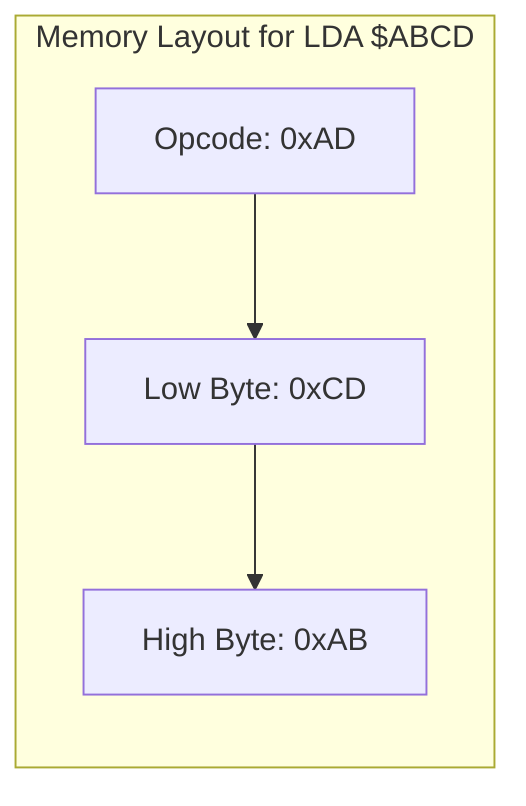

# Day 12: アブソリュート・アドレッシング (16bit)

---

🌐 Available languages:
[English](./README.md) | [日本語](./README_ja.md)

## 📜 概要

Day 11 で学んだゼロページは便利ですが、256 バイトしかありません。今日は、CPU がメモリの全範囲（64KB）にアクセスできるようにするための **アブソリュート (Absolute) ・アドレッシング** を実装します。

このモードでは、オペコードの後に 2 バイト（下位バイト、上位バイトの順）のアドレスが続きます。これにより、プログラムのどこからでも任意のメモリ番地を読み書きできるようになります。

## 🎯 学習目標

- **16 ビットアドレスの扱い**: リトルエンディアン形式で 2 バイトのアドレスをフェッチする。
- **フルレンジのメモリアクセス**: ROM や周辺機器との通信に不可欠なアドレス指定方法の習得。

## 🏗️ 6502 のアドレス形式 (リトルエンディアン)



6502 は **リトルエンディアン** です。16 ビットのアドレス `$ABCD` を指定する場合、メモリ上には以下のように並びます。

1. オペコード
2. アドレス下位バイト (`$CD`)
3. アドレス上位バイト (`$AB`)

**例え:**
日付を **「日-月-年」** の順（25日 12月 2025年）で書くようなものです。

- 一番「細かい」単位（日）が最初に来ます。
- 一番「大きい」単位（年）が最後に来ます。
- ビッグエンディアンは「年-月-日」（2025-12-25）です。

## 🏗️ 実装する命令

| オペコード | ニーモニック | 説明                    | サイクル数 |
| :--------: | ------------ | ----------------------- | :--------: |
|   `0xAD`   | `LDA abs`    | 指定番地から A にロード |     4      |
|   `0x8D`   | `STA abs`    | A の値を指定番地に保存  |     4      |

## 🛠️ 実装ステップ

1. **マルチサイクル・フェッチ**:
    - アドレス下位バイトをフェッチして一時保存する。
    - アドレス上位バイトをフェッチし、16 ビットのアドレスを完成させる。
2. **アドレスバスの駆動**:
    - 完成した 16 ビットアドレスを `address_bus` に出力し、次のサイクルでデータを読み書きします。

## 🧪 動作確認

Day 05 以降、**テストベンチ (`day12/sim/`) は完成した状態で提供されています。** 自分で作成したコードの正しさを検証するために活用してください。

- **テストプログラム**:

    ```asm
    LDA #$55
    STA $1234  ; Absolute アドレス $1234 に書き込み
    LDA #$00
    LDA $1234  ; ロード (A = 0x55)
    ```

- **シミュレーション**: `make sim` を実行し、Absolute アドレッシングによる読み書きが正しく行われ、最終的に `PASS` と表示されることを確認します。
- **実機 (FPGA)**: LCD で PC と A レジスタの値の変化を確認します。

## 🎯 次のステップ

Day 13 では、データの加工能力を高めるために **論理演算命令 (AND, ORA, EOR, BIT)** を実装します。
