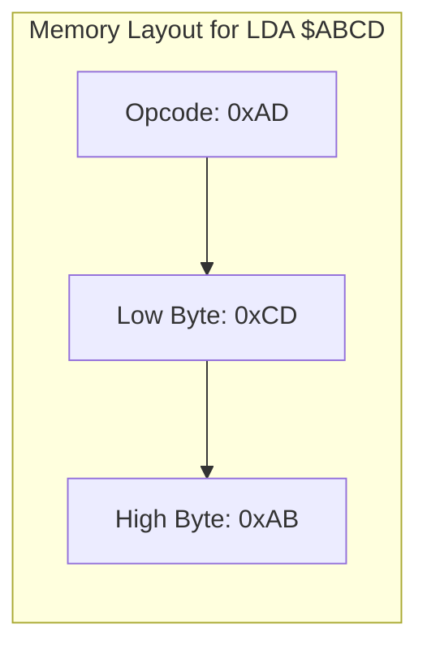

# Day 12: アブソリュート・アドレッシング (16bit)

---

🌐 Available languages:
[English](./README.md) | [日本語](./README_ja.md)

## 実習の見取り図

完成例では下記の課題が実装済みです。

| 項目           | 内容                                                            |
| -------------- | --------------------------------------------------------------- |
| 編集する箇所   | cpu.svのabsolute load/store TODO                                |
| 提供済みの前提 | zero-page処理と同期RAM                                          |
| テストの期待値 | 注入プログラムの16bit番地への保存・読出し                       |
| 実機で見るもの | ROMはRAM[$0300]=$AA、A=$AA、PC=$020AでHLT。命令列を上書きしない |

## 📜 概要

Day 11 で学んだゼロページは便利ですが、256 バイトしかありません。今日は、16 ビットの有効アドレスを指定するための**アブソリュート (Absolute) ・アドレッシング**を実装します。

このモードでは、オペコードの後に 2 バイト（下位バイト、上位バイトの順）のアドレスが続きます。アドレス表現は 64KiB ですが、実際にアクセス可能かはシステムのメモリマップに依存します。

## 🧠 メモリ構成の注意

Day 10 以降はプログラムを Gowin BSRAM で実装した RAM (`ram.sv`) から実行します。Day 04〜09 の簡易 ROM とは構成が異なります。

## 🎯 学習目標

- **16 ビットアドレスの扱い**: リトルエンディアン形式で 2 バイトのアドレスをフェッチする。
- **フルレンジのメモリアクセス**: ROM や周辺機器との通信に不可欠なアドレス指定方法の習得。

## 🏗️ 6502 のアドレス形式 (リトルエンディアン)



6502 は**リトルエンディアン**です。16 ビットのアドレス `$ABCD` を指定する場合、メモリ上には以下のように並びます。

1. オペコード
2. アドレス下位バイト (`$CD`)
3. アドレス上位バイト (`$AB`)

## 🏗️ 実装する命令

| オペコード | ニーモニック | 説明                    | サイクル数 |
| :--------: | ------------ | ----------------------- | :--------: |
| `0xAD`     | `LDA abs`    | 指定番地から A にロード | 4          |
| `0x8D`     | `STA abs`    | A の値を指定番地に保存  | 4          |

## 🛠️ 実装ステップ

1. **マルチサイクル・フェッチ**:
    - アドレス下位バイトをフェッチして一時保存する。
    - アドレス上位バイトをフェッチし、16 ビットのアドレスを完成させる。
2. **アドレスバスの駆動**:
    - 完成した 16 ビットアドレスを `address_bus` に出力し、次のサイクルでデータを読み書きします。

## 🧪 動作確認

完成版 CPU テストはこのディレクトリで `make test-cpu` を実行します。`make sim` は LCD/TFT smoke test を実行し、CPU は `make test-cpu` で別に検査します。テスト合格は各テストの assertion 範囲だけを確認するもので、全命令や実機動作を保証しません。

- **テストプログラム**:

    ```asm
    LDA #$AA
    STA $0300  ; RAM(ページ3)に保存
    LDA #$00
    LDA $0300  ; 再ロード (A=$AA)
    HLT        ; PC=$020Aで停止
    ```

- **実機 (FPGA)**: LCD で PC や A レジスタの値を確認し、期待通りにループやメモリアクセスが行われているかを確認します。

## 🎯 次のステップ

Day 13 では、データの加工能力を高めるために**論理演算命令 (AND, ORA, EOR, BIT)**を実装します。

命令表のサイクル数は標準 6502 の参考値です。この教材の FSM 状態数・メモリ待ちを含むクロック数とは異なります。

CPU 単体テストと実機 ROM は別の入力です。表の実機期待値は `rom.sv` / LCD 配線から読み取った値であり、全ボードでの実機確認済みという意味ではありません。

同期 RAM の要求・取込みタイミングは[同期RAMの説明](../docs/DAY18_TO_DAY99_ja.md#同期ramを読むときの時間)を参照してください。起動時は PLL LOCK を同期し 16 クロック安定してから boot を開始します。

LCD の VSync は表示書込みクロックへ 2 段同期し、立上りでフレーム更新を開始します。VRAM 読出しと font 読出しは画素クロック内で処理します。

完成例の `make test-rom` は実機用 `rom.sv` を boot コピー・同期 RAM 経由で実行し、停止 PC とデータを検査します。CPU 単体テストに注入するプログラムとは別に検証します。
