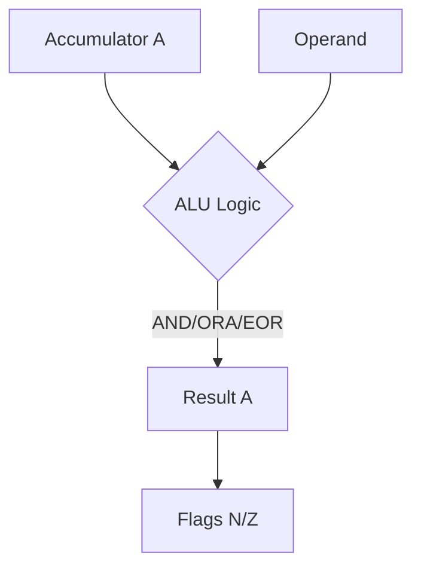
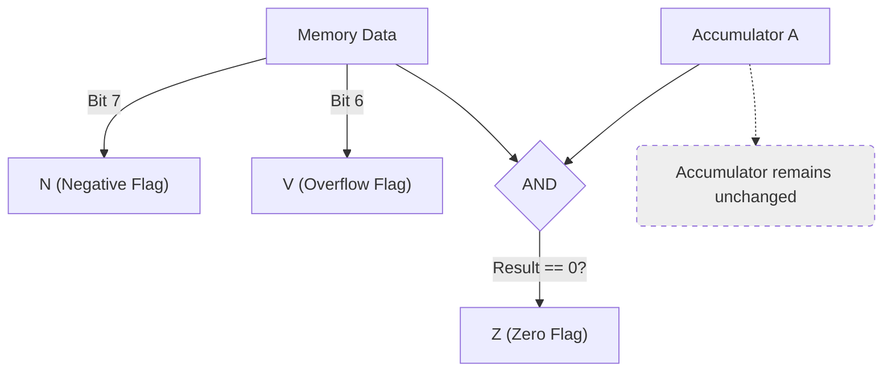

# Day 13: Logical Operations & BIT

---

🌐 Available languages:
[English](./README.md) | [日本語](./README_ja.md)

## 📜 Overview

In addition to arithmetic, bitwise manipulation is a core responsibility of a CPU. Today, we implement **Logical Operations (AND, ORA, EOR)** and the **BIT** instruction for checking bit states.

These instructions enable "masking," "toggling," and "testing" specific bits—operations that are essential for low-level hardware control.

## 🧠 Memory Model Note

From Day 10 onward, the program runs from RAM backed by Gowin BSRAM (`ram.sv`), not the simple ROM used in earlier days.

## 🎯 Learning Objectives

- **Bitwise Logic Implementation**: Hardware implementation of AND, OR, and XOR.
- **Flag Updates**: Verify how N and Z flags are updated after logical operations.
- **The BIT Instruction**: Understand how to test flags without modifying the Accumulator.

## 🏗️ Instructions to Implement



| Opcode | Mnemonic   | Description                   | Cycles |
| :----: | ---------- | ----------------------------- | :----: |
| `0x29` | `AND #imm` | A = A & Operand               |   2    |
| `0x09` | `ORA #imm` | A = A \| Operand              |   2    |
| `0x49` | `EOR #imm` | A = A ^ Operand               |   2    |
| `0x24` | `BIT zp`   | Test bits in memory against A |   3    |



_Note: The `BIT` instruction also copies memory bit 7 to the N flag and bit 6 to the V flag, which is unique._

## 🛠️ Implementation Steps

1. **Extend the ALU**:
    - Add `&` (AND), `|` (OR), and `^` (XOR) logic to your `always_comb` block.
2. **Flag Update Logic**:
    - Update `Z = (result == 0)` and `N = result[7]` for logical results.
3. **Decode BIT Instruction**:
    - `BIT` updates the Z flag based on `A & Memory`, but **does not change** the value of A.
    - Implement the transfer logic for flags: `N = Memory[7]` and `V = Memory[6]`.

## 🧪 Verification

This Day includes a CPU testbench. If the starter TODOs are not yet implemented, it is expected and normal for the CPU test to fail. After implementing the TODOs, run `make test-cpu` and confirm the tests pass. Passing the tests verifies the tested scope only and does not guarantee untested instructions or real-hardware behavior.

- **Test Program**:

    ```asm
    LDA #$F0
    AND #$3C   ; A = 0x30 (Z=0 N=0)
    ORA #$03   ; A = 0x33 (Z=0 N=0)
    EOR #$33   ; A = 0x00 (Z=1 N=0)
    LDA #$0F
    BIT $10    ; M=0xC3: Z=0, N=1, V=1 (A unchanged)
    BIT $11    ; M=0x30: Z=1, N=0, V=0 (A unchanged)
    HLT
    ```

- **Simulation**: Run `make test-cpu` and verify the simulation outputs `PASS` (`make sim` additionally runs the TFT smoke test).
- **FPGA**: Confirm on the LCD that A and the N/V/Z flags are displayed. `BIT` holds A unchanged and updates N/V/Z based on the memory value.

## 🎯 Next Step

In Day 14, we will further expand our bit manipulation repertoire by implementing **Shift and Rotate Instructions (ASL, LSR, ROL, ROR)**.
