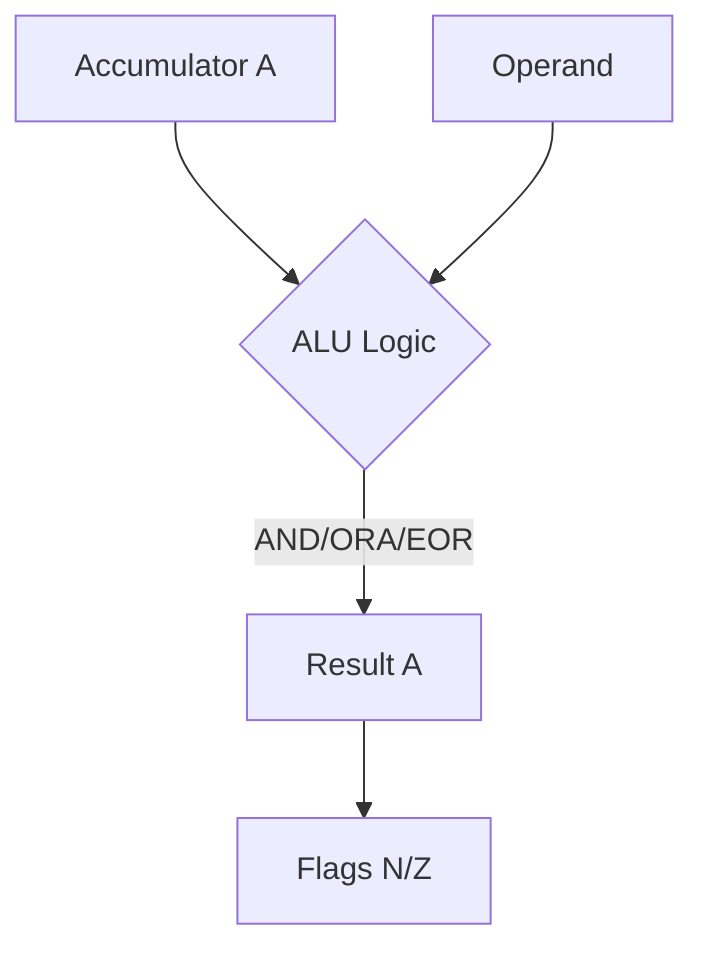
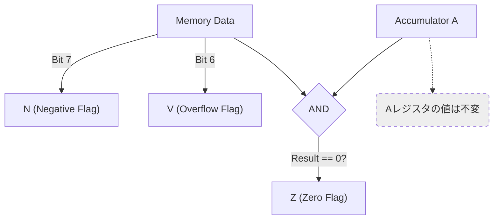

# Day 13: 論理演算命令と BIT

---

🌐 Available languages:
[English](./README.md) | [日本語](./README_ja.md)

## 実習の見取り図

この Day のスターターで編集します。

| 項目           | 内容                                     |
| -------------- | ---------------------------------------- |
| 編集する箇所   | cpu.svのAND/ORA/EOR/BIT TODO             |
| 提供済みの前提 | absolute / zero-page処理                 |
| テストの期待値 | 論理演算のAとBITのN/V/Z、A保持           |
| 実機で見るもの | ROMはBIT $11でA=$0F/P=$BC、PC=$0212でHLT |

## 📜 概要

数値の計算だけでなく、ビット単位の操作も CPU の重要な役割です。今日は**論理演算命令 (AND, ORA, EOR)**と、特定のビット状態をチェックするための**BIT 命令**を実装します。

これらにより、特定ビットの「マスク」「反転」「フラグ判定」などの、ハードウェア制御に欠かせない操作が可能になります。

## 🧠 メモリ構成の注意

Day 10 以降はプログラムを Gowin BSRAM で実装した RAM (`ram.sv`) から実行します。Day 04〜09 の簡易 ROM とは構成が異なります。

## 🎯 学習目標

- **ビット演算の理解**: AND, OR, XOR のハードウェア実装。
- **フラグへの影響**: 論理演算後に N, Z フラグがどう更新されるかの確認。
- **BIT 命令の特殊性**: レジスタの内容を変えずにフラグだけを更新する仕組み。

## 🏗️ 実装する命令



| オペコード | ニーモニック | 説明                                   | サイクル数 |
| :--------: | ------------ | -------------------------------------- | :--------: |
|   `0x29`   | `AND #imm`   | A = A & オペランド                     |     2      |
|   `0x09`   | `ORA #imm`   | A = A \| オペランド                    |     2      |
|   `0x49`   | `EOR #imm`   | A = A ^ オペランド                     |     2      |
|   `0x24`   | `BIT zp`     | A とメモリの AND 演算 (フラグのみ更新) |     3      |



※ `BIT` 命令は、メモリの内容のビット 7 を N フラグに、ビット 6 を V フラグにコピーするという特殊な動作も持ちます。

## 🛠️ 実装ステップ

1. **論理演算の追加**:
    - `STATE_FETCH_OPCODE` で `OP_AND_IMM` / `OP_ORA_IMM` / `OP_EOR_IMM` をオペランドフェッチ (`STATE_FETCH_OPERAND`) に遷移させ、`STATE_FETCH_OPERAND` で `a & data_in` / `a | data_in` / `a ^ data_in` を A に書き戻します (`cpu.sv` の TODO コメント参照)。
2. **フラグ更新ロジック**:
    - 論理演算の結果が 0 なら `Z=1`、ビット 7（最上位ビット）が 1 なら `N=1` とします。
3. **BIT 命令のデコード**:
    - `BIT` は `A & Memory` の結果に基づいて Z フラグを更新しますが、A レジスタ自体の値は**変更しません**。
    - また、`N = Memory[7]`, `V = Memory[6]` という転送ロジックも実装します。

## 🧪 動作確認

この Day には CPU テストベンチ (`sim/tb_cpu.sv`) が含まれます。スターターの TODO が未実装なら CPU テストは失敗するのが正常です。実装後に `make test-cpu` を実行し、対応するテストが通ることを確認してください。テスト合格はテスト対象範囲の確認であり、未テストの命令や実機動作は保証しません。

- **テストプログラム** (テストベンチがメモリ `$0200` に注入します):

    ```asm
    LDA #$F0
    AND #$3C   ; A = $30 (Z=0 N=0)
    ORA #$03   ; A = $33 (Z=0 N=0)
    EOR #$33   ; A = $00 (Z=1 N=0)
    LDA #$0F
    BIT $10    ; M=$C3: Z=0, N=1, V=1 (A は変化なし)
    BIT $11    ; M=$30: Z=1, N=0, V=0 (A は変化なし)
    HLT
    ```

- **シミュレーション**: `make test-cpu` を実行し、最終的に `RESULT: ALL TESTS PASSED` と表示されることを確認します (`make sim` は CPU テストに加えて TFT smoke test も実行します)。
- **実機 (FPGA)**: `rom.sv` には上記とは別の命令列 (`LDA #$EF` から始まり `BIT $11` で終わる列) が入っています。LCD の A 行と P 行 (P = {N,V,1,1,1,1,Z,C}) の値を確認します。`BIT` では A を保持したまま、メモリ値に応じて N/V/Z だけが更新されます。

命令表のサイクル数は標準 6502 の参考値です。この教材の FSM 状態数・メモリ待ちを含むクロック数とは異なります。

CPU 単体テストと実機 ROM は別の入力です。表の実機期待値は `rom.sv` / LCD 配線から読み取った値であり、全ボードでの実機確認済みという意味ではありません。

同期 RAM の要求・取込みタイミングは[同期RAMの説明](../docs/DAY18_TO_DAY99_ja.md#同期ramを読むときの時間)を参照してください。起動時は PLL LOCK を同期し 16 クロック安定してから boot を開始します。

LCD の VSync は表示書込みクロックへ 2 段同期し、立上りでフレーム更新を開始します。VRAM 読出しと font 読出しは画素クロック内で処理します。

## 🎯 次のステップ

Day 14 では、ビットを左右にずらす**シフトおよび回転命令 (ASL, LSR, ROL, ROR)**を実装し、ビット操作の幅をさらに広げます。
