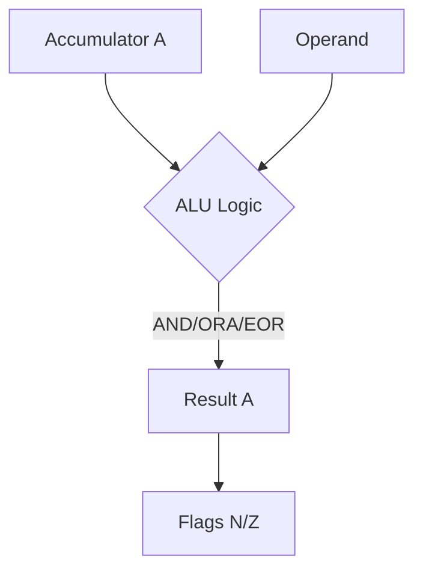
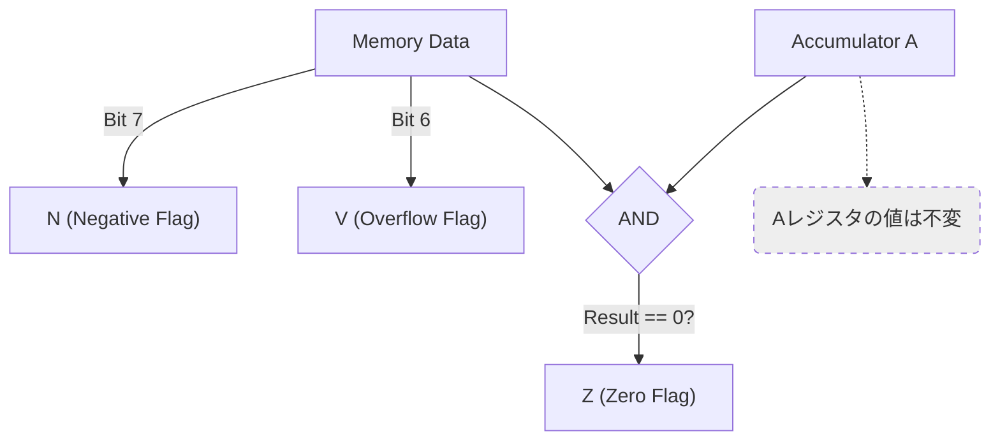

# Day 13: 論理演算命令と BIT

---

🌐 Available languages:
[English](./README.md) | [日本語](./README_ja.md)

## 📜 概要

数値の計算だけでなく、ビット単位の操作も CPU の重要な役割です。今日は **論理演算命令 (AND, ORA, EOR)** と、特定のビット状態をチェックするための **BIT 命令** を実装します。

これらにより、特定ビットの「マスク」「反転」「フラグ判定」などの、ハードウェア制御に欠かせない操作が可能になります。

## 🧠 メモリ構成の注意

Day 10 以降はプログラムを Gowin BSRAM で実装した RAM (`ram.sv`) から実行します。Day 04〜09 の簡易 ROM とは構成が異なります。

## 🎯 学習目標

- **ビット演算の理解**: AND, OR, XOR のハードウェア実装。
- **フラグへの影響**: 論理演算後に N, Z フラグがどう更新されるかの確認。
- **BIT 命令の特殊性**: レジスタの内容を変えずにフラグだけを更新する仕組み。

## 🏗️ 実装する命令



| オペコード | ニーモニック | 説明                                   | サイクル数 |
| :--------: | ------------ | -------------------------------------- | :--------: |
|   `0x29`   | `AND #imm`   | A = A & オペランド                     |     2      |
|   `0x09`   | `ORA #imm`   | A = A \| オペランド                    |     2      |
|   `0x49`   | `EOR #imm`   | A = A ^ オペランド                     |     2      |
|   `0x24`   | `BIT zp`     | A とメモリの AND 演算 (フラグのみ更新) |     3      |



※ `BIT` 命令は、メモリの内容のビット 7 を N フラグに、ビット 6 を V フラグにコピーするという特殊な動作も持ちます。

## 🛠️ 実装ステップ

1. **ALU の拡張**:
    - `always_comb` ブロックに `&` (AND), `|` (OR), `^` (XOR) の演算ロジックを追加します。
2. **フラグ更新ロジック**:
    - 論理演算の結果が 0 なら `Z=1`、ビット 7（最上位ビット）が 1 なら `N=1` とします。
3. **BIT 命令のデコード**:
    - `BIT` は `A & Memory` の結果に基づいて Z フラグを更新しますが、A レジスタ自体の値は**変更しません**。
    - また、`N = Memory[7]`, `V = Memory[6]` という転送ロジックも実装します。

## 🧪 動作確認

このDayにはCPUテストベンチが含まれます。スターターのTODOが未実装ならCPUテストは失敗するのが正常です。実装後に `make test-cpu` を実行し、対応するテストが通ることを確認してください。テスト合格はテスト対象範囲の確認であり、未テストの命令や実機動作は保証しません。

- **テストプログラム**:

    ```asm
    LDA #$F0
    AND #$3C   ; A = 0x30 (Z=0 N=0)
    ORA #$03   ; A = 0x33 (Z=0 N=0)
    EOR #$33   ; A = 0x00 (Z=1 N=0)
    LDA #$0F
    BIT $10    ; M=0xC3: Z=0, N=1, V=1 (A unchanged)
    BIT $11    ; M=0x30: Z=1, N=0, V=0 (A unchanged)
    HLT
    ```

- **シミュレーション**: `make test-cpu` を実行し、最終的に `PASS` と表示されることを確認します (`make sim` はCPUテストに加えてTFT smoke testも実行します)。
- **実機 (FPGA)**: LCDでAとN/V/Zの表示を確認します。`BIT`ではAを保持し、メモリ値に応じてN/V/Zを更新します。

## 🎯 次のステップ

Day 14 では、ビットを左右にずらす **シフトおよび回転命令 (ASL, LSR, ROL, ROR)** を実装し、ビット操作の幅をさらに広げます。
