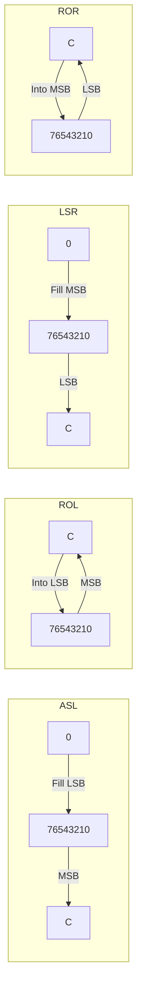

# Day 14: Shift & Rotate Instructions (ASL, LSR, ROL, ROR)

---

🌐 Available languages:
[English](./README.md) | [日本語](./README_ja.md)

## Lesson at a glance

Edit this day's starter workspace.

| Item | Details |
| --- | --- |
| Where to edit | ASL/LSR/ROL/ROR TODOs in cpu.sv |
| Provided foundation | Logic operations and flags |
| Expected test results | A/C/Z/N after shifts and rotates, including zero boundaries |
| What to observe on hardware | ROM ends with A=$80/P=$BD and HLT at PC=$020C |

## 📜 Overview

Today, we implement **Shift** and **Rotate** instructions, which move bits to the left or right within a register.

These instructions are frequently used for fast multiplication by 2 (`ASL`), division by 2 (`LSR`), and processing serial data. A key concept here is understanding how shifted-out bits are stored in the **Carry (C) flag**.

## 🧠 Memory Model Note

From Day 10 onward, the program runs from RAM backed by Gowin BSRAM (`ram.sv`), not the simple ROM used in earlier days.

## 🎯 Learning Objectives

- **Bit Shifting**: Moving bits and filling the empty space with 0.
- **Bit Rotation**: Circularly shifting bits through the Carry flag.
- **High-speed Math**: Understanding how shifts perform efficient multiplication and division.

## 🏗️ Instructions to Implement



| Opcode | Mnemonic | Description                         | Cycles |
| :----: | -------- | ----------------------------------- | :----: |
| `0x0A` | `ASL A`  | Arithmetic Shift Left (Fill with 0) | 2      |
| `0x4A` | `LSR A`  | Logical Shift Right (Fill with 0)   | 2      |
| `0x2A` | `ROL A`  | Rotate Left (Through Carry)         | 2      |
| `0x6A` | `ROR A`  | Rotate Right (Through Carry)        | 2      |

## 🛠️ Implementation Steps

1. **Shift Logic**:
    - `ASL`: `new_A = {A[6:0], 1'b0};` `new_C = A[7];`
    - `LSR`: `new_A = {1'b0, A[7:1]};` `new_C = A[0];`
2. **Rotate Logic**:
    - `ROL`: `new_A = {A[6:0], C};` `new_C = A[7];`
    - `ROR`: `new_A = {C, A[7:1]};` `new_C = A[0];`
3. **Flag Updates**:
    - All shift/rotate instructions update Z and N based on the result. The C flag becomes the bit that was shifted or rotated out.

## 🧪 Verification

This Day includes a CPU testbench. If the starter TODOs are not yet implemented, it is expected and normal for the CPU test to fail. After implementing the TODOs, run `make test-cpu` and confirm the tests pass. Passing the tests verifies the tested scope only and does not guarantee untested instructions or real-hardware behavior.

- **Test Program**:

    ```asm
    LDA #$45
    ASL A      ; A = 0x8A (C=0 Z=0 N=1)
    LSR A      ; A = 0x45 (C=0 Z=0 N=0)
    SEC        ; C = 1
    ROL A      ; A = 0x8B (C=0 Z=0 N=1)
    ROR A      ; A = 0x45 (C=1 Z=0 N=0)
    LDA #$80
    ASL A      ; A = 0x00 (C=1 Z=1 N=0)
    HLT
    ```

- **Simulation**: Run `make test-cpu` and verify the simulation outputs `PASS` (`make sim` additionally runs the TFT smoke test).
- **FPGA**: Observe the shift/rotate results and the final halted state on the LCD.

Instruction-table cycles are reference values for the standard 6502, not clock counts for this FSM including memory waits.

CPU unit tests and the hardware ROM use different inputs. The hardware expectations above are derived from `rom.sv` and the LCD wiring; they do not mean that operation has been verified on every board.

See [synchronous RAM timing](../docs/DAY18_TO_DAY99.md#synchronous-ram-read-timing) for request and capture timing. At startup, PLL LOCK is synchronized and must remain stable for 16 clocks before boot begins.

LCD VSync passes through a two-stage synchronizer into the display-write clock domain. Its rising edge starts a frame update. VRAM and font reads remain in the pixel-clock domain.

## 🎯 Next Step

In Day 15, we will implement **Comparison Instructions (CMP, CPX, CPY)** and **Increment/Decrement** for memory contents, which provide the data needed for branches.
