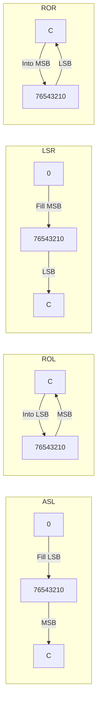

# Day 14: Shift & Rotate Instructions (ASL, LSR, ROL, ROR)

---

🌐 Available languages:
[English](./README.md) | [日本語](./README_ja.md)

## 📜 Overview

Today, we implement **Shift** and **Rotate** instructions, which move bits to the left or right within a register.

These instructions are frequently used for fast multiplication by 2 (`ASL`), division by 2 (`LSR`), and processing serial data. A key concept here is understanding how shifted-out bits are stored in the **Carry (C) flag**.

## 🧠 Memory Model Note

From Day 10 onward, the program runs from RAM backed by Gowin BSRAM (`ram.sv`), not the simple ROM used in earlier days.

## 🎯 Learning Objectives

- **Bit Shifting**: Moving bits and filling the empty space with 0.
- **Bit Rotation**: Circularly shifting bits through the Carry flag.
- **High-speed Math**: Understanding how shifts perform efficient multiplication and division.

## 🏗️ Instructions to Implement



| Opcode | Mnemonic | Description                         | Cycles |
| :----: | -------- | ----------------------------------- | :----: |
| `0x0A` | `ASL A`  | Arithmetic Shift Left (Fill with 0) |   2    |
| `0x4A` | `LSR A`  | Logical Shift Right (Fill with 0)   |   2    |
| `0x2A` | `ROL A`  | Rotate Left (Through Carry)         |   2    |
| `0x6A` | `ROR A`  | Rotate Right (Through Carry)        |   2    |

## 🛠️ Implementation Steps

1. **Shift Logic**:
    - `ASL`: `new_A = {A[6:0], 1'b0};` `new_C = A[7];`
    - `LSR`: `new_A = {1'b0, A[7:1]};` `new_C = A[0];`
2. **Rotate Logic**:
    - `ROL`: `new_A = {A[6:0], C};` `new_C = A[7];`
    - `ROR`: `new_A = {C, A[7:1]};` `new_C = A[0];`
3. **Flag Updates**:
    - All shift/rotate instructions update Z and N based on the result. The C flag becomes the bit that was shifted or rotated out.

## 🧪 Verification

- **Test Program**:

    ```asm
    LDA #$01
    ASL A      ; A = $02, C=0
    ASL A      ; A = $04, C=0
    LDA #$80
    ASL A      ; A = $00, C=1, Z=1
    ```

- **FPGA**: Observe the bits moving left/right on the LCD and confirm that the edge bits correctly transfer to the Carry flag.

## 🎯 Next Step

In Day 15, we will implement **Comparison Instructions (CMP, CPX, CPY)** and **Increment/Decrement** for memory contents, which provide the data needed for branches.
