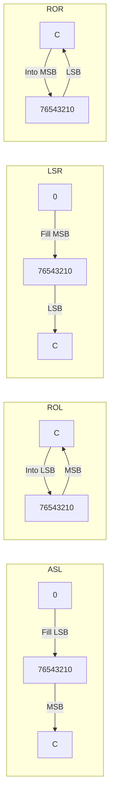

# Day 14: シフト・回転命令 (ASL, LSR, ROL, ROR)

---

🌐 Available languages:
[English](./README.md) | [日本語](./README_ja.md)

## 📜 概要

今日はデータをビット単位で左右にずらす **シフト (Shift)** と **回転 (Rotate)** 命令を実装します。

これらの命令は、2 倍の乗算 (`ASL`) や 2 で割る除算 (`LSR`)、シリアル通信のデータ処理などで頻繁に使用されます。また、桁あふれしたビットが **キャリーフラグ (C)** に格納される仕組みを理解することが重要です。

## 🧠 メモリ構成の注意

Day 10 以降はプログラムを Gowin BSRAM で実装した RAM (`ram.sv`) から実行します。Day 04〜09 の簡易 ROM とは構成が異なります。

## 🎯 学習目標

- **ビットシフトの仕組み**: ビットを左右にずらし、空いたビットを 0 で埋める動作。
- **ビット回転の仕組み**: キャリーフラグを含めてビットを循環させる動作。
- **データの加工**: シフト演算による高速な乗除算の理解。

## 🏗️ 実装する命令



| オペコード | ニーモニック | 説明                      | サイクル数 |
| :--------: | ------------ | ------------------------- | :--------: |
|   `0x0A`   | `ASL A`      | A を左シフト (空きに 0)   |     2      |
|   `0x4A`   | `LSR A`      | A を右シフト (空きに 0)   |     2      |
|   `0x2A`   | `ROL A`      | A を左回転 (キャリー経由) |     2      |
|   `0x6A`   | `ROR A`      | A を右回転 (キャリー経由) |     2      |

## 🛠️ 実装ステップ

1. **シフトロジックの実装**:
    - `ASL`: `new_A = {A[6:0], 1'b0};` `new_C = A[7];`
    - `LSR`: `new_A = {1'b0, A[7:1]};` `new_C = A[0];`
2. **回転ロジックの実装**:
    - `ROL`: `new_A = {A[6:0], C};` `new_C = A[7];`
    - `ROR`: `new_A = {C, A[7:1]};` `new_C = A[0];`
3. **フラグの更新**:
    - すべてのシフト/回転命令で、結果に基づき Z, N フラグを更新します。C フラグはシフトアウト（または回転アウト）されたビットになります。

## 🧪 動作確認

- **テストプログラム**:

    ```asm
    LDA #$01
    ASL A      ; A = $02, C=0
    ASL A      ; A = $04, C=0
    LDA #$80
    ASL A      ; A = $00, C=1, Z=1
    ```

- **実機 (FPGA)**: LCD でビットが左右に移動し、端のビットがキャリーフラグに移る様子を確認します。

## 🎯 次のステップ

Day 15 では、数値を比較して条件判断の材料を作る **比較命令 (CMP, CPX, CPY)** と、**インクリメント/デクリメント** を実装します。
