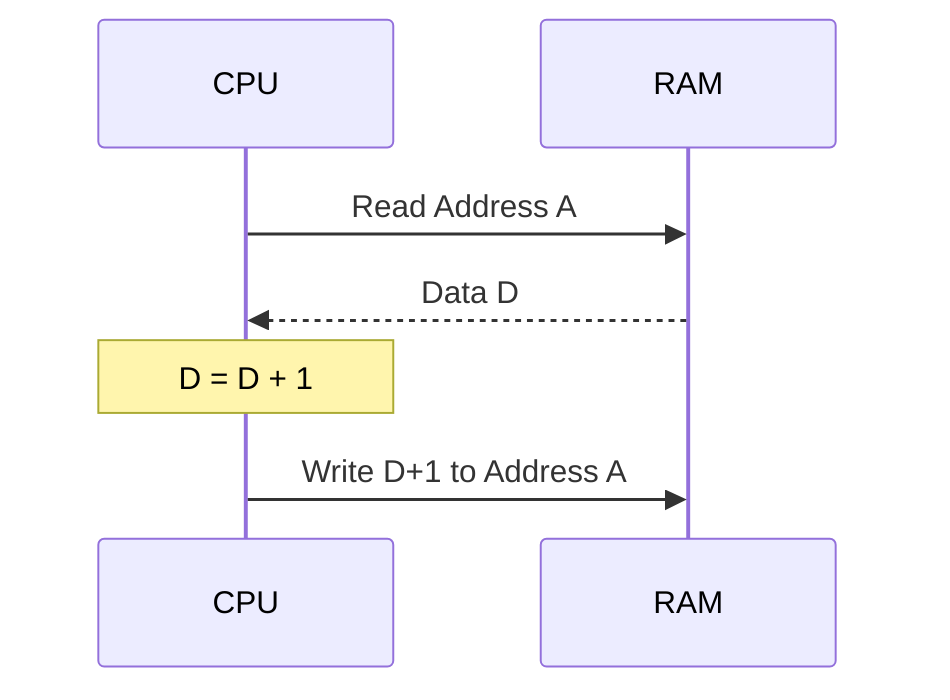

# Day 15: Comparison & Memory Inc/Dec (CMP, INC, DEC)

---

🌐 Available languages:
[English](./README.md) | [日本語](./README_ja.md)

## 📜 Overview

To wrap up Phase 3, we implement **Comparison Instructions (CMP, CPX, CPY)** and instructions that directly modify memory: **Increment (INC)** and **Decrement (DEC)**.

Comparisons are heavily used just before branches to make decisions, while memory inc/dec instructions are useful for managing counters stored in RAM.

## 🧠 Memory Model Note

From Day 10 onward, after reset the `boot_loader.sv` copies the 256-byte program at ROM address `$0200` into RAM (`ram.sv`, mapped at `$0000-$7FFF`) starting at `$0200`, and the CPU executes from RAM (the ROM is mapped at `$8000-$FFFF`). This differs from the earlier Day 04-09 setup where the CPU ran directly from the simple ROM.

## 🎯 Learning Objectives

- **The Mechanism of Comparison**: Understand that comparing is just a subtraction where the result is discarded and only flags are updated.
- **Read-Modify-Write (RMW)**: Implement the sequence of reading from memory, processing the data, and writing it back.
- **Flag Control**: Correctly set C, Z, and N flags based on comparison results.

## 🏗️ Instructions to Implement



| Opcode | Mnemonic   | Description                   | Cycles |
| :----: | ---------- | ----------------------------- | :----: |
| `0xC9` | `CMP #imm` | Compare A with immediate      |   2    |
| `0xE0` | `CPX #imm` | Compare X with immediate      |   2    |
| `0xC0` | `CPY #imm` | Compare Y with immediate      |   2    |
| `0xE6` | `INC zp`   | Increment memory at Zero Page |   5    |
| `0xC6` | `DEC zp`   | Decrement memory at Zero Page |   5    |

Cycle counts are reference values from the real 6502. The CPU in this curriculum is an educational multi-cycle FSM implementation, so actual cycle counts are higher.

## 🛠️ Implementation Steps

1. **Comparison Logic**:
    - Compute `Register - Operand`.
    - If no borrow occurs (`Register >= Operand` in unsigned 8-bit comparison), set `C=1`. Set `N=result[7]`, and `Z=(result == 8'h00)`.
2. **Read-Modify-Write Sequence**:
    - `INC` and `DEC` split into steps: read the data, compute ±1, and write it back to the same address.
    - Reuse the existing states: in `STATE_FETCH_OPERAND` set `address_bus` to the Zero Page address and transition to `STATE_EXECUTE`; in `STATE_EXECUTE` compute `data_in ± 1`, update `Z`/`N`, assert `write_en`, and transition to `STATE_WRITE_BACK`; in `STATE_WRITE_BACK` clear `write_en` and return to `STATE_FETCH_OPCODE` (see also the TODO comments in `cpu.sv`).

## 🧪 Verification

This Day includes a CPU testbench. If the starter TODOs are not yet implemented, it is expected and normal for the CPU test to fail. After implementing the TODOs, run `make test-cpu` and confirm the tests pass. Passing the tests verifies the tested scope only and does not guarantee untested instructions or real-hardware behavior.

- **Test Program**:

    ```asm
    LDA #$50
    CMP #$50   ; equal:      C=1 Z=1 N=0 (A unchanged)
    CMP #$51   ; smaller:    C=0 Z=0 N=1
    LDX #$05
    CPX #$03   ; larger:     C=1 Z=0 N=0
    LDY #$07
    CPY #$09   ; smaller:    C=0 Z=0 N=1
    INC $30    ; $0F -> $10 (Z=0 N=0)
    INC $31    ; $FF -> $00 (wrap: Z=1)
    DEC $32    ; $00 -> $FF (wrap: N=1)
    DEC $30    ; $10 -> $0F
    HLT        ; $EF: custom halt instruction (implemented on Day 10)
    ```

    The testbench `sim/tb_cpu.sv` injects this program directly into its own memory model (the `rom.sv` used on the FPGA contains a different demo program).

- **Simulation**: Run `make test-cpu` and verify the simulation outputs `PASS` (`make sim` additionally runs the TFT smoke test).
- **FPGA**: Confirm the register and flag states on the LCD as the program progresses.

## 🏁 Phase 3 Complete

Congratulations! You now have a solid foundation of memory access and data processing. From Day 16 in **Phase 4**, we will implement the 6502's most powerful features: Indexed and Indirect addressing modes.
