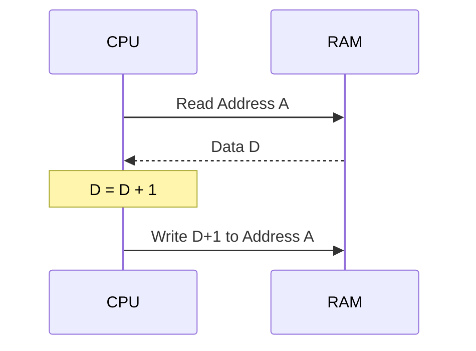

# Day 15: 比較命令とメモリの増減 (CMP, INC, DEC)

---

🌐 Available languages:
[English](./README.md) | [日本語](./README_ja.md)

## 📜 概要

Phase 3 の締めくくりとして、値を比較してフラグを更新する **比較命令 (CMP, CPX, CPY)** と、メモリ上の値を直接書き換える **インクリメント (INC) / デクリメント (DEC)** 命令を実装します。

比較命令は分岐の直前で多用され、メモリの増減命令はループカウンタをメモリ上に置く際に便利です。

## 🎯 学習目標

- **比較の仕組み**: 減算を行い結果は捨ててフラグのみを更新する仕組みの理解。
- **Read-Modify-Write**: メモリから読み込み、加工し、書き戻す一連の動作の実装。
- **フラグ制御**: 比較結果に応じて C, Z, N フラグを正しくセットする。

## 🏗️ 実装する命令

| オペコード | ニーモニック | 説明                        | サイクル数 |
| :--------: | ------------ | --------------------------- | :--------: |
|   `0xC9`   | `CMP #imm`   | A と即値を比較              |     2      |
|   `0xE0`   | `CPX #imm`   | X と即値を比較              |     2      |
|   `0xC0`   | `CPY #imm`   | Y と即値を比較              |     2      |
|   `0xE6`   | `INC zp`     | 指定アドレスのメモリ値を +1 |     5      |
|   `0xC6`   | `DEC zp`     | 指定アドレスのメモリ値を -1 |     5      |

## 🛠️ 実装ステップ

1. **比較ロジック**:
    - `CMP` などは `Register - Operand` を計算します。
    - `result >= 0` なら `C=1`（ボローなし）。
    - `result == 0` なら `Z=1`。
2. **Read-Modify-Write (RMW)**:
    - `INC` や `DEC` はメモリからデータを読み出すサイクル、ALU で計算するサイクル、そして同じアドレスに書き戻すサイクルが必要です。
    - ステートマシンに `STATE_RMW_READ`, `STATE_RMW_WRITE` などを追加します。

## 🧪 動作確認

Day 05 以降、**テストベンチ (`day15/sim/`) は完成した状態で提供されています。** 自分で作成したコードの正しさを検証するために活用してください。

- **テストプログラム**: これまで実装した命令（LDA, STA, JMP, Branch, ALUなど）を組み合わせた総合的なプログラム。
- **シミュレーション**: `make sim` を実行し、システム全体が正しく動作し、最終的に `PASS` と表示されることを確認します。
- **実機 (FPGA)**: LCD に CPU の各レジスタとフラグが表示され、プログラムが期待通りに進行することを確認します。

## 🏁 Phase 3 完了

おめでとうございます！これで基本的なメモリアクセスとデータ加工命令が揃いました。Day 16 からの **Phase 4** では、インデックス付きアドレッシングや間接アドレッシングといった、6502 の最も強力な機能を実装していきます。
