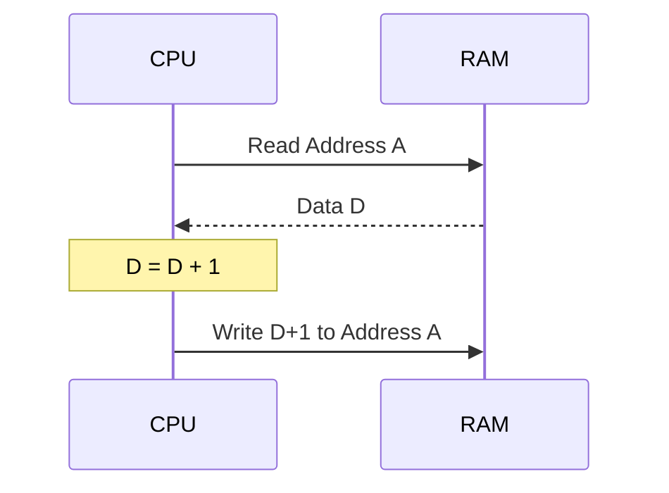

# Day 15: 比較命令とメモリの増減 (CMP, INC, DEC)

---

🌐 Available languages:
[English](./README.md) | [日本語](./README_ja.md)

## 📜 概要

Phase 3 の締めくくりとして、値を比較してフラグを更新する**比較命令 (CMP, CPX, CPY)**と、メモリ上の値を直接書き換える**インクリメント (INC) / デクリメント (DEC)**命令を実装します。

比較命令は分岐の直前で多用され、メモリの増減命令はループカウンタをメモリ上に置く際に便利です。

## 🧠 メモリ構成の注意

Day 10 以降は、リセット後に `boot_loader.sv` が ROM の `$0200` から 256 バイトのプログラムを Gowin BSRAM 製 RAM (`ram.sv`, `$0000-$7FFF`) の `$0200` 以降へコピーし、CPU は RAM から実行します (ROM は `$8000-$FFFF` にマップ)。Day 04〜09 の簡易 ROM から直接実行する構成とは異なります。

## 🎯 学習目標

- **比較の仕組み**: 減算を行い結果は捨ててフラグのみを更新する仕組みの理解。
- **Read-Modify-Write**: メモリから読み込み、加工し、書き戻す一連の動作の実装。
- **フラグ制御**: 比較結果に応じて C, Z, N フラグを正しくセットする。

## 🏗️ 実装する命令


```mermaid
sequenceDiagram
    participant CPU
    participant RAM
    CPU->>RAM: Read Address A
    RAM-->>CPU: Data D
    Note over CPU: D = D + 1
    CPU->>RAM: Write D+1 to Address A
```

| オペコード | ニーモニック | 説明                        | サイクル数 |
| :--------: | ------------ | --------------------------- | :--------: |
|   `0xC9`   | `CMP #imm`   | A と即値を比較              |     2      |
|   `0xE0`   | `CPX #imm`   | X と即値を比較              |     2      |
|   `0xC0`   | `CPY #imm`   | Y と即値を比較              |     2      |
|   `0xE6`   | `INC zp`     | 指定アドレスのメモリ値を +1 |     5      |
|   `0xC6`   | `DEC zp`     | 指定アドレスのメモリ値を -1 |     5      |

サイクル数は実機 6502 の参考値です。本カリキュラムの CPU はマルチサイクル FSM による教育的実装のため、実際のサイクル数はこれより多くなります。

## 🛠️ 実装ステップ

1. **比較ロジック**:
    - `CMP` などは `Register - Operand` を計算します。
    - 減算でボローが発生しなければ `C=1`（8bit の符号なし比較で Register >= Operand）。結果の bit 7 を `N`、結果が 0 なら `Z=1` とします。
2. **Read-Modify-Write (RMW)**:
    - `INC` や `DEC` はメモリからデータを読み出すステップ、±1 を計算するステップ、そして同じアドレスに書き戻すステップに分かれます。
    - 既存のステートを再利用します: `STATE_FETCH_OPERAND` でゼロページアドレスを `address_bus` にセットして `STATE_EXECUTE` へ遷移、`STATE_EXECUTE` で `data_in ± 1` を計算して `Z`/`N` を更新し `write_en` を立てて `STATE_WRITE_BACK` へ、`STATE_WRITE_BACK` で `write_en` をクリアして `STATE_FETCH_OPCODE` に戻ります (`cpu.sv` の TODO コメントも参照)。

## 🧪 動作確認

この Day には CPU テストベンチが含まれます。スターターの TODO が未実装なら CPU テストは失敗するのが正常です。実装後に `make test-cpu` を実行し、対応するテストが通ることを確認してください。テスト合格はテスト対象範囲の確認であり、未テストの命令や実機動作は保証しません。

- **テストプログラム**:

    ```asm
    LDA #$50
    CMP #$50   ; equal:      C=1 Z=1 N=0 (A unchanged)
    CMP #$51   ; smaller:    C=0 Z=0 N=1
    LDX #$05
    CPX #$03   ; larger:     C=1 Z=0 N=0
    LDY #$07
    CPY #$09   ; smaller:    C=0 Z=0 N=1
    INC $30    ; $0F -> $10 (Z=0 N=0)
    INC $31    ; $FF -> $00 (wrap: Z=1)
    DEC $32    ; $00 -> $FF (wrap: N=1)
    DEC $30    ; $10 -> $0F
    HLT        ; $EF: カスタム停止命令 (Day 10 で実装済み)
    ```

    テストベンチ `sim/tb_cpu.sv` はこのプログラムを自身のメモリモデルに直接注入します (FPGA 実機向けの `rom.sv` は別のデモプログラムです)。

- **シミュレーション**: `make test-cpu` を実行し、最終的に `PASS` と表示されることを確認します (`make sim` は CPU テストに加えて TFT smoke test も実行します)。
- **実機 (FPGA)**: LCD に CPU の各レジスタとフラグが表示され、プログラムが期待通りに進行することを確認します。

## 🏁 Phase 3 完了

おめでとうございます！これで基本的なメモリアクセスとデータ加工命令が揃いました。Day 16 からの**Phase 4**では、インデックス付きアドレッシングや間接アドレッシングといった、6502 の最も強力な機能を実装していきます。
