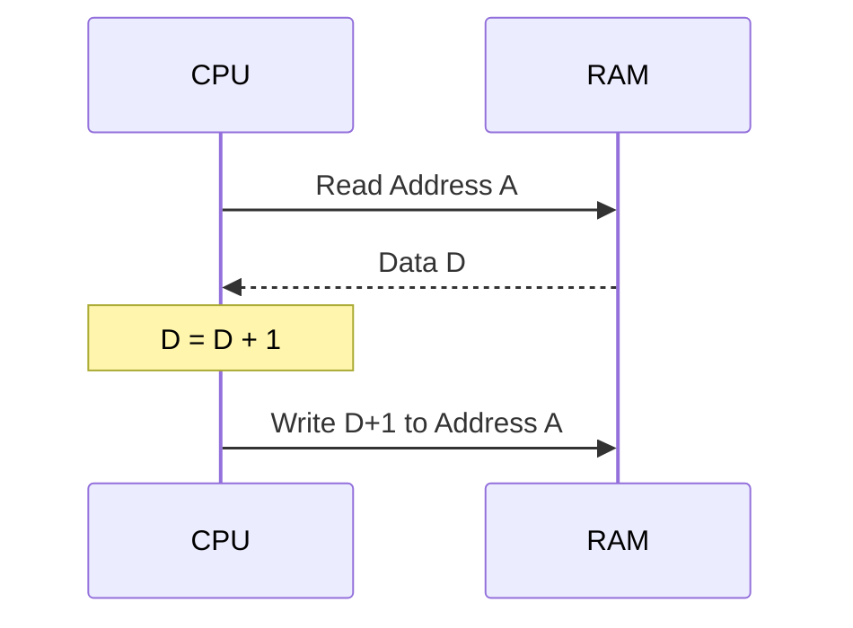

# Day 15: Comparison & Memory Inc/Dec (CMP, INC, DEC)

---

🌐 Available languages:
[English](./README.md) | [日本語](./README_ja.md)

## 📜 Overview

To wrap up Phase 3, we implement **Comparison Instructions (CMP, CPX, CPY)** and instructions that directly modify memory: **Increment (INC)** and **Decrement (DEC)**.

Comparisons are heavily used just before branches to make decisions, while memory inc/dec instructions are useful for managing counters stored in RAM.

## 🧠 Memory Model Note

From Day 10 onward, the program runs from RAM backed by Gowin BSRAM (`ram.sv`), not the simple ROM used in earlier days.

## 🎯 Learning Objectives

- **The Mechanism of Comparison**: Understand that comparing is just a subtraction where the result is discarded and only flags are updated.
- **Read-Modify-Write (RMW)**: Implement the sequence of reading from memory, processing the data, and writing it back.
- **Flag Control**: Correctly set C, Z, and N flags based on comparison results.

## 🏗️ Instructions to Implement



| Opcode | Mnemonic   | Description                   | Cycles |
| :----: | ---------- | ----------------------------- | :----: |
| `0xC9` | `CMP #imm` | Compare A with immediate      |   2    |
| `0xE0` | `CPX #imm` | Compare X with immediate      |   2    |
| `0xC0` | `CPY #imm` | Compare Y with immediate      |   2    |
| `0xE6` | `INC zp`   | Increment memory at Zero Page |   5    |
| `0xC6` | `DEC zp`   | Decrement memory at Zero Page |   5    |

## 🛠️ Implementation Steps

1. **Comparison Logic**:
    - Perform `Register - Operand`.
    - If `result >= 0`, then `C=1` (No borrow).
    - If `result == 0`, then `Z=1`.
2. **Read-Modify-Write Sequence**:
    - `INC` and `DEC` require separate cycles to read the data, process it in the ALU, and write it back to the same address.
    - Add states like `STATE_RMW_READ` and `STATE_RMW_WRITE` to your FSM.

## 🧪 Verification

- **Test Program**:

    ```asm
    LDA #$10
    CMP #$10   ; Z=1, C=1
    BNE FAIL   ; Should not jump

    LDA #$00
    STA $10    ; Save 0 at $0010
    INC $10    ; Memory at $0010 becomes 1
    ```

- **FPGA**: Confirm on the LCD that memory values and status flags change as expected during comparisons and memory updates.

## 🏁 Phase 3 Complete

Congratulations! You now have a solid foundation of memory access and data processing. From Day 16 in **Phase 4**, we will implement the 6502's most powerful features: Indexed and Indirect addressing modes.
