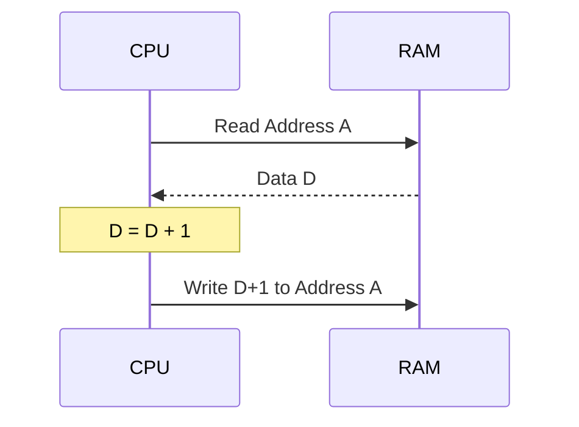

# Day 15: Comparison & Inc/Dec (CMP, INC, DEC, DEX, DEY)

---

🌐 Available languages:
[English](./README.md) | [日本語](./README_ja.md)

## Lesson at a glance

The reference solution already implements the tasks below.

| Item | Details |
| --- | --- |
| Where to edit | CMP/CPX/CPY, INC/DEC and DEX/DEY TODOs in cpu.sv |
| Provided foundation | Instructions through shifts and rotates |
| Expected test results | Comparisons, wrapping, zero and C/V preservation, including C=1/V=1 |
| What to observe on hardware | Successful ROM execution ends with RAM[$10]=$01, X=$00/Y=$FF and HLT at PC=$0212 |

## 📜 Overview

To wrap up Phase 3, we implement **Comparison Instructions (CMP, CPX, CPY)**, the register decrements **DEX/DEY**, and instructions that directly modify memory: **Increment (INC)** and **Decrement (DEC)**.

Comparisons are heavily used just before branches to make decisions, while memory inc/dec instructions are useful for managing counters stored in RAM. DEX/DEY complete the register set by adding the counterparts of Day 07's INX/INY.

## 🧠 Memory Model Note

From Day 10 onward, after reset the `boot_loader.sv` copies the 256-byte program at ROM address `$0200` into RAM (`ram.sv`, mapped at `$0000-$7FFF`) starting at `$0200`, and the CPU executes from RAM (the ROM is mapped at `$8000-$FFFF`). This differs from the earlier Day 04-09 setup where the CPU ran directly from the simple ROM.

## 🎯 Learning Objectives

- **The Mechanism of Comparison**: Understand that comparing is just a subtraction where the result is discarded and only flags are updated.
- **Read-Modify-Write (RMW)**: Implement the sequence of reading from memory, processing the data, and writing it back.
- **Flag Control**: Correctly set C, Z, and N flags based on comparison results.
- **Register Decrement**: Extend Day 07's `INX`/`INY` with `DEX`/`DEY` (Z and N flags, C unchanged).

## 🏗️ Instructions to Implement


```mermaid
sequenceDiagram
    participant CPU
    participant RAM
    CPU->>RAM: Read Address A
    RAM-->>CPU: Data D
    Note over CPU: D = D + 1
    CPU->>RAM: Write D+1 to Address A
```

| Opcode | Mnemonic   | Description                   | Cycles |
| :----: | ---------- | ----------------------------- | :----: |
| `0xC9` | `CMP #imm` | Compare A with immediate      | 2      |
| `0xE0` | `CPX #imm` | Compare X with immediate      | 2      |
| `0xC0` | `CPY #imm` | Compare Y with immediate      | 2      |
| `0xCA` | `DEX`      | Decrement X (Z, N flags)      | 2      |
| `0x88` | `DEY`      | Decrement Y (Z, N flags)      | 2      |
| `0xE6` | `INC zp`   | Increment memory at Zero Page | 5      |
| `0xC6` | `DEC zp`   | Decrement memory at Zero Page | 5      |

Cycle counts are reference values from the real 6502. The CPU in this curriculum is an educational multi-cycle FSM implementation, so actual cycle counts are higher.

## 🛠️ Implementation Steps

1. **Comparison Logic**:
    - Compute `Register - Operand`.
    - If no borrow occurs (`Register >= Operand` in unsigned 8-bit comparison), set `C=1`. Set `N=result[7]`, and `Z=(result == 8'h00)`.
2. **Read-Modify-Write Sequence**:
    - `INC` and `DEC` split into steps: read the data, compute ±1, and write it back to the same address.
    - Reuse the existing states: in `STATE_FETCH_OPERAND` set `address_bus` to the Zero Page address and transition to `STATE_EXECUTE`; in `STATE_EXECUTE` compute `data_in ± 1`, update `Z`/`N`, assert `write_en`, and transition to `STATE_WRITE_BACK`; in `STATE_WRITE_BACK` clear `write_en` and return to `STATE_FETCH_OPCODE`.
3. **Register Decrement (DEX, DEY)**:
    - These are 1-byte instructions handled entirely in `STATE_FETCH_OPCODE`, just like `INX`/`INY` from Day 07.
    - `DEX`: `x <= x - 1`; set `Z` if the result is zero and `N` from bit 7 of the result. `DEY` does the same for `y`. `C` and `V` are unchanged.

## 🧪 Verification

Run the completed CPU test with `make test-cpu` in this directory (it uses the shared starter testbench `../day15/sim/tb_cpu.sv`). `make test` additionally runs the TFT smoke test, the synchronous RAM integration test (`test-sync`), and the LCD pipeline test (`test-lcd-pipeline`). Passing the tests verifies the tested scope only and does not guarantee untested instructions or real-hardware behavior.

- **Test Program**:

    ```asm
    LDA #$10
    CMP #$10   ; Z=1, C=1
    BNE FAIL   ; Should not jump

    LDA #$00
    STA $10    ; Save 0 at $10
    INC $10    ; Memory at $10 becomes 1
    LDX #$01
    LDY #$00
    DEX
    DEY
    HLT        ; Halts at $0212 on success
    ```

    This is the instruction sequence in the completed `rom.sv` (if the comparison is equal, the branch is not taken, and `STA`/`INC` change the value at `$10` from `0` to `1`). The shared starter testbench injects a different program (`LDA #$50` / `CMP #$50` ... `HLT`).

- **Simulation**: Run `make test-cpu` and verify the simulation outputs `RESULT: ALL TESTS PASSED`.
- **FPGA**: Confirm on the LCD that memory values and status flags change as expected during comparisons and memory updates.

## 🏁 Phase 3 Complete

Congratulations! You now have a solid foundation of memory access and data processing. From Day 16 in **Phase 4**, we will implement the 6502's most powerful features: Indexed and Indirect addressing modes.

The CPU test also sets C=1/V=1 before DEX/DEY to check flag preservation. On hardware the successful ROM stops at $0212 with X=$00, Y=$FF, RAM[$10]=$01.

CPU unit tests and the hardware ROM use different inputs. The hardware expectations above are derived from `rom.sv` and the LCD wiring; they do not mean that operation has been verified on every board.

See [synchronous RAM timing](../docs/DAY18_TO_DAY99.md#synchronous-ram-read-timing) for request and capture timing. At startup, PLL LOCK is synchronized and must remain stable for 16 clocks before boot begins.

LCD VSync passes through a two-stage synchronizer into the display-write clock domain. Its rising edge starts a frame update. VRAM and font reads remain in the pixel-clock domain.

In the reference solution, `make test-rom` executes the hardware `rom.sv` through boot copying and synchronous RAM, then checks the halt PC and data. This is separate from the program injected by the CPU unit test.
