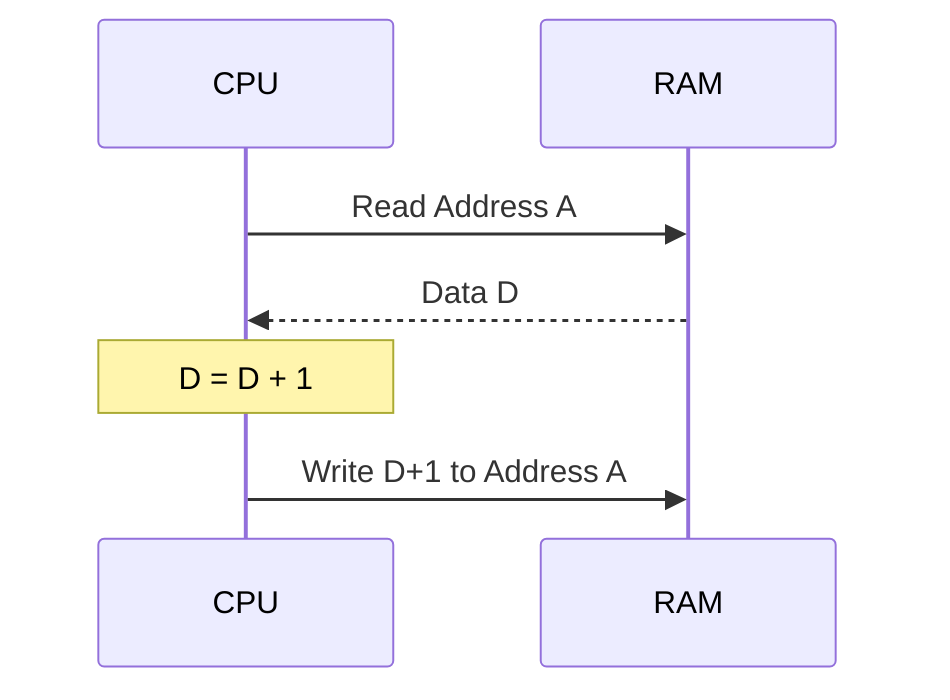

# Day 15: 比較命令と増減 (CMP, INC, DEC, DEX, DEY)

---

🌐 Available languages:
[English](./README.md) | [日本語](./README_ja.md)

## 📜 概要

Phase 3 の締めくくりとして、値を比較してフラグを更新する**比較命令 (CMP, CPX, CPY)**、レジスタデクリメントの**DEX / DEY**、そしてメモリ上の値を直接書き換える**インクリメント (INC) / デクリメント (DEC)**命令を実装します。

比較命令は分岐の直前で多用され、メモリの増減命令はループカウンタをメモリ上に置く際に便利です。DEX/DEY は Day 07 の INX/INY の対になる命令で、レジスタ操作の系列を完成させます。

## 🧠 メモリ構成の注意

Day 10 以降は、リセット後に `boot_loader.sv` が ROM の `$0200` から 256 バイトのプログラムを Gowin BSRAM 製 RAM (`ram.sv`, `$0000-$7FFF`) の `$0200` 以降へコピーし、CPU は RAM から実行します (ROM は `$8000-$FFFF` にマップ)。Day 04〜09 の簡易 ROM から直接実行する構成とは異なります。

## 🎯 学習目標

- **比較の仕組み**: 減算を行い結果は捨ててフラグのみを更新する仕組みの理解。
- **Read-Modify-Write**: メモリから読み込み、加工し、書き戻す一連の動作の実装。
- **フラグ制御**: 比較結果に応じて C, Z, N フラグを正しくセットする。
- **レジスタデクリメント**: Day 07 の `INX`/`INY` に対になる `DEX`/`DEY` の実装 (Z/N フラグ更新、C は不変)。

## 🏗️ 実装する命令



| オペコード | ニーモニック | 説明                        | サイクル数 |
| :--------: | ------------ | --------------------------- | :--------: |
|   `0xC9`   | `CMP #imm`   | A と即値を比較              |     2      |
|   `0xE0`   | `CPX #imm`   | X と即値を比較              |     2      |
|   `0xC0`   | `CPY #imm`   | Y と即値を比較              |     2      |
|   `0xCA`   | `DEX`        | X を -1 (Z/N フラグ更新)    |     2      |
|   `0x88`   | `DEY`        | Y を -1 (Z/N フラグ更新)    |     2      |
|   `0xE6`   | `INC zp`     | 指定アドレスのメモリ値を +1 |     5      |
|   `0xC6`   | `DEC zp`     | 指定アドレスのメモリ値を -1 |     5      |

サイクル数は実機 6502 の参考値です。本カリキュラムの CPU はマルチサイクル FSM による教育的実装のため、実際のサイクル数はこれより多くなります。

## 🛠️ 実装ステップ

1. **比較ロジック**:
    - `CMP` などは `Register - Operand` を計算します。
    - 減算でボローが発生しなければ `C=1`（8bit の符号なし比較で Register >= Operand）。結果の bit 7 を `N`、結果が 0 なら `Z=1` とします。
2. **Read-Modify-Write (RMW)**:
    - `INC` や `DEC` はメモリからデータを読み出すステップ、±1 を計算するステップ、そして同じアドレスに書き戻すステップに分かれます。
    - 既存のステートを再利用します: `STATE_FETCH_OPERAND` でゼロページアドレスを `address_bus` にセットして `STATE_EXECUTE` へ遷移、`STATE_EXECUTE` で `data_in ± 1` を計算して `Z`/`N` を更新し `write_en` を立てて `STATE_WRITE_BACK` へ、`STATE_WRITE_BACK` で `write_en` をクリアして `STATE_FETCH_OPCODE` に戻ります。
3. **レジスタデクリメント (DEX, DEY)**:
    - Day 07 の `INX`/`INY` と同様、`STATE_FETCH_OPCODE` 内で完結する 1 バイト命令です。
    - `DEX` は `x <= x - 1`。結果が 0 なら `Z`、結果の bit 7 を `N` にセットします。`DEY` は `y` に対する同じ処理です。`C` と `V` は変化しません。

## 🧪 動作確認

完成版 CPU テストはこのディレクトリで `make test-cpu` を実行します (共有スターターのテストベンチ `../day15/sim/tb_cpu.sv` を使用します)。`make test` はこれに加えて TFT smoke test、同期 RAM 統合テスト (`test-sync`)、LCD パイプラインテスト (`test-lcd-pipeline`) も実行します。テスト合格は各テストの assertion 範囲だけを確認するもので、全命令や実機動作を保証しません。

- **テストプログラム**:

    ```asm
    LDA #$10
    CMP #$10   ; Z=1, C=1
    BNE FAIL   ; ジャンプしないはず

    LDA #$00
    STA $10    ; メモリ $10 に 0 を保存
    INC $10    ; メモリ $10 の値を 1 にする
    HLT        ; 成功なら $020C で停止
    ```

    これは完成版 `rom.sv` の命令列です (比較が等しければ分岐せず、`STA`/`INC` で `$10` の値が `0` から `1` になります)。共有スターターのテストベンチは別のプログラム (`LDA #$50` / `CMP #$50` ... `HLT`) を注入します。

- **シミュレーション**: `make test-cpu` を実行し、最終的に `RESULT: ALL TESTS PASSED` と表示されることを確認します。
- **実機 (FPGA)**: LCD でメモリやレジスタの変化、フラグの状態を確認します。

## 🏁 Phase 3 完了

おめでとうございます！これで基本的なメモリアクセスとデータ加工命令が揃いました。Day 16 からの**Phase 4**では、インデックス付きアドレッシングや間接アドレッシングといった、6502 の最も強力な機能を実装していきます。
