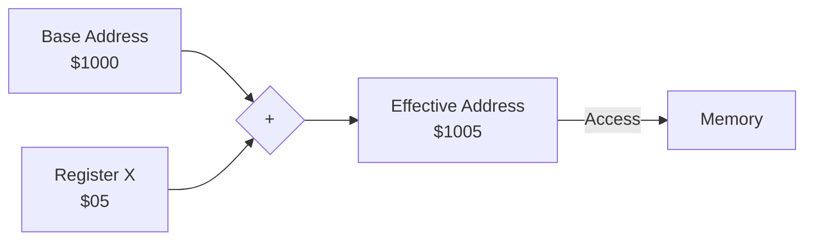

# Day 16: Indexed Addressing (LDA abs,X)

---

🌐 Available languages:
[English](./README.md) | [日本語](./README_ja.md)

## 📜 Overview

Today, we implement one of the features that makes the 6502 incredibly powerful: **Indexed Addressing**.

In this mode, the CPU accesses an address calculated by adding the value of the **X** or **Y** register to a base address. This enables efficient processing of arrays, tables, and lists using loops.

## 🧠 Memory Model Note

From Day 10 onward, the program runs from RAM backed by Gowin BSRAM (`ram.sv`), not the simple ROM used in earlier days.

## 🎯 Learning Objectives

- **Index Calculation**: Understand the timing of adding a register value to a base address.
- **Array Processing**: Buffer or table traversal using loops and the X register.
- **Multi-cycle Logic**: Handling the extra cycles required for address arithmetic.

## 🏗️ Example Instructions



| Opcode | Mnemonic    | Description                   | Cycles |
| :----: | ----------- | ----------------------------- | :----: |
| `0xBD` | `LDA abs,X` | Load A from address (abs + X) |   4+   |
| `0xB9` | `LDA abs,Y` | Load A from address (abs + Y) |   4+   |
| `0x9D` | `STA abs,X` | Store A to address (abs + X)  |   5    |

_Note: The `+` indicates that an extra cycle is added on a real 6502 if a "page boundary" is crossed (e.g., from $xxFF to $yy00). You may implement a simplified fixed-cycle version initially._

## 🛠️ Implementation Steps

1. **Add Address Adder**:
    - Implement logic to add the 8-bit X or Y register value to the 16-bit fetched base address.
    - Example: `effective_address = base_address + X;`
2. **State Machine Adjustment**:
    - Manage the cycles to fetch the base address bytes, perform the addition, and then perform the final memory access.

## 🧪 Verification

This Day includes a CPU testbench. If the starter TODOs are not yet implemented, it is expected and normal for the CPU test to fail. After implementing the TODOs, run `make test-cpu` and confirm the tests pass. Passing the tests verifies the tested scope only and does not guarantee untested instructions or real-hardware behavior.

- **Test Program**:

    ```asm
    LDX #$05
    LDA $1000,X ; A = mem[$1005] = 0x5A (indexed read)
    LDA #$77
    STA $1000,X ; mem[$1005] = 0x77    (indexed write)
    LDY #$05
    LDA $1000,Y ; A = mem[$1005] = 0x77
    HLT
    ```

- **Simulation**: Run `make test-cpu` and verify the indexed memory access testbench outputs `PASS` (`make sim` additionally runs the TFT smoke test).
- **FPGA**: The hardware ROM (`rom.sv`) executes a loop loading array `DATA` ($11, $22, $33). Confirm on the LCD that A sequentially updates to `$11`,`$22`, and `$33`, and finally halts at`A=$33`, `X=$03`.

## 🎯 Next Step

In Day 17, we will tackle the most advanced mode: **Indirect Addressing**. This is essential for handling pointers and dynamic memory access.
