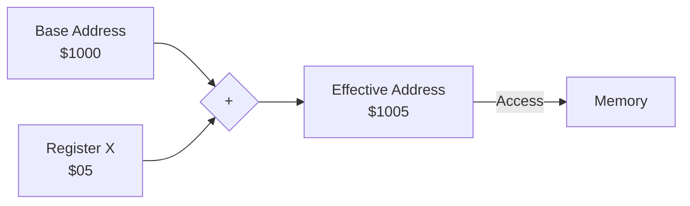

# Day 16: インデックス付きアドレッシング (LDA abs,X)

---

🌐 Available languages:
[English](./README.md) | [日本語](./README_ja.md)

## 📜 概要

今日は 6502 を非常に強力にしている機能の一つ、**インデックス付きアドレッシング**を実装します。

これはベースとなるアドレス（絶対アドレスなど）に、X レジスタまたは Y レジスタの値を加算した場所をアクセスするモードです。これにより、ループを使って配列やテーブルからデータを効率的に読み書きできるようになります。

## 🧠 メモリ構成の注意

Day 10 以降はプログラムを Gowin BSRAM で実装した RAM (`ram.sv`) から実行します。Day 04〜09 の簡易 ROM とは構成が異なります。

## 🎯 学習目標

- **インデックス計算**: ベースアドレス + レジスタ値の計算タイミングの理解。
- **配列処理の基礎**: ループと X レジスタを組み合わせたプログラミング。
- **マルチサイクル処理**: アドレス計算によるクロック数の増加への対応。

## 🏗️ 実装する命令（例）



| オペコード | ニーモニック | 説明                               | サイクル数 |
| :--------: | ------------ | ---------------------------------- | :--------: |
|   `0xBD`   | `LDA abs,X`  | アドレス (abs + X) から A にロード |     4+     |
|   `0xB9`   | `LDA abs,Y`  | アドレス (abs + Y) から A にロード |     4+     |
|   `0x9D`   | `STA abs,X`  | A の値をアドレス (abs + X) に保存  |     5      |

※ `+` はページ境界（$xxFF から $yy00 への跨ぎ）が発生した場合に 1 サイクル増えることを意味しますが、最初は簡略化して実装しても構いません。

## 🛠️ 実装ステップ

1. **アドレス加算器の追加**:
    - フェッチした 16 ビットのベースアドレスに、X または Y レジスタの値を加算するロジックを実装します。
    - 例: `effective_address = base_address + X;`
2. **ステートマシンの調整**:
    - ベースアドレスの 2 バイト目をフェッチした後、加算を行ってからメモリアクセスを行うためのステート管理（あるいはパイプライン）を調整します。

## 🧪 動作確認

Day 05 以降、**テストベンチ (`day16/sim/`) は完成した状態で提供されています。** 自分で作成したコードの正しさを検証するために活用してください。

- **テストプログラム**:

    ```asm
    ; 配列の内容を A に順番にロードする
    LDX #$00
    LOOP:
    LDA DATA,X ; DATA + X 番地からロード
    INX
    CPX #$03
    BNE LOOP
    HLT
    DATA: .byte $11, $22, $33
    ```

- **シミュレーション**: `make sim` を実行し、インデックス付きアドレッシングによって配列データが正しくロードされ、最終的に `PASS` と表示されることを確認します。
- **実機 (FPGA)**: LCD で A レジスタが `$11`, `$22`, `$33` と変化し、最後にループを抜けることを確認します。

## 🎯 次のステップ

Day 17 では、さらに高度な **間接アドレッシング (Indirect Addressing)** に挑戦します。ポインタ変数を使いこなすための、6502 の最難関モードです。
