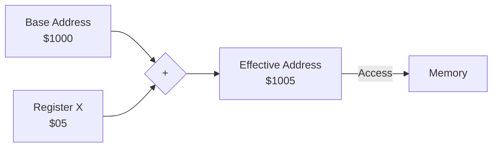

# Day 16: インデックス付きアドレッシング (LDA abs,X)

---

🌐 Available languages:
[English](./README.md) | [日本語](./README_ja.md)

## 📜 概要

今日は 6502 を非常に強力にしている機能の一つ、**インデックス付きアドレッシング**を実装します。

これはベースとなるアドレス（絶対アドレスなど）に、X レジスタまたは Y レジスタの値を加算した場所をアクセスするモードです。これにより、ループを使って配列やテーブルからデータを効率的に読み書きできるようになります。

## 🧠 メモリ構成の注意

Day 10 以降はプログラムを Gowin BSRAM で実装した RAM (`ram.sv`) から実行します。Day 04〜09 の簡易 ROM とは構成が異なります。

## 🎯 学習目標

- **インデックス計算**: ベースアドレス + レジスタ値の計算タイミングの理解。
- **配列処理の基礎**: ループと X レジスタを組み合わせたプログラミング。
- **マルチサイクル処理**: アドレス計算によるクロック数の増加への対応。

## 🏗️ 実装する命令（例）


```mermaid
graph LR
    Base[Base Address<br/>$1000]
    RegX[Register X<br/>$05]
    Adder{+}
    Eff[Effective Address<br/>$1005]
    Mem[Memory]

    Base --> Adder
    RegX --> Adder
    Adder --> Eff
    Eff -->|Access| Mem
```

| オペコード | ニーモニック | 説明                               | サイクル数 |
| :--------: | ------------ | ---------------------------------- | :--------: |
|   `0xBD`   | `LDA abs,X`  | アドレス (abs + X) から A にロード |     4+     |
|   `0xB9`   | `LDA abs,Y`  | アドレス (abs + Y) から A にロード |     4+     |
|   `0x9D`   | `STA abs,X`  | A の値をアドレス (abs + X) に保存  |     5      |

※ `LDA abs,X` / `LDA abs,Y` はページを跨ぐと 1 サイクル増えます。`STA abs,X` はページ跨ぎの有無にかかわらず 5 サイクルです。表は NMOS 6502 の基本タイミングであり、教材 CPU の実装・テストで一致するかは別途確認してください。

## 🛠️ 実装ステップ

1. **アドレス加算器の追加**:
    - フェッチした 16 ビットのベースアドレスに、X または Y レジスタの値を加算するロジックを実装します。
    - 例: `effective_address = base_address + X;`
2. **ステートマシンの調整**:
    - ベースアドレスの 2 バイト目をフェッチした後、加算を行ってからメモリアクセスを行うためのステート管理（あるいはパイプライン）を調整します。

## 🧪 動作確認

この Day には CPU テストベンチが含まれます。スターターの TODO が未実装なら CPU テストは失敗するのが正常です。実装後に `make test-cpu` を実行し、対応するテストが通ることを確認してください。テスト合格はテスト対象範囲の確認であり、未テストの命令や実機動作は保証しません。

- **テストプログラム**:

    ```asm
    LDX #$05
    LDA $1000,X ; A = mem[$1005] = 0x5A (indexed read)
    LDA #$77
    STA $1000,X ; mem[$1005] = 0x77    (indexed write)
    LDY #$05
    LDA $1000,Y ; A = mem[$1005] = 0x77
    HLT
    ```

- **シミュレーション**: `make test-cpu` を実行し、上記テストベンチのインデックス付き読み書きテストで最終的に `PASS` と表示されることを確認します (`make sim` は CPU テストに加えて TFT smoke test も実行します)。
- **実機 (FPGA)**: 実機 ROM (`rom.sv`) では配列 `DATA` ($11, $22, $33) を順次ロードするループが走り、LCD 上で A レジスタが `$11`、`$22`、`$33` と変化して最終的に `A=$33`, `X=$03` で停止することを確認します。

## 🎯 次のステップ

Day 17 では、さらに高度な**間接アドレッシング (Indirect Addressing)**に挑戦します。ポインタ変数を使いこなすための、6502 の最難関モードです。
