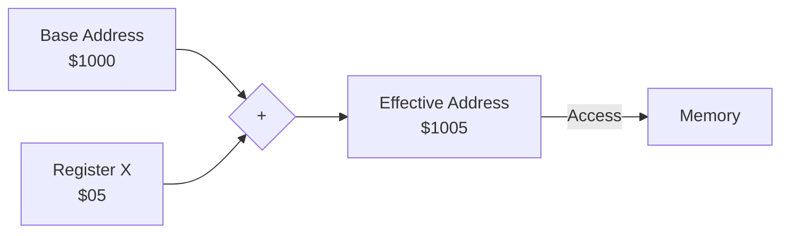

# Day 16: Indexed Addressing (LDA abs,X / abs,Y, STA abs,X)

---

🌐 Available languages:
[English](./README.md) | [日本語](./README_ja.md)

## Lesson at a glance

The reference solution already implements the tasks below.

| Item | Details |
| --- | --- |
| Where to edit | Indexed load/store TODOs in cpu.sv |
| Provided foundation | Instructions through DEX/DEY |
| Expected test results | Indexed reads/writes in the CPU test yield A=$77 |
| What to observe on hardware | ROM reads array values $11 → $22 → $33 and halts with A=$33/X=$03 |

## 📜 Overview

Today, we implement one of the features that makes the 6502 incredibly powerful: **Indexed Addressing**.

In this mode, the CPU accesses an address calculated by adding the value of the **X** or **Y** register to a base address. This enables efficient processing of arrays, tables, and lists using loops.

## 🧠 Memory Model Note

From Day 10 onward, the program runs from RAM backed by Gowin BSRAM (`ram.sv`), not the simple ROM used in earlier days. The CPU sees `$0000-$7FFF` as RAM and `$8000-$FFFF` as ROM; after reset, `boot_loader.sv` copies the 256-byte boot image from ROM into RAM starting at `$0200` before execution begins.

## 🎯 Learning Objectives

- **Index Calculation**: Understand the timing of adding a register value to a base address.
- **Array Processing**: Buffer or table traversal using loops and the X register.
- **Multi-cycle Logic**: Handling the extra cycles required for address arithmetic.

## 🏗️ Instructions to Implement



| Opcode | Mnemonic    | Description                   | Cycles |
| :----: | ----------- | ----------------------------- | :----: |
| `0xBD` | `LDA abs,X` | Load A from address (abs + X) |   4+   |
| `0xB9` | `LDA abs,Y` | Load A from address (abs + Y) |   4+   |
| `0x9D` | `STA abs,X` | Store A to address (abs + X)  |   5    |

_Note: The cycle counts are those of a real 6502. `LDA abs,X` / `LDA abs,Y` take an extra cycle when a page boundary is crossed (e.g., from $xxFF to $yy00), while `STA abs,X` always takes 5 cycles. This educational CPU performs a single 16-bit add onto the base address with fixed cycles, so there is no page-crossing penalty._

## 🛠️ Implementation Steps

1. **Add Address Adder**:
    - Implement logic to add the 8-bit X or Y register value to the 16-bit fetched base address.
    - Example: `effective_address = base_address + X;`
2. **State Machine Adjustment**:
    - Manage the cycles to fetch the base address bytes, perform the addition, and then perform the final memory access.

## 🧪 Verification

Run the completed CPU test with `make test-cpu` in this directory. The shared starter testbench `../day16/sim/tb_cpu.sv` verifies indexed reads and writes with `LDA abs,X` / `LDA abs,Y` / `STA abs,X`. `make test` additionally runs the TFT smoke test (`test-lcd`), the synchronous-RAM integration test (`test-sync`: step periods 1/4/16 plus manual stepping), and the LCD pipeline check (`test-lcd-pipeline`). `make sim` runs only the TFT smoke test. Passing the tests verifies the asserted scope only and does not guarantee untested instructions or real-hardware behavior.

- **Test Program**:

    ```asm
    ; Load array elements into A sequentially
    LDX #$00
    LOOP:
    LDA DATA,X ; Load from DATA + X
    INX
    CPX #$03
    BNE LOOP
    HLT
    DATA: .byte $11, $22, $33
    ```

    This is the instruction sequence in the completed `rom.sv` (`LDA DATA,X` assembles to `LDA $020B,X`, with `DATA` placed at `$020B-$020D`). The shared starter testbench injects a different program.

- **FPGA**: Confirm on the LCD that the A register sequentially changes to `$11`, `$22`, and `$33`, and that the program exits the loop and halts with `A=$33`, `X=$03`. On hardware, a 24-bit counter in `lcd_demo.sv` throttles `pc_enable` so the CPU runs slowly enough to follow the register changes by eye.

## 🎯 Next Step

In Day 17, we will tackle the most advanced mode: **Indirect Addressing**. This is essential for handling pointers and dynamic memory access.

CPU unit tests and the hardware ROM use different inputs. The hardware expectations above are derived from `rom.sv` and the LCD wiring; they do not mean that operation has been verified on every board.

See [synchronous RAM timing](../docs/DAY18_TO_DAY99.md#synchronous-ram-read-timing) for request and capture timing. At startup, PLL LOCK is synchronized and must remain stable for 16 clocks before boot begins.

LCD VSync passes through a two-stage synchronizer into the display-write clock domain. Its rising edge starts a frame update. VRAM and font reads remain in the pixel-clock domain.
