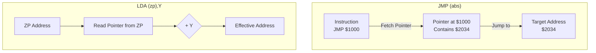

# Day 17: 間接アドレッシング ((zp,X), (zp),Y)

---

🌐 Available languages:
[English](./README.md) | [日本語](./README_ja.md)

## 📜 概要

今日は 6502 で最も複雑、かつ最も強力な **間接アドレッシング (Indirect Addressing)** を実装します。

**例え:**
これは **「宝探し」** や C 言語の **「ポインタへのポインタ (`**ptr`)」** に似ています。

1. **即値 (Immediate)**: 「宝はここにある。」
2. **絶対 (Absolute)**: 「宝は 1 丁目 1 番地にある。」
3. **間接 (Indirect)**: 「1 丁目 1 番地に行け。そこに、宝のありかが書かれたメモがある。」

これは C 言語などの「ポインタ」のハードウェア実装そのものであり、OS や本格的なアプリケーションの開発には欠かせません。

## 🎯 学習目標

- **ポインタの概念**: 「アドレスが入ったアドレス」を読み取る仕組みの理解。
- **インデックス付き間接**: `(zp,X)` と `(zp),Y` の動作の違いを学ぶ。
- **多段メモリアクセス**: 1 命令の中で何度もメモリ番地をフェッチする複雑なステート管理。

## 🏗️ 実装する命令（例）



| オペコード | Mnemonic     | 説明                                         | サイクル数 |
| :--------: | ------------ | -------------------------------------------- | :--------: |
|   `0x6C`   | `JMP (abs)`  | 指定番地に書かれた 16bit アドレスへジャンプ  |     5      |
|   `0xA1`   | `LDA (zp,X)` | ポインタ計算 (zp+X) 後、その先の内容をロード |     6      |
|   `0xB1`   | `LDA (zp),Y` | ポインタ取得後、その値に Y を足してロード    |     5+     |

## 🛠️ 実装ステップ

1. **間接アドレスのフェッチ**:
    - オペランドで示された番地（例：ゼロページ）から 2 バイトを読み取り、一時的な 16 ビットアドレスレジスタに格納します。
2. **インデックスの加算**:
    - `(zp,X)`: ゼロページ内で X を足してからポインタを読み取ります。
    - `(zp),Y`: ポインタを読み取った後に Y を足して最終アドレスを決めます。
3. **複雑なステートマシンの実装**:
    - 1 つの命令で 5 ～ 6 サイクルを要するため、状態を細かく分けて制御します。

## 🧪 動作確認

Day 05 以降、**テストベンチ (`day17/sim/`) は完成した状態で提供されています。** 自分で作成したコードの正しさを検証するために活用してください。

- **テストプログラム**:

    ```asm
    JSR sub    ; サブルーチン呼び出し
    HLT

sub:
    LDA #$42
    RTS        ; サブルーチンから復帰
    ```

- **シミュレーション**: `make sim` を実行し、サブルーチンへの遷移と復帰が正しく行われ、最終的に `PASS` と表示されることを確認します。
- **実機 (FPGA)**: LCD で PC がジャンプし、再び戻ってくる様子を確認します。

## 🎯 次のステップ

Day 18 では、6502 の標準セットにはない、FPGA 独自の **カスタム命令 (HLT, WVS, CVR, IFO)** を CPU に追加し、ハードウェアをより直接的に制御します。
