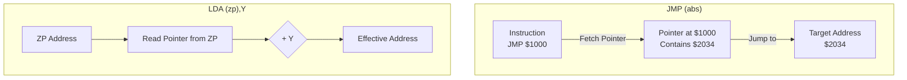

# Day 17: Indirect Addressing ((zp,X), (zp),Y)

---

🌐 Available languages:
[English](./README.md) | [日本語](./README_ja.md)

## 📜 Overview

Today, we implement the most complex and powerful addressing modes of the 6502: **Indirect Addressing**.

In these modes, the CPU doesn't look at the data at the specified address. Instead, it looks at that address to find _another_ address, and then accesses the data there. This is the hardware implementation of "pointers" in languages like C, and it is essential for operating systems and sophisticated applications.

## 🧠 Memory Model Note

From Day 11 onward, the program runs from RAM backed by Gowin BSRAM (`ram.sv`), not the simple ROM used in earlier days.

## 🎯 Learning Objectives

- **Pointer Concepts**: Understand how to fetch an "address of an address."
- **Pre- vs. Post-Indexing**: Learn the difference between `(zp,X)` and `(zp),Y`.
- **Complex Memory Fetches**: Manage state transitions for instructions that perform multiple memory reads in a single opcode.

## 🏗️ Example Instructions



| Opcode | Mnemonic     | Description                                        | Cycles |
| :----: | ------------ | -------------------------------------------------- | :----: |
| `0x6C` | `JMP (abs)`  | Indirect Jump: Jump to address stored at `abs`     |   5    |
| `0xA1` | `LDA (zp,X)` | Pre-indexed Indirect: Load from `pointer(zp+X)`    |   6    |
| `0xB1` | `LDA (zp),Y` | Post-indexed Indirect: Load from `pointer(zp) + Y` |   5+   |

## 🛠️ Implementation Steps

1. **Indirect Address Fetching**:
    - Fetch the 2 bytes from the specified memory location (e.g., Zero Page) and store them in a temporary 16-bit internal register.
2. **Indexing Logic**:
    - `(zp,X)`: Add X to the page-0 address _before_ fetching the pointer.
    - `(zp),Y`: Fetch the pointer from page-0 _first_, then add Y to get the final effective address.
3. **Advanced FSM Control**:
    - Since these instructions take 5 to 6 cycles, ensure your state machine correctly sequences the operand fetch, pointer fetch, and final data access/operation.

## 🧪 Verification

- **Test Program**:

    ```asm
    LDA #$20
    STA $10    ; Store $20 at $0010
    LDA #$80
    STA $11    ; Store $80 at $0011 -> Pointer value is now $8020

    LDY #$01
    LDA ($10),Y ; Load from address ($8020 + 1) = $8021
    ```

- **FPGA**: Verify on the LCD that the final data loaded into A matches the content of the address pointed to by your memory variable.

## 🎯 Next Step

In Day 18, we will break away from the standard 6502 set and implement **Custom FPGA Instructions (HLT, WVS, CVR, IFO)** to take direct control of our hardware peripherals.
