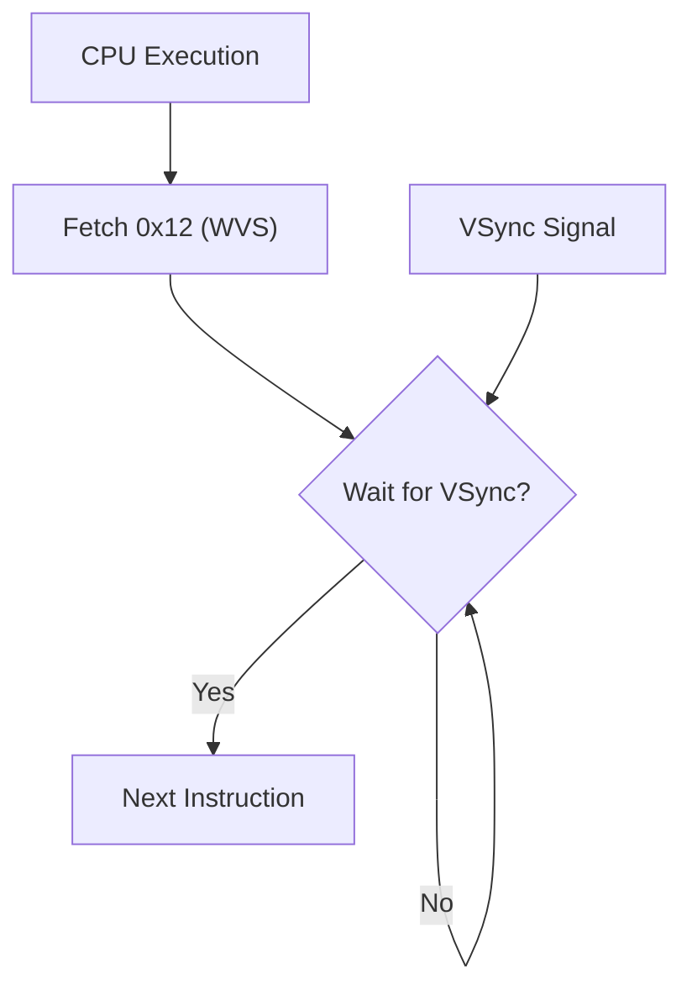

# Day 18: Custom Instructions (WVS, CVR, IFO)

---

🌐 Available languages:
[English](./README.md) | [日本語](./README_ja.md)

## 📜 Overview

One of the best parts of building your own CPU on an FPGA is adding "original instructions" that don't exist in standard architectures. Today, we will use unused 6502 opcodes to implement **custom instructions** that directly control the FPGA hardware.

This allows the program to halt the CPU, control VRAM writing, and perform other unique operations.

## 🧠 Memory Model Note

From Day 10 onward, the program runs from RAM backed by Gowin BSRAM (`ram.sv`), not the simple ROM used in earlier days.

## 🎯 Learning Objectives

- **Defining Custom Instructions**: How to use unused opcodes.
- **Hardware Interfacing**: Understanding how instruction execution affects external hardware (like LCD drivers).
- **Architecture Flexibility**: Learning the concept of "accelerators" where software directly triggers hardware functions.

## 🏗️ Custom Instructions to Implement



| Opcode | Mnemonic     | Description                                                   |
| :----: | ------------ | ------------------------------------------------------------- |
| `0x12` | `WVS #count` | **Wait for V-Sync**: Wait for a specified number of V-Syncs.  |
| `0x22` | `CVR`        | **Clear VRAM**: Clear VRAM or fill with a specific color.     |
| `0x32` | `IFO`        | **Info**: Display debug info (registers, PC, etc.) on screen. |

> [!NOTE]
> Previously, the CPU speed was intentionally throttled for debugging. With the `WVS` instruction, we can now synchronize with the display in software, so the CPU now runs at the full FPGA clock speed (approx. 40MHz).

## 🛠️ Implementation Steps

1. **Opcode Assignment**:
    - Define new instructions in `opcodes.svh`.
2. **Decoder and Execution Logic**:
    - Change `WVS` to a 2-byte instruction and implement logic to wait for the specified number of rising edges of the `v-sync` signal.
3. **External Signal Definition**:
    - Add `vsync` input and notification signals to the `cpu` module's ports and connect them to external hardware.

## 🧪 Verification

Starting from Day 05, **the testbench (`day18/sim/`) is provided in a complete state.** Use it to verify the correctness of your implementation.

- **Test Program**:

    ```asm
    LDA #$01
    STA $00    ; Initialize memory
    LOOP:
    INC $00
    IFO        ; Debug display
    WVS #$3A   ; Wait 58 V-Syncs (approx. 1 second)
    JMP LOOP
    ```

- **Simulation**: Run `make sim` and verify that the system works in harmony and the simulation outputs `PASS`.
- **FPGA**: Confirm on the LCD that all CPU states transition as intended by the program.

## 🎉 Congratulations

You have finally completed the entire 18-day curriculum!
By building a 6502 CPU on an FPGA and adding your own custom instructions, you have gained deep knowledge that bridges the gap between hardware and software.

This journey doesn't end here. The possibilities are endless: you can make this CPU even faster, add more instructions, or even challenge yourself to build a completely new architecture.

We wish you all the best in your future endeavors as an engineer!
