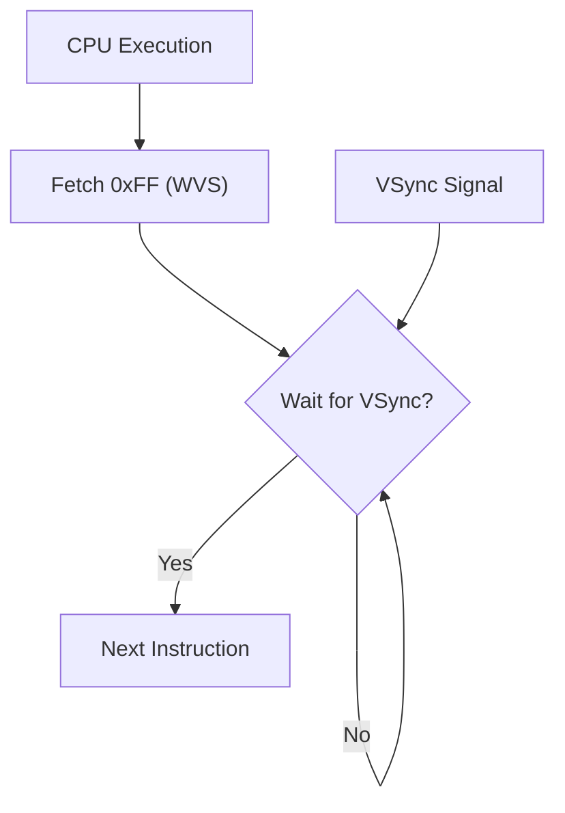

# Day 18: Custom Instructions (WVS, CVR, IFO, HLT)

---

🌐 Available languages:
[English](./README.md) | [日本語](./README_ja.md)

## 📜 Overview

One of the best parts of building your own CPU on an FPGA is adding "original instructions" that don't exist in standard architectures. Today, we will use unused 6502 opcodes to implement **custom instructions** that directly control the FPGA hardware.

This allows the program to halt the CPU, control VRAM writing, and perform other unique operations.

## 🧠 Memory Model Note

From Day 10 onward, the program runs from RAM backed by Gowin BSRAM (`ram.sv`), not the simple ROM used in earlier days.

## 🎯 Learning Objectives

- **Defining Custom Instructions**: How to use unused opcodes.
- **Hardware Interfacing**: Understanding how instruction execution affects external hardware (like LCD drivers).
- **Architecture Flexibility**: Learning the concept of "accelerators" where software directly triggers hardware functions.

## 🏗️ Custom Instructions to Implement


```mermaid
graph TD
    CPU[CPU Execution] --> Fetch["Fetch 0xFF (WVS)"]
    Fetch --> Wait{Wait for VSync?}
    VSync[VSync Signal] --> Wait
    Wait -- No --> Wait
    Wait -- Yes --> Next[Next Instruction]
```

| Opcode | Mnemonic     | Description                                                                      |
| :----: | ------------ | -------------------------------------------------------------------------------- |
| `0xFF` | `WVS #count` | **Wait for V-Sync**: In Day 18, operand N waits for max(1,N) VSync rising edges. |
| `0xCF` | `CVR`        | **Clear VRAM**: Request the peripheral circuit to clear VRAM.                    |
| `0xDF` | `IFO`        | **Info**: Request the peripheral circuit to display debug information.           |
| `0xEF` | `HLT`        | **Halt CPU**: Stop the CPU while the LCD controller keeps running.               |

`CVR` and `IFO` are request signals from the CPU to the peripheral circuit. The CPU instruction execution cycle and the time needed for VRAM clearing or character rendering are separate things.

> [!NOTE]
> Through Day 17 the CPU was throttled via `pc_enable` in `lcd_demo.sv` for debugging. In Day 18 the CPU runs continuously (`pc_enable = 1`) and synchronizes with the display in software via the `WVS` instruction. The CPU/memory clock (`MEMORY_CLK`) in Day 18 is 27MHz on the 9K board only (Day 04-17 used 40.5MHz) and 40.5MHz on the 20K board (see `day18_*.sdc`).

## 🛠️ Implementation Steps

The starter `cpu.sv` already implements all instructions through Day 17, including `HLT` (`$EF`). The TODOs are the three instructions `WVS` / `CVR` / `IFO`.

1. **Opcode Assignment**:
    - Define new instructions in `opcodes.svh`.
2. **Decoder and Execution Logic**:
    - Implement `WVS` as an opcode plus a 1-byte immediate operand. In the Day 18 spec, operand N waits for max(1,N) rising edges (zero also waits once) (Day 99 waits for N+1, so beware the spec difference).
3. **External Signal Definition**:
    - Add `vsync` input and notification signals to the `cpu` module's ports and connect them to external hardware.

## 🧪 Verification

This Day includes a CPU testbench. If the starter TODOs are not yet implemented, it is expected and normal for the CPU test to fail. After implementing the TODOs, run `make test-cpu` and confirm the tests pass. Passing the tests verifies the tested scope only and does not guarantee untested instructions or real-hardware behavior.

- **Program injected by the testbench** (`sim/tb_cpu.sv`):

    ```asm
    CVR        ; vram_clear pulses for exactly 1 cycle
    WVS #2     ; PC holds at $0202 until 2 VSync rising edges (Day 18 semantics)
    IFO        ; show_info pulses for exactly 1 cycle
    JSR $0210  ; subroutine: LDA #$37 / RTS (returns to $0207)
    HLT        ; PC stops at $0207 (vram_clear/show_info stay low)
    ```

    The testbench injects this program into its own memory model, so it is separate from the `rom.sv` program that runs on hardware.

- **Hardware program** (`rom.sv`):

    ```asm
    LDA #$01
    STA $00    ; $00 = $01
    LDA #$02
    STA $01    ; $01 = $02
    LDA #$03
    STA $02    ; $02 = $03
    LOOP:      ; $020C
    CLC
    ADC #$01   ; A += 1
    INX
    INY
    IFO        ; request debug display
    WVS #$3A   ; wait for 58 VSyncs (approx. 1 second)
    JMP LOOP
    ```

- **Simulation**: Run `make test-cpu` and verify the simulation outputs `PASS` (`make sim` additionally runs the TFT smoke test).
- **FPGA**: Confirm that the IFO display refreshes about once per second and the A/X/Y registers count up on the LCD.

## 🎉 Congratulations

You have finally completed the entire 18-day curriculum!
By building a 6502 CPU on an FPGA and adding your own custom instructions, you have gained deep knowledge that bridges the gap between hardware and software.

This journey doesn't end here. The possibilities are endless: you can make this CPU even faster, add more instructions, or even challenge yourself to build a completely new architecture.

We wish you all the best in your future endeavors as an engineer!
