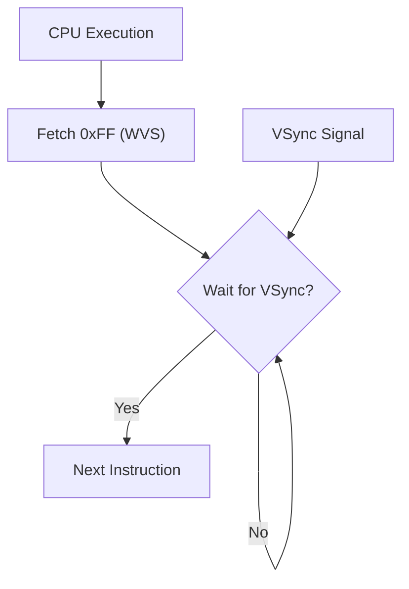

# Day 18: 独自拡張命令 (WVS, CVR, IFO, HLT)

---

🌐 Available languages:
[English](./README.md) | [日本語](./README_ja.md)

## 実習の見取り図

この Day のスターターを編集します。

| 項目               | 内容                                                                                                               |
| ------------------ | ------------------------------------------------------------------------------------------------------------------ |
| 編集する箇所       | cpu.sv のWVS/CVR/IFO TODO                                                                                          |
| 用意されているもの | HLT、同期VSync、PLL LOCK待ち、表示FSM                                                                              |
| テストの期待値     | スターターのCPUテストはCVR/IFOパルスとWVS #2を確認。WVS #0と同期 RAM と表示回路の統合テストはday18_completedに用意 |
| 実機で見るもの     | ROMはIFO表示を約1秒ごとに更新しA/X/Yを増加                                                                         |

## 📜 概要

FPGA で CPU を自作する醍醐味の一つは、既存のアーキテクチャにない「自分だけの命令」を追加できることです。今日は、6502 の未使用オペコードを使って、FPGA ハードウェアを直接制御する**カスタム命令**を実装します。

これにより、プログラムから CPU を停止させたり、VRAM の書き込みを制御したりするなどの独自の操作が可能になります。

## 🧠 メモリ構成の注意

Day 10 以降はプログラムを Gowin BSRAM で実装した RAM (`ram.sv`) から実行します。Day 04〜09 の簡易 ROM とは構成が異なります。

## 🎯 学習目標

- **カスタム命令の定義**: 未使用オペコードの活用方法。
- **ハードウェアとの直結**: 命令実行が CPU 外部の周辺回路（LCD ドライバ等）に与える影響。
- **アーキテクチャの柔軟性**: ソフトウェアでハードウェア機能を直接叩く「アクセラレータ」の概念。

## 🏗️ 実装するカスタム命令



| オペコード | ニーモニック | 説明                                                                          |
| :--------: | ------------ | ----------------------------------------------------------------------------- |
| `0xFF`     | `WVS #count` | **Wait for V-Sync**: Day 18実装では`max(1,count)` 回のVSync立ち上がりを待つ。 |
| `0xCF`     | `CVR`        | **Clear VRAM**: 周辺回路へVRAMクリアを要求する。                              |
| `0xDF`     | `IFO`        | **Info**: 周辺回路へデバッグ情報の表示を要求する。                            |
| `0xEF`     | `HLT`        | **Halt CPU**: LCD コントローラを動かしたまま CPU を停止する。                 |

`CVR` と `IFO` は CPU から周辺回路への要求信号です。CPU 命令の実行サイクルと、VRAM 消去や文字描画に要する時間は別です。

> [!NOTE]
> Day 17 まではデバッグのため `lcd_demo.sv` の `pc_enable` で CPU を減速していました。Day 18 では `pc_enable = 1` で CPU を常時動作させ、表示との同期は `WVS` 命令で取ります。CPU/メモリクロック (`MEMORY_CLK`) は Day 18 のみ 9K ボードでは 27MHz（Day 04〜17 は 40.5MHz）、20K ボードでは 40.5MHz です（`day18_*.sdc` を参照）。

## 🛠️ 実装ステップ

スターター版 `cpu.sv` には `HLT` (`$EF`) を含む Day 17 までの命令が実装済みです。TODO は `WVS` / `CVR` / `IFO` の 3 命令です。

1. **オペコードの割り当て**:
    - `opcodes.svh` に新しい命令を定義します。
2. **デコーダと実行ロジック**:
    - `WVS` をオペコードと 1 バイトの即値オペランドからなる命令として実装し、Day 18 の仕様ではオペランド N に対して `max(1,N)` 回待ちます（0 も 1 回）（Day 99 では N+1 回待つため、仕様差に注意）。
3. **外部信号の定義**:
    - `cpu` モジュールのポートに `vsync` 入力、および周辺ハードウェアへの通知信号を追加し、接続します。

## 🧪 動作確認

この Day には CPU テストベンチが含まれます。スターターの TODO が未実装なら CPU テストは失敗するのが正常です。実装後に `make test-cpu` を実行し、対応するテストが通ることを確認してください。テストの合格によって確認できるのは、テストした範囲だけです。未テストの命令や実機での動作を保証するものではありません。

- **テストベンチが注入するプログラム** (`sim/tb_cpu.sv`):

    ```asm
    CVR        ; vram_clear がちょうど 1 サイクル立ち上がる
    WVS #2     ; 2 回の VSync 立ち上がりまで PC が $0202 で保持される (Day 18 の仕様)
    IFO        ; show_info がちょうど 1 サイクル立ち上がる
    JSR $0210  ; サブルーチン: LDA #$37 / RTS ($0207 へ復帰)
    HLT        ; PC が $0207 で停止 (vram_clear/show_info は Low のまま)
    ```

    テストベンチはこのプログラムを独自のメモリモデルへ注入するため、実機で動く `rom.sv` とは別です。

- **実機プログラム** (`rom.sv`):

    ```asm
    LDA #$01
    STA $00    ; $00 = $01
    LDA #$02
    STA $01    ; $01 = $02
    LDA #$03
    STA $02    ; $02 = $03
    LOOP:      ; $020C
    CLC
    ADC #$01   ; A += 1
    INX
    INY
    IFO        ; デバッグ表示を要求
    WVS #$3A   ; 58 回の VSync を待つ（約 1 秒）
    JMP LOOP
    ```

- **シミュレーション**: `make test-cpu` を実行し、最終的に `PASS` と表示されることを確認します (`make sim` は CPU テストに加えて TFT smoke test も実行します)。
- **実機 (FPGA)**: LCD の IFO 表示が約 1 秒ごとに更新され、A/X/Y レジスタがカウントアップすることを確認します。

## 🎉 おめでとうございます

ついに全 18 日間のカリキュラムを完遂しました！
FPGA 上に 6502 CPU を構築し、さらに独自の拡張命令まで追加したあなたは、ハードウェアとソフトウェアの架け橋となる深い知識を手に入れました。

この旅はここで終わるわけではありません。この CPU をさらに高速化したり、より多くの命令を追加したり、あるいは全く新しいアーキテクチャに挑戦したりと、可能性は無限大です。

あなたのエンジニアとしてのさらなる飛躍を心より応援しています！

CPU 単体テストと実機 ROM では、実行するプログラムが異なります。表に示した実機での期待値は `rom.sv` と LCD の配線から判断した値であり、すべてのボードで実機確認を済ませたという意味ではありません。

同期 RAM に読み出しを要求してからデータを取り込むまでのタイミングは[同期RAMの説明](../docs/DAY18_TO_DAY99_ja.md#同期ramを読むときの時間)を参照してください。起動時は PLL LOCK を同期し、16 クロック連続で安定したことを確認してからブート処理を開始します。
