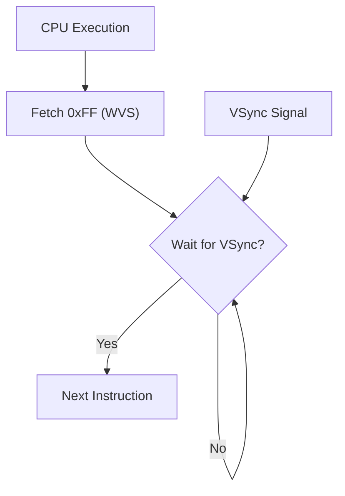

# Day 18: Custom Instructions (WVS, CVR, IFO)

---

🌐 Available languages:
[English](./README.md) | [日本語](./README_ja.md)

## 📜 Overview

One of the best parts of building your own CPU on an FPGA is adding "original instructions" that don't exist in standard architectures. Today, we will use unused 6502 opcodes to implement **custom instructions** that directly control the FPGA hardware.

This allows the program to halt the CPU, control VRAM writing, and perform other unique operations.

## 🧠 Memory Model Note

From Day 10 onward, the program runs from RAM backed by Gowin BSRAM (`ram.sv`), not the simple ROM used in earlier days.

## 🎯 Learning Objectives

- **Defining Custom Instructions**: How to use unused opcodes.
- **Hardware Interfacing**: Understanding how instruction execution affects external hardware (like LCD drivers).
- **Architecture Flexibility**: Learning the concept of "accelerators" where software directly triggers hardware functions.

## 🏗️ Custom Instructions to Implement



| Opcode | Mnemonic     | Description                                                   |
| :----: | ------------ | ------------------------------------------------------------- |
| `0xFF` | `WVS #count` | **Wait for V-Sync**: Wait for a specified number of V-Syncs.  |
| `0xCF` | `CVR`        | **Clear VRAM**: Clear VRAM or fill with a specific color.     |
| `0xDF` | `IFO`        | **Info**: Display debug info (registers, PC, etc.) on screen. |
| `0xEF` | `HLT`        | **Halt CPU**: Stop the CPU; the LCD controller keeps running. |

> [!NOTE]
> Previously, the CPU speed was intentionally throttled for debugging. With the `WVS` instruction, we can now synchronize with the display in software, so the CPU now runs at the full FPGA clock speed (27MHz on 9K, 40.5MHz on 20K, see day18_*.sdc).

## 🛠️ Implementation Steps

1. **Opcode Assignment**:
    - Define new instructions in `opcodes.svh`.
2. **Decoder and Execution Logic**:
    - Change `WVS` to a 2-byte instruction and implement logic to wait for the specified number of rising edges of the `v-sync` signal.
3. **External Signal Definition**:
    - Add `vsync` input and notification signals to the `cpu` module's ports and connect them to external hardware.

## 🧪 Verification

- **Test Program**:

    ```asm
    LDA #$01
    STA $00    ; Initialize memory
    LOOP:
    INC $00
    IFO        ; Debug display
    WVS #$3A   ; Wait for 58 V-Syncs (approx. 1 second)
    JMP LOOP
    ```

- **FPGA**: Confirm that the display updates synchronously and shows registers and memory dumps counting up every second.
  The right column of the memory area is a day99-style LED view: memory row `0x0k` shows byte `$0k` as eight `@` (1) / space (0) cells, bit 7 down to bit 0 under the `76543210` header, with a `0x0k:` label to the left of each row.

## 🎉 Congratulations

You have successfully completed the entire 18-day curriculum!
By building a 6502 CPU from scratch on an FPGA and even adding your own custom instructions, you have gained deep knowledge that bridges the gap between hardware and software.

This journey doesn't end here. You now have the foundation to optimize this CPU, add more instructions, or even dive into entirely new architectures. The possibilities are endless!

Wishing you the very best in your future engineering endeavors!
