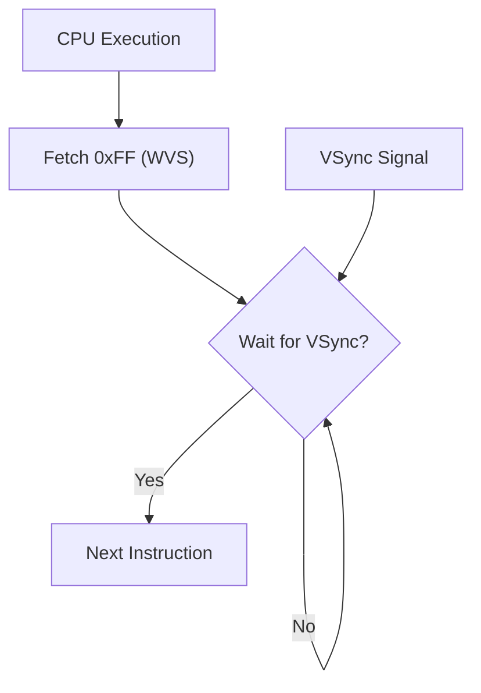

# Day 18: 独自拡張命令 (WVS, CVR, IFO, HLT)

---

🌐 Available languages:
[English](./README.md) | [日本語](./README_ja.md)

## 📜 概要

FPGA で CPU を自作する醍醐味の一つは、既存のアーキテクチャにない「自分だけの命令」を追加できることです。今日は、6502 の未使用オペコードを使って、FPGA ハードウェアを直接制御する**カスタム命令**を実装します。

これにより、プログラムから CPU を停止させたり、VRAM の書き込みを制御したりするなどの独自の操作が可能になります。

## 🧠 メモリ構成の注意

Day 10 以降はプログラムを Gowin BSRAM で実装した RAM (`ram.sv`) から実行します。Day 04〜09 の簡易 ROM とは構成が異なります。

## 🎯 学習目標

- **カスタム命令の定義**: 未使用オペコードの活用方法。
- **ハードウェアとの直結**: 命令実行が CPU 外部の周辺回路（LCD ドライバ等）に与える影響。
- **アーキテクチャの柔軟性**: ソフトウェアでハードウェア機能を直接叩く「アクセラレータ」の概念。

## 🏗️ 実装するカスタム命令



| オペコード | ニーモニック | 説明                                                                     |
| :--------: | ------------ | ------------------------------------------------------------------------ |
|   `0xFF`   | `WVS #count` | **Wait for V-Sync**: Day 18実装では指定した回数のVSync立ち上がりを待つ。 |
|   `0xCF`   | `CVR`        | **Clear VRAM**: 周辺回路へVRAMクリアを要求する。                         |
|   `0xDF`   | `IFO`        | **Info**: 周辺回路へデバッグ情報の表示を要求する。                       |
|   `0xEF`   | `HLT`        | **Halt CPU**: LCD コントローラを動かしたまま CPU を停止する。            |

`CVR` と `IFO` は CPU から周辺回路への要求信号です。CPU 命令の実行サイクルと、VRAM 消去や文字描画に要する時間は別です。

> [!NOTE]
> Day 17 まではデバッグのため `lcd_demo.sv` の `pc_enable` で CPU を減速していました。Day 18 では `pc_enable = 1` で CPU を常時動作させ、表示との同期は `WVS` 命令で取ります。CPU/メモリクロック (`MEMORY_CLK`) は Day 18 のみ 9K ボードでは 27MHz（Day 04〜17 は 40.5MHz）、20K ボードでは 40.5MHz です（`day18_*.sdc` を参照）。

## 🛠️ 実装ステップ

1. **オペコードの割り当て**:
    - `opcodes.svh` に新しい命令を定義します。
2. **デコーダと実行ロジック**:
    - `WVS` をオペコードと 1 バイトの即値オペランドからなる命令として実装し、Day 18 の仕様ではオペランド N に対して N 回待ちます（Day 99 では N+1 回待つため、仕様差に注意）。
3. **外部信号の定義**:
    - `cpu` モジュールのポートに `vsync` 入力、および周辺ハードウェアへの通知信号を追加し、接続します。

## 🧪 動作確認

完成版のテストはこのディレクトリで `make test` を実行します。`test` は `test-cpu`（共有テストベンチ `../day18/sim/tb_cpu.sv` による CPU ロジックテスト）、`test-lcd`（TFT smoke test）、`test-lcd-pipeline`、`test-sync`、`test-system`、`test-vsync` を順に実行します。テスト合格は各テストの assertion 範囲だけを確認するもので、全命令や実機動作を保証しません。

- **完成版 `rom.sv` の実行列**:

    ```asm
    LDA #$01
    STA $00    ; $00 = $01
    LDA #$02
    STA $01    ; $01 = $02
    LDA #$03
    STA $02    ; $02 = $03
    LOOP:      ; $020C
    CLC
    ADC #$01   ; A += 1
    INX
    INY
    IFO        ; デバッグ表示を要求
    WVS #$3A   ; 58 回の VSync を待つ（約 1 秒）
    JMP LOOP
    ```

`make test-cpu` は共有テストベンチ `../day18/sim/tb_cpu.sv` を実行します。テストベンチは CVR / `WVS #2` / IFO / `JSR` / `HLT` を使った別のプログラムを注入するため、ここに示した完成版 ROM の列とは別です。

- **実機 (FPGA)**: `make download` 後、LCD の IFO 表示が約 1 秒ごとに更新され、A/X/Y レジスタがカウントアップすることを確認します。
  メモリ領域の右側の列は day99 と同じ LED 表示です。各行の右側には `0x0k:` ラベルに続いてメモリ `$0k` の値が `@`(1)/空白(0) の 8 セルでビット 7→0 の順（ヘッダ `76543210`）に表示されます。

## 🎉 おめでとうございます

ついに全 18 日間のカリキュラムを完遂しました！
FPGA 上に 6502 CPU を構築し、さらに独自の拡張命令まで追加したあなたは、ハードウェアとソフトウェアの架け橋となる深い知識を手に入れました。

この旅はここで終わるわけではありません。この CPU をさらに高速化したり、より多くの命令を追加したり、あるいは全く新しいアーキテクチャに挑戦したりと、可能性は無限大です。

あなたのエンジニアとしてのさらなる飛躍を心より応援しています！
