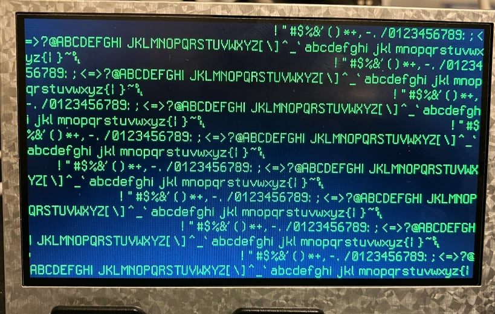

# Tang Nano 6502 CPU with LCD Display

A complete SystemVerilog implementation of a 6502 microprocessor with LCD controller for Tang Nano FPGA boards, featuring modular architecture and comprehensive testing.

## 🚀 Quick Start

- For Tang Nano 9K

  - Build and Download

    ```bash
    # Clone and build
    git clone <repository-url>
    cd lcd_cpu_bsram
    make

    # Download
    make download
    ```

- For Tang Nano 20K

  - Update the following files

  - `lcd_cpu_bsram.gprj`

    ```xml
    <!-- Tang Nano 9K -->
    <!-- <Device name="GW1NR-9C" pn="GW1NR-LV9QN88PC6/I5">gw1nr9c-004</Device> -->
    <!-- Tang Nano 20K -->
    <Device name="GW2AR-18C" pn="GW2AR-LV18QN88C8/I7">gw2ar18c-000</Device>

    <!-- Tang Nano 9K -->
    <!-- <File path="src/lcd_cpu_bsram_9K.cst" type="file.cst" enable="1"/>
    <File path="src/gowin_rpll_9K/gowin_rpll40.v" type="file.verilog" enable="1"/>
    <File path="src/gowin_rpll_9K/gowin_rpll9.v" type="file.verilog" enable="1"/> -->
    <!-- Tang Nano 20K -->
    <File path="src/lcd_cpu_bsram_20K.cst" type="file.cst" enable="1"/>
    <File path="src/gowin_rpll_20K/gowin_rpll40.v" type="file.verilog" enable="1"/>
    <File path="src/gowin_rpll_20K/gowin_rpll9.v" type="file.verilog" enable="1"/>
    ```

  - `src/top.sv`

  ```systemverilog
      // Tang Nano 9K:
      //  wire rst_n = ResetButton;
      // Tang Nano 20K:
      wire rst_n = !ResetButton;
  ```

  - Make

    ```bash
    # BOARD is optional
    make BOARD=20k download
    ```

  - Download

    ```bash
    # BOARD is mandatory
    make BOARD=20k download
    ```

## ✨ Features

- **Complete 6502 CPU**: Standard instruction set plus custom extensions (CVR, IFO, HLT, WVS)
- **LCD Text Display**: 60×17 character display with hardware font rendering
- **Modular Design**: Clean separation between CPU core, LCD controller, and memory systems
- **Assembly Programming**: cc65 toolchain integration with example programs
- **Comprehensive Testing**: Unit tests and integration test suites
- **Multi-Board Support**: Tang Nano 9K/20K with automatic configuration

## 📚 Documentation

| Document                                                               | Purpose                                   | Audience                   |
| ---------------------------------------------------------------------- | ----------------------------------------- | -------------------------- |
| **[docs/DEVELOPER.md](./docs/DEVELOPER.md)**                           | Technical architecture and learning guide | FPGA developers & learners |
| **[docs/README_architecture_en.md](./docs/README_architecture_en.md)** | Detailed CPU architecture                 | Advanced developers        |
| **[docs/README_architecture_ja.md](./docs/README_architecture_ja.md)** | CPU implementation details (Japanese)     | Advanced developers (Ja)   |
| **[docs/BUILD.md](./docs/BUILD.md)**                                   | Build system and tooling                  | All developers             |
| **[docs/INSTRUCTIONS.md](./docs/INSTRUCTIONS.md)**                     | CPU supported instructions                | All developers             |
| **[docs/LCD.md](./docs/LCD.md)**                                       | LCD specification                         | Who need LCD info          |
| **[docs/CODING_STYLE.md](./docs/CODING_STYLE.md)**                     | SystemVerilog conventions                 | Contributors               |
| **[docs/QUALITY_en.md](./docs/QUALITY_en.md)**                         | Code quality                              | All developers             |
| **[docs/QUALITY_ja.md](./docs/QUALITY_ja.md)**                         | Code quality (Japanease)                  | All developers (Ja)        |
| **[CLAUDE.md](./CLAUDE.md)**                                           | AI development integration                | Claude Code users          |

## 🛠️ System Requirements

**Hardware:**

- Tang Nano 9K or 20K FPGA board
- 043026-N6(ML) 4.3" 480×272 LCD module (optional)

**Software:**

- Gowin EDA tools (for FPGA synthesis)
- cc65 assembler (for 6502 programs)
- Make and basic Unix tools

## 📋 Architecture Overview

This project implements a complete computer system on FPGA with the following components:

- **6502 CPU Core**: Modular implementation with decoder, ALU, and memory interface
- **LCD Controller**: 480×272 RGB display with character-based text mode
- **Memory System**: 32KB RAM + 1KB VRAM + 4KB Font ROM
- **Custom Instructions**: Hardware-accelerated display operations

## 🏗️ Project Structure

```
├── src/                    # SystemVerilog source files
│   ├── cpu.sv             # Main CPU module (includes modular components)
│   ├── lcd.sv             # LCD timing and character rendering
│   ├── top.sv             # Top-level system integration
│   └── gowin_*/           # Board-specific PLL configurations
├── include/               # Shared constants and auto-generated files
├── examples/              # 6502 assembly programs
├── tests/                 # Testbench files
└── docs/                  # Comprehensive documentation
```

## 🎯 Board Configuration

The Makefile automatically handles board-specific configurations. For manual setup details, see [docs/BUILD.md](./docs/BUILD.md).

```bash
# Quick board switching
make BOARD=9k    # Tang Nano 9K (default)
make BOARD=20k   # Tang Nano 20K

# Custom tool paths (if needed)
make GWSH=/path/to/gw_sh PRG=/path/to/programmer_cli download
```

## 🎮 Programming Examples

The system supports 6502 assembly programming with the cc65 toolchain:

```bash
# Install prerequisites
brew install srecord cc65          # macOS
sudo apt install srecord cc65      # Linux

# Build and run an example
cd examples
make clean && make                  # Builds simple5.s by default
cd .. && make download             # Program FPGA with example
```

**Available Examples:**

- `simple.s` - Basic "Hello World" display
- `simple2.s` - Character printing loop
- `simple3.s` - Memory operations
- `simple4.s` - Custom instruction demos
- `simple5.s` - Advanced graphics example
- `hello_world.s` / `hello_world_scroll.s` - Text display demos

## 🔧 Development Setup

**Prerequisites:**

```bash
# macOS
brew install srecord cc65

# Linux (Ubuntu/Debian)
sudo apt install srecord cc65 golang gtkwave verilator

# Gowin EDA tools (for FPGA development)
# Download from Gowin website
```

**Tool Path Configuration:**

```bash
# If Gowin tools are not in default locations
export GWSH=/path/to/gw_sh
export PRG=/path/to/programmer_cli

# Or specify per command
make GWSH=/opt/GowinEDA/IDE/bin/gw_sh download
```

## 🧠 6502 CPU Implementation

**Standard 6502 Instructions:** All standard opcodes implemented except interrupt-related instructions (BRK, RTI, CLI, SEI)

**Custom Extensions:**

- `0xCF` **CVR** - Clear VRAM (hardware-accelerated screen clear)
- `0xDF` **IFO** - Info/Debug (display registers and memory)
- `0xEF` **HLT** - Halt CPU (LCD continues running)
- `0xFF` **WVS** - Wait VSync (synchronize with display refresh)

**Memory Map:**

```
0x0000-0x00FF  Zero Page (256B)
0x0100-0x01FF  Stack (256B)
0x0200-0x7BFF  Program RAM (30.5KB)
0x7C00-0x7FFF  Shadow VRAM (1KB, read-only)
0xE000-0xE3FF  VRAM (1KB, write-only)
0xF000-0xFFFF  Font ROM (4KB, display controller only)
```

**Display System:**

- 60×17 character text mode (480×272 pixels)
- 16×8 pixel font characters with [Sweet16Font](https://github.com/kmar/Sweet16Font) (Boost licensed)
- Hardware accelerated character rendering

Complete instruction reference and addressing modes available in [docs/README_architecture_en.md](./docs/README_architecture_en.md).

## 🧪 Testing and Simulation

The project includes comprehensive testing infrastructure:

```bash
# Run simulation (requires DSIM Studio on Linux/Windows x64)
# See docs/DEVELOPER.md for detailed setup instructions

# Lint and format code
make lint
make format
```

**Test Suites:**

- **tb_cpu.sv**: Complete CPU integration tests (9 test cases)
- **tb_cpu_modules.sv**: Individual module unit tests (25+ tests)
- **tb_lcd.sv**: LCD controller timing validation
- **tb_top.sv**: Full system integration tests

## 🤝 Contributing

We welcome contributions! Please see:

- [docs/CODING_STYLE.md](./docs/CODING_STYLE.md) for code standards
- [docs/DEVELOPER.md](./docs/DEVELOPER.md) for technical architecture
- [CLAUDE.md](./CLAUDE.md) for AI-assisted development guidelines

## 📄 License

This project uses components with different licenses:

- **Font**: [Sweet16Font](https://github.com/kmar/Sweet16Font) (Boost Software License)
- **Project Code**: Check individual file headers for licensing information

## 🖼️ Example Output



_The system running a simple text display program on the 480×272 LCD module_

---

For detailed technical information, architecture diagrams, and learning materials, see the [docs/](./docs/) directory.
