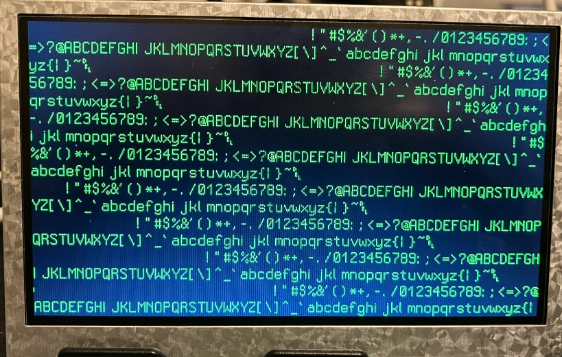

# Tang Nano 6502 CPU LCDディスプレイ搭載

Tang Nano FPGAボード向けのLCDコントローラを搭載した6502マイクロプロセッサの完全なSystemVerilog実装です。このプロジェクトは、モジュラーアーキテクチャ、包括的なテスト、カスタムアセンブリプログラムのサポートを特徴としています。

---

🌐 **対応言語:** [English](./README.md) | [日本語](./README_ja.md)

## 🚀 クイックスタート

このガイドでは、Tang Nano 9Kおよび20Kボードにプロジェクトをビルドしてデプロイする手順を説明します。

### 前提条件

-   **ハードウェア**: Tang Nano 9Kまたは20K
-   **ソフトウェア**: Gowin EDA, cc65, Make

### 1. リポジトリのクローン

```bash
git clone <repository-url>
cd lcd_cpu_bsram
```

### 2. ビルドとダウンロード

Makefileはビルドプロセスを自動化します。デフォルトでは、**Tang Nano 9K**をターゲットとします。

```bash
# Tang Nano 9K向けにビルドしてダウンロード（デフォルト）
make download
```

**Tang Nano 20K**をターゲットにするには、`BOARD`変数を使用します。

```bash
# Tang Nano 20K向けにビルドしてダウンロード
make BOARD=20k download
```

ビルドシステムは、ピン制約やPLL設定など、ボード固有の構成を自動的に処理します。

## ✨ 特徴

-   **完全な6502 CPU**: ハードウェア制御用のカスタム拡張機能を備えた標準命令セットを実装。
-   **LCDテキストディスプレイ**: 480x272 LCDを駆動し、ハードウェアアクセラレーションによるフォントレンダリングで60x17文字を表示。
-   **モジュラー設計**: CPUコア、LCDコントローラ、メモリシステム間のクリーンな分離。
-   **アセンブリプログラミング**: cc65ツールチェーンと統合され、いくつかのサンプルプログラムが含まれています。
-   **包括的なテスト**: ユニットテスト、統合スイート、シミュレーションテストベンチが含まれています。
-   **マルチボードサポート**: Tang Nano 9Kと20Kのターゲットを簡単に切り替え可能。

## 📚 ドキュメント

詳細については、ドキュメントを参照してください。

| ドキュメント                                                               | 説明                                             |
| ---------------------------------------------------------------------- | ------------------------------------------------------- |
| **[docs/DEVELOPER.md](./docs/DEVELOPER.md)**                           | 技術アーキテクチャ、セットアップ、学習ガイド。      |
| **[docs/README_architecture_ja.md](./docs/README_architecture_ja.md)** | CPUアーキテクチャの詳細。               |
| **[docs/BUILD.md](./docs/BUILD.md)**                                   | ビルドシステム、ツール、手動設定。        |
| **[docs/INSTRUCTIONS.md](./docs/INSTRUCTIONS.md)**                     | サポートされているCPU命令とカスタム拡張機能。       |
| **[docs/LCD.md](./docs/LCD.md)**                                       | LCDの仕様とコントローラの詳細。              |
| **[docs/CODING_STYLE.md](./docs/CODING_STYLE.md)**                     | SystemVerilogコーディング規約。                       |
| **[CLAUDE.md](./CLAUDE.md)**                                           | AI支援開発のガイドライン。                 |

## 🏗️ プロジェクト構成

```
├── src/                    # SystemVerilogソースファイル
│   ├── cpu.sv             # メインCPUモジュール
│   ├── lcd.sv             # LCDタイミングと文字レンダリング
│   ├── top.sv             # トップレベルのシステム統合
│   └── gowin_*/           # ボード固有のPLL構成
├── include/               # 共有定数と自動生成ファイル
├── examples/              # 6502アセンブリプログラム
├── tests/                 # テストベンチファイル
└── docs/                  # 包括的なドキュメント
```

## 🧠 6502 CPU実装

### カスタム命令

標準の6502命令セットに加えて、このCPUには効率的なハードウェア対話のためのカスタムオペコードが含まれています。

-   `0xCF` **CVR**: VRAMをクリア（ハードウェアアクセラレーションによる画面クリア）。
-   `0xDF` **IFO**: 情報/デバッグ（レジスタとメモリを表示）。
-   `0xEF` **HLT**: LCDをアクティブにしたままCPUを停止。
-   `0xFF` **WVS**: VSyncを待ってディスプレイのリフレッシュと同期。

### メモリマップ

```
0x0000-0x01FF  ゼロページ＆スタック (512B)
0x0200-0x7BFF  プログラムRAM (30.5KB)
0x7C00-0x7FFF  シャドウVRAM (1KB, 読み取り専用)
0xE000-0xE3FF  VRAM (1KB, 書き込み専用)
0xF000-0xFFFF  フォントROM (4KB, ディスプレイコントローラ用)
```

## 🎮 プログラミング例

`examples/`ディレクトリには、いくつかの6502アセンブリプログラムが含まれています。`cc65`ツールチェーンを使用してビルドします。

```bash
# 前提条件のインストール（macOS）
brew install srecord cc65

# サンプルをビルドして実行
cd examples
make clean && make          # デフォルトでsimple5.sをビルド
cd ..
make download               # FPGAにサンプルをプログラム
```

**オンラインツール:**

-   [6502アセンブラ](https://sokoide.github.io/6502-assembler/)
-   [6502デバッガ](https://sokoide.github.io/6502-emulator/)

## 🧪 テストとシミュレーション

このプロジェクトには、包括的なテストインフラストラクチャが含まれています。

```bash
# lintとフォーマットチェックを実行
make lint
make format
```

詳細なシミュレーション手順については、**[docs/DEVELOPER.md](./docs/DEVELOPER.md)**を参照してください。

## 🤝 貢献

貢献を歓迎します！`docs/`ディレクトリにあるコーディング標準と開発ガイドラインを確認してください。

## 📄 ライセンス

-   **フォント**: [Sweet16Font](https://github.com/kmar/Sweet16Font) (Boost Software License)
-   **プロジェクトコード**: ライセンス情報については、個々のファイルヘッダーを確認してください。

## 🖼️ 出力例



_480x272 LCDモジュールでテキスト表示プログラムを実行しているシステム。_
