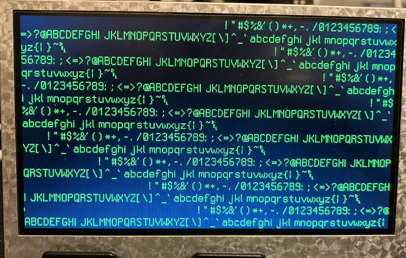

# Tang Nano 6502 CPU LCD ディスプレイ搭載

Tang Nano FPGA ボード向けの LCD コントローラを搭載した 6502 マイクロプロセッサの完全な SystemVerilog 実装です。このプロジェクトは、モジュラーアーキテクチャ、包括的なテスト、カスタムアセンブリプログラムのサポートを特徴としています。

---

🌐 **対応言語:** [English](./README.md) | [日本語](./README_ja.md)

## 🚀 クイックスタート

このガイドでは、Tang Nano 9K および 20K ボードにプロジェクトをビルドしてデプロイする手順を説明します。

### 前提条件

- **ハードウェア**: Tang Nano 9K または 20K
- **ソフトウェア**: Gowin EDA, cc65, Make

### 1. リポジトリのクローン

```bash
git clone <repository-url>
cd tangnano_6502_cpu
```

### 2. ビルドとダウンロード

Makefile は両ボードのビルドを自動化します。デフォルトは **Tang Nano 9K**、`BOARD=20k` を渡すと 20K 向けになります。

```bash
# Tang Nano 9K（デフォルト）
make download

# Tang Nano 20K
make BOARD=20k download
```

## ✨ 特徴

- **完全な 6502 CPU**: ハードウェア制御用のカスタム拡張機能を備えた標準命令セットを実装。
- **LCD テキストディスプレイ**: 480x272 LCD を駆動し、ハードウェアアクセラレーションによるフォントレンダリングで 60x17 文字を表示。
- **モジュラー設計**: CPU コア、LCD コントローラ、メモリシステム間のクリーンな分離。
- **アセンブリプログラミング**: cc65 ツールチェーンと統合され、いくつかのサンプルプログラムが含まれています。
- **包括的なテスト**: ユニットテスト、統合スイート、シミュレーションテストベンチが含まれています。
- **マルチボードサポート**: Tang Nano 9K と 20K のターゲットを簡単に切り替え可能。

## 📚 ドキュメント

詳細については、ドキュメントを参照してください。

| ドキュメント                                                           | 説明                                            |
| ---------------------------------------------------------------------- | ----------------------------------------------- |
| **[docs/DEVELOPER.md](./docs/DEVELOPER.md)**                           | 技術アーキテクチャ、セットアップ、学習ガイド。  |
| **[docs/README_architecture_ja.md](./docs/README_architecture_ja.md)** | CPU アーキテクチャの詳細。                      |
| **[docs/BUILD.md](./docs/BUILD.md)**                                   | ビルドシステム、ツール、手動設定。              |
| **[docs/INSTRUCTIONS.md](./docs/INSTRUCTIONS.md)**                     | サポートされている CPU 命令とカスタム拡張機能。 |
| **[docs/LCD.md](./docs/LCD.md)**                                       | LCD の仕様とコントローラの詳細。                |
| **[docs/CODING_STYLE.md](./docs/CODING_STYLE.md)**                     | SystemVerilog コーディング規約。                |
| **[CLAUDE.md](./CLAUDE.md)**                                           | AI 支援開発のガイドライン。                     |

## 🏗️ プロジェクト構成

```bash
├── src/                    # SystemVerilogソースファイル
│   ├── cpu.sv             # メインCPUモジュール
│   ├── lcd.sv             # LCDタイミングと文字レンダリング
│   ├── top.sv             # トップレベルのシステム統合
│   └── gowin_*/           # ボード固有のPLL構成
├── include/               # 共有定数と自動生成ファイル
├── examples/              # 6502アセンブリプログラム
├── tests/                 # テストベンチファイル
└── docs/                  # 包括的なドキュメント
```

## 🧠 6502 CPU 実装

## 🧭 day06-18（教育用CPU）との違い

このリポジトリの day06-18 は、6502を「部品→統合」の順で理解するための教育用ステップで、モジュール分割や制御方法が day99 と一致しない部分があります。

- **day06-18**: レジスタ/ALU/デコーダ/メモリIF/制御ユニットなど、学習しやすい粒度で分割（段階的に機能を増やすことを優先）。
- **day99**: 実機( LCD + VRAM + カスタム命令 )を動かす統合版。CPUは `cpu_ctx_t` を中心に **2-process FSM**（`always_comb`で`next`計算、`always_ff`で`cur<=next`更新）へ収束し、リファクタしやすい形を優先。

教育用途としては **day06-18は現状のままの方が分かりやすい**（制御の段階的な導入がしやすい）一方で、実務寄りの「安全なリファクタ/拡張」を学ぶなら day99 の2-process FSM構造が参考になります。

詳細は `day99_completed/docs/FSM.md` と `day99_completed/docs/README_architecture_ja.md` を参照してください。

### カスタム命令

標準の 6502 命令セットに加えて、この CPU には効率的なハードウェア対話のためのカスタムオペコードが含まれています。

- `0xCF` **CVR**: VRAM をクリア（ハードウェアアクセラレーションによる画面クリア）。
- `0xDF` **IFO**: 情報/デバッグ（レジスタとメモリを表示）。
- `0xEF` **HLT**: LCD をアクティブにしたまま CPU を停止。
- `0xFF` **WVS**: VSync を待ってディスプレイのリフレッシュと同期。

### メモリマップ

```bash
0x0000-0x01FF  ゼロページ＆スタック (512B)
0x0200-0x7BFF  プログラムRAM (30.5KB)
0x7C00-0x7FFF  シャドウVRAM (1KB, 読み取り専用)
0xE000-0xE3FF  VRAM (1KB, 書き込み専用)
0xF000-0xFFFF  フォントROM (4KB, ディスプレイコントローラ用)
```

## 🎮 プログラミング例

`examples/`ディレクトリには、いくつかの 6502 アセンブリプログラムが含まれています。`cc65`ツールチェーンを使用してビルドします。

```bash
# 前提条件のインストール（macOS）
brew install srecord cc65

# サンプルをビルドして実行
cd examples
make clean && make          # デフォルトでsimple5.sをビルド
cd ..
make download               # FPGAにサンプルをプログラム
```

**オンラインツール:**

- [6502 アセンブラ](https://sokoide.github.io/6502-assembler/)
- [6502 デバッガ](https://sokoide.github.io/6502-emulator/)

## 🧪 テストとシミュレーション

このプロジェクトには、包括的なテストインフラストラクチャが含まれています。

```bash
# lintとフォーマットチェックを実行
make lint
make format
```

詳細なシミュレーション手順については、**[docs/DEVELOPER.md](./docs/DEVELOPER.md)**を参照してください。

## 🤝 貢献

貢献を歓迎します！`docs/`ディレクトリにあるコーディング標準と開発ガイドラインを確認してください。

## 📄 ライセンス

- **フォント**: [Sweet16Font](https://github.com/kmar/Sweet16Font) (Boost Software License)
- **プロジェクトコード**: ライセンス情報については、個々のファイルヘッダーを確認してください。

## 🖼️ 出力例



_480x272 LCD モジュールでテキスト表示プログラムを実行しているシステム。_
