# FPGA Developer Guide

A comprehensive learning guide for FPGA developers working with the Tang Nano 6502 CPU project. This document progresses from basic concepts to advanced implementation details.

## 🎯 Learning Path

**Beginner**: Start with [System Overview](#system-overview) and [Getting Started](#getting-started)
**Intermediate**: Study [Architecture](#architecture) and [Build System](#build-system)
**Advanced**: Deep dive into [CPU Implementation](#cpu-implementation) and [Custom Extensions](#custom-extensions)

## 📋 System Overview

This project demonstrates a complete computer system implementation on FPGA, combining:

- **6502 CPU**: A classic 8-bit microprocessor with custom extensions
- **Display System**: Hardware-accelerated text rendering on LCD
- **Memory Hierarchy**: Multiple memory types with different access patterns
- **Cross-Platform Build**: Support for Tang Nano 9K and 20K boards

### Key Learning Concepts

- **Clock Domain Crossing**: Managing multiple clock frequencies (27MHz → 9MHz/40.5MHz)
- **Memory Controllers**: SDPB RAM, VRAM, and pROM integration
- **State Machines**: Complex CPU instruction execution pipeline
- **Hardware/Software Interface**: Assembly programming meets FPGA implementation

## 🚀 Getting Started

### Prerequisites

**Hardware Knowledge:**
- Basic digital logic and state machines
- Understanding of clocked circuits and timing
- Familiarity with memory interfaces

**Software Tools:**
- **Gowin EDA**: FPGA synthesis and place & route
- **cc65**: 6502 assembler and linker
- **Make**: Build automation
- **DSIM Studio** (optional): Advanced simulation environment

### Quick Setup

```bash
# 1. Clone and explore
git clone <repository>
cd lcd_cpu_bsram
ls -la src/ docs/ examples/

# 2. Build for your board
make BOARD=9k    # Tang Nano 9K (default)
make BOARD=20k   # Tang Nano 20K

# 3. Program FPGA
make download

# 4. Try assembly programming
cd examples
make clean && make
cd .. && make download
```

### Understanding the Build Flow


## 🏗️ Architecture

### System Block Diagram

```mermaid
graph TB
    subgraph "Tang Nano FPGA"
        subgraph "Clock Generation"
            XTAL[27MHz Crystal] --> PLL40[40.5MHz PLL]
            XTAL --> PLL9[9MHz PLL]
        end

        subgraph "CPU Subsystem @ 40.5MHz"
            CPU[6502 CPU Core]
            RAM32[32KB SDPB RAM]
            BOOTROM[Boot Program<br/>Auto-generated]
        end

        subgraph "Display Subsystem @ 9MHz"
            LCD[LCD Controller]
            VRAM1[1KB VRAM SDPB]
            FONTROM[4KB Font pROM]
        end

        PLL40 --> CPU
        PLL40 --> RAM32
        PLL40 --> VRAM1
        PLL9 --> LCD

        CPU <--> RAM32
        CPU <--> VRAM1
        LCD <--> VRAM1
        LCD <--> FONTROM
        BOOTROM --> CPU
    end

    subgraph "External"
        BUTTON[Reset Button]
        DISPLAY[480×272 LCD<br/>043026-N6(ML)]
    end

    BUTTON --> CPU
    LCD --> DISPLAY
```

### Memory Architecture Deep Dive

The system implements a sophisticated memory hierarchy optimized for both CPU access and display rendering:

```
CPU Address Space (64KB addressable):
┌─────────────────┬─────────────────┬──────────────────────────────────┐
│ 0x0000-0x00FF   │ Zero Page       │ Fast 8-bit addressing, 256B     │
│ 0x0100-0x01FF   │ Stack           │ Hardware stack operations, 256B │
│ 0x0200-0x7BFF   │ Program RAM     │ Main memory, 30.5KB             │
│ 0x7C00-0x7FFF   │ Shadow VRAM     │ CPU-readable VRAM copy, 1KB     │
│ 0x8000-0xDFFF   │ (Unmapped)      │ Available for expansion          │
│ 0xE000-0xE3FF   │ Text VRAM       │ CPU-writable display, 1KB       │
│ 0xE400-0xEFFF   │ (Unmapped)      │ Future display expansion         │
│ 0xF000-0xFFFF   │ Font ROM        │ Not CPU-accessible, 4KB         │
└─────────────────┴─────────────────┴──────────────────────────────────┘
```

**Key Design Decisions:**

1. **Dual VRAM Access**: Shadow VRAM allows CPU to read display content while LCD controller has dedicated write access
2. **Memory-Mapped I/O**: VRAM appears as normal memory to CPU, hardware handles display timing
3. **Font ROM Isolation**: 4KB font data is LCD-controller-only, saving CPU address space

### Module Hierarchy

```
src/
├── top.sv              # System integration and clock management
├── cpu.sv              # 6502 CPU core with modular components
├── lcd.sv              # LCD timing and character rendering
├── gowin_rpll_9K/      # Tang Nano 9K PLL configurations
└── gowin_rpll_20K/     # Tang Nano 20K PLL configurations

include/
├── consts.svh          # System-wide constants and parameters
├── cpu_pkg.sv          # CPU-specific types and enums
├── cpu_tasks.sv        # Reusable CPU tasks and functions
└── boot_program.sv     # Auto-generated from assembly (examples/)
```

## 🔧 Build System

### Makefile Targets

```bash
# Core build targets
make                    # Build bitstream (default: 9K)
make clean             # Clean generated files
make download          # Program FPGA via SRAM

# Board-specific builds
make BOARD=9k          # Tang Nano 9K configuration
make BOARD=20k         # Tang Nano 20K configuration
make DEVICE=GW2AR-18C  # Override device directly

# Development tools
make lint              # Run SystemVerilog linter
make format            # Format code with standard style
make simulation        # Run testbench (if configured)

# Custom tool paths
make GWSH=/custom/path/gw_sh PRG=/custom/path/programmer_cli download
```

### Board Configuration Management

The build system automatically handles board differences:

| Configuration | Tang Nano 9K | Tang Nano 20K |
|---------------|--------------|---------------|
| **Device** | GW1NR-9C | GW2AR-18C |
| **Package** | QN88PC6/I5 | QN88C8/I7 |
| **Reset Logic** | `rst_n = ResetButton` | `rst_n = !ResetButton` |
| **Constraints** | `lcd_cpu_bsram_9K.cst` | `lcd_cpu_bsram_20K.cst` |
| **PLL Files** | `gowin_rpll_9K/*.v` | `gowin_rpll_20K/*.v` |

### Assembly Program Integration

```bash
cd examples/
# Edit Makefile to select program:
# SRCS = simple5.s

make clean && make
# Generates:
# - example.hex (Intel HEX format)
# - example.lst (Assembly listing)
# - ../include/boot_program.sv (SystemVerilog include)

cd ../
make download  # Build FPGA with new program
```

## 🧠 CPU Implementation

### 6502 Core Architecture

The CPU implementation follows a modular design for maintainability:

```systemverilog
// Main CPU module structure
module cpu (
    // Clock and Reset
    input logic rst_n, clk,

    // Memory Interface
    input logic [7:0] dout,           // RAM read data
    output logic [7:0] din,           // RAM write data
    output logic [14:0] ada, adb,     // RAM addresses
    output logic cea, ceb,            // RAM enables

    // Video Memory Interface
    output logic [9:0] v_ada,         // VRAM address
    output logic v_cea,               // VRAM enable
    output logic [7:0] v_din,         // VRAM data

    // System Integration
    input logic vsync,                // LCD sync for WVS instruction
    input logic [7:0] boot_program[7680], // Program ROM
    input logic [15:0] boot_program_length
);
```

### State Machine Design

The CPU uses a multi-stage pipeline:


### Instruction Implementation Examples

**Load Immediate (LDA #$41):**
```systemverilog
8'hA9: begin  // LDA immediate
    ra = operands[7:0];              // Load value into accumulator
    flg_z = (ra == 8'h00);           // Update zero flag
    flg_n = ra[7];                   // Update negative flag
    fetch_opcode(2);                 // Next instruction (2 bytes)
end
```

**Store Absolute (STA $E000):**
```systemverilog
8'h8D: begin  // STA absolute
    automatic logic [15:0] addr = operands[15:0] & 16'hFFFF;
    sta_write(addr, ra);  // Handle RAM vs VRAM routing
    cea = 1;              // Enable RAM write
    v_cea = write_to_vram; // Enable VRAM if target is display
    fetch_opcode(3);      // Next instruction (3 bytes)
end
```

## 🎨 Display System

### LCD Controller Architecture

The LCD controller operates independently from the CPU, implementing a character-based text display:

```systemverilog
// Key parameters
localparam int CHAR_WIDTH = 8;    // pixels per character
localparam int CHAR_HEIGHT = 16;  // pixels per character
localparam int COLUMNS = 60;      // characters per row (480/8)
localparam int ROWS = 17;         // character rows (272/16)
```

### Character Rendering Pipeline

```mermaid
sequenceDiagram
    participant LCD as LCD Controller
    participant VRAM as Character VRAM
    participant FONT as Font ROM
    participant OUT as RGB Output

    LCD->>VRAM: Request character at (col, row)
    VRAM-->>LCD: Character code (0x41 = 'A')
    LCD->>FONT: Request font data (char * 16 + y_pixel)
    FONT-->>LCD: Font bitmap line (8 bits)
    LCD->>OUT: Generate RGB pixels (8 pixels)

    Note over LCD: Repeat for all 480×272 pixels
    Note over LCD: Hardware handles timing automatically
```



### Display Timing

The LCD controller generates precise timing for the 480×272 display:

```
Horizontal Timing (9MHz pixel clock):
├─ Back Porch: 43 pixels
├─ Active Area: 480 pixels
├─ Front Porch: 8 pixels
└─ Total: 531 pixels per line

Vertical Timing:
├─ Back Porch: 12 lines
├─ Active Area: 272 lines
├─ Front Porch: 8 lines
└─ Total: 292 lines per frame

Frame Rate: 9MHz ÷ (531 × 292) ≈ 58 FPS
```

## 🔍 Custom Extensions

### Custom Instructions

The CPU implements four custom instructions beyond standard 6502:

**CVR (0xCF) - Clear VRAM:**
```systemverilog
8'hCF: begin  // CVR - Clear VRAM
    if (clear_vram_addr <= COLUMNS * ROWS) begin
        v_ada <= clear_vram_addr;
        v_din <= 8'h20;  // Space character
        v_cea <= 1;      // Enable VRAM write
        clear_vram_addr <= clear_vram_addr + 1;
    end else begin
        v_cea <= 0;
        fetch_opcode(1);
    end
end
```

**WVS (0xFF) - Wait VSync:**
```systemverilog
8'hFF: begin  // WVS - Wait for VSync
    if (vsync_stage == operands[7:0]) begin
        fetch_opcode(2);  // Done waiting
    end else if (vsync_sync && !vsync_meta) begin
        vsync_stage <= vsync_stage + 1;  // Count VSync pulses
    end
    // Synchronize VSync signal across clock domains
    {vsync_sync, vsync_meta} <= {vsync_meta, vsync};
end
```

### Cross-Clock Domain Design

The system carefully manages clock domain crossings:

```systemverilog
// VSync synchronization (LCD 9MHz → CPU 40.5MHz)
logic vsync_meta, vsync_sync;
always_ff @(posedge clk) begin
    {vsync_sync, vsync_meta} <= {vsync_meta, vsync};
end

// Usage in CPU for WVS instruction
if (vsync_sync && !vsync_meta) begin
    // Rising edge detected - count VSync pulse
    vsync_stage <= vsync_stage + 1;
end
```

## 🧪 Testing and Simulation

### Test Environment Setup

**DSIM Studio (Recommended):**
```bash
# Linux/Windows x64 only (macOS not supported)
# 1. Install DSIM Studio plugin in VSCode
# 2. Register and activate license
# 3. Open project file: lcd_cpu_bsram.dpf
# 4. Run "library configuration"
# 5. Execute testbench: tb_cpu
```

### Available Test Suites

**tb_cpu.sv** - Complete CPU Integration Tests:
- Basic instruction execution
- Memory access patterns
- Custom instruction validation
- Flag operation verification
- Stack operations
- Branch and jump logic
- Interrupt handling (placeholder)
- Complex program execution
- Error condition handling

**tb_cpu_modules.sv** - Unit Tests:
- Individual CPU module testing
- ALU operation verification
- Memory controller validation
- Decoder logic testing
- Register file operations

**tb_lcd.sv** - Display System Tests:
- LCD timing validation
- Character rendering verification
- VRAM access patterns
- Font ROM interface testing

### Writing Custom Tests

```systemverilog
// Example test structure
module tb_custom;
    // DUT instantiation
    cpu dut (
        .rst_n(rst_n),
        .clk(clk),
        // ... connect all signals
    );

    initial begin
        // Test initialization
        reset_system();
        load_test_program();

        // Execute test sequence
        run_cpu_cycles(100);

        // Verify results
        assert(dut.ra == expected_accumulator)
            else $error("Accumulator mismatch");

        $display("Test completed successfully");
        $finish;
    end
endmodule
```

## 🔧 Development Tips

### Debugging Strategies

**1. Waveform Analysis:**
```systemverilog
// Add to testbench for signal capture
initial begin
    $dumpfile("simulation.vcd");
    $dumpvars(0, tb_cpu);
end
```

**2. Custom Debug Instructions:**
```systemverilog
8'hDF: begin  // IFO - Info/Debug
    $display("PC=%04X A=%02X X=%02X Y=%02X SP=%02X",
             pc, ra, rx, ry, sp);
    $display("Flags: C=%b Z=%b V=%b N=%b",
             flg_c, flg_z, flg_v, flg_n);
    fetch_opcode(2);
end
```

**3. Memory Monitoring:**
```systemverilog
// Watch for specific memory access
always @(posedge clk) begin
    if (cea && ada == 16'hE000) begin
        $display("VRAM write: %02X at time %t", din, $time);
    end
end
```

### Performance Optimization

**1. Clock Domain Optimization:**
- Minimize cross-domain signals
- Use proper synchronizers
- Consider clock enable strategies

**2. Memory Access Patterns:**
- Understand SDPB timing requirements
- Optimize for burst accesses where possible
- Consider dual-port usage patterns

**3. Logic Utilization:**
- Monitor LUT and FF usage in synthesis reports
- Consider pipeline vs. combinational trade-offs
- Optimize critical path timing

### Common Pitfalls

**1. Reset Polarity:**
```systemverilog
// Tang Nano 9K vs 20K difference
// 9K:  wire rst_n = ResetButton;
// 20K: wire rst_n = !ResetButton;
```

**2. Clock Domain Crossing:**
```systemverilog
// Wrong: Direct assignment across domains
// cpu_signal <= lcd_signal;  // Timing violation!

// Correct: Proper synchronization
always_ff @(posedge cpu_clk) begin
    {sync_reg, meta_reg} <= {meta_reg, lcd_signal};
end
```

**3. Memory Initialization:**
```systemverilog
// Ensure proper boot sequence
initial begin
    // Load program before releasing reset
    wait(boot_program_loaded);
    rst_n <= 1'b1;
end
```

## 📚 Further Learning

### Advanced Topics

1. **FPGA-Specific Optimizations**
   - Gowin primitive usage
   - Block RAM configuration
   - DSP slice utilization

2. **CPU Architecture Extensions**
   - Adding new instruction sets
   - Implementing interrupts
   - Cache design considerations

3. **Display System Enhancements**
   - Sprite rendering
   - Hardware scrolling
   - Color palette management

### Recommended Reading

- **6502 Documentation**: Original MOS Technology manuals
- **FPGA Design**: "Digital Design and Computer Architecture" by Harris & Harris
- **SystemVerilog**: "SystemVerilog for Design" by Sutherland, Davidmann & Flake
- **Tang Nano Documentation**: Gowin FPGA user guides and application notes

### Community and Support

- **Project Repository**: Issues and discussions
- **Tang Nano Community**: Hardware-specific questions
- **6502 Forums**: Vintage computing and emulation communities
- **FPGA Communities**: General FPGA design discussions

---

This guide provides a foundation for understanding and extending the Tang Nano 6502 CPU project. Start with the basics and gradually work through more complex topics as you become comfortable with the codebase and FPGA development workflow.