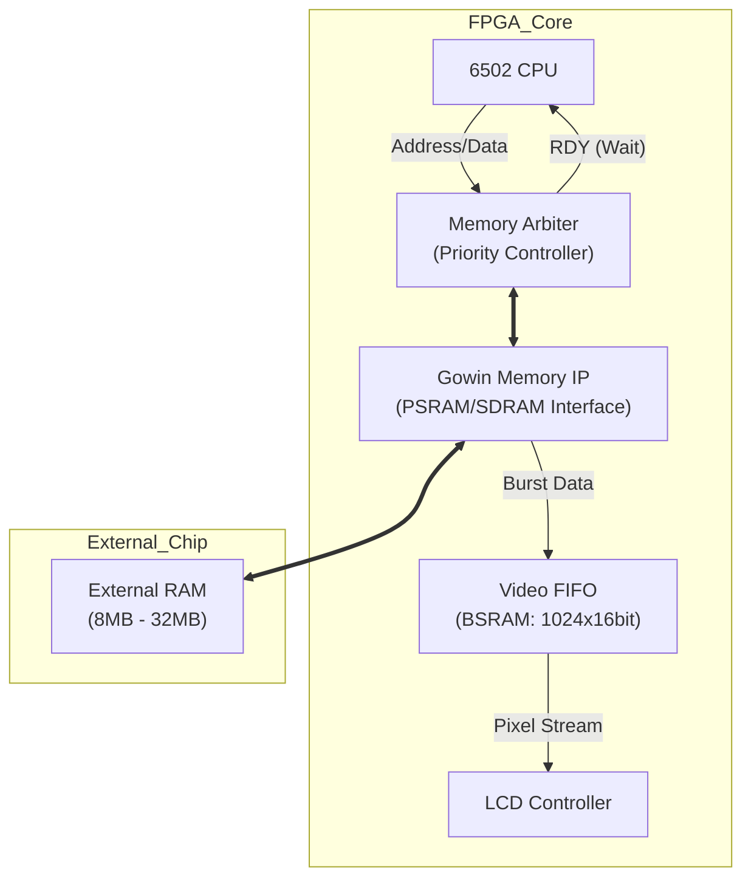

# 外部RAMを利用した高解像度Graphic VRAMアーキテクチャ

このドキュメントでは、Tang Nano の外部 RAM (PSRAM/SDRAM) を活用し、6502 CPU からアクセス可能な **Graphic VRAM (480x272, 16bit color)** を構築するためのアーキテクチャを定義する。

## 1. 概要と実現可能性

### 目標

* **解像度:** 480 x 272 ピクセル
* **色深度:** 16bit (RGB565)
* **VRAM容量:** 約 261 KB (480 *272* 2 bytes)
* **フレームレート:** 60fps
* **機能:** CPU と LCD コントローラで単一の外部 RAM を共有する。

### 帯域幅の計算 (Bandwidth Analysis)

このシステムが成立する根拠は、外部メモリの転送速度が LCD の要求速度を圧倒している点にある。

* **LCD表示に必要な帯域:**
  * Pixel Clock: 約 9 MHz
  * Throughput: 9 M pixel/sec × 16 bit = **144 Mbps**
* **Tang Nano (外部メモリ) の理論帯域:**
  * Clock: 100 MHz (仮定)
  * Bus Width: 16 bit (PSRAM) / 32 bit (SDRAM)
  * Max Throughput: 100 MHz × 16 bit = **1600 Mbps** (Tang Nano 9K の場合)

**結論:** LCD 表示に消費される帯域は全体の **10%未満** である。残りの 90%以上の帯域は CPU のメモリアクセスに割り当てることが可能であり、パフォーマンスへの影響は軽微である。

## 2. システムアーキテクチャ

外部メモリはシングルポートであるため、**Memory Arbiter（調停回路）** と **Video FIFO** を用いてアクセス権を制御する「バケツリレー方式」を採用する。

### ブロック図



### コンポーネントの役割

1. **Memory Arbiter (調停回路)**
    * CPU と Video コントローラからのアクセス要求を管理する。
    * **優先順位:** Video FIFO (低残量時) > CPU > Video FIFO (通常時)。
    * CPU がアクセスできない間は、6502 の `RDY` 信号を Low にして CPU をハードウェア的に一時停止させる。
    * ※注: 使用する 6502 コアによっては `RDY` が読み出しサイクルのみ有効な場合があります。書き込みサイクルも停止可能か、コアの仕様を確認してください。

2. **Video FIFO (BSRAM)**
    * 外部メモリと LCD の速度差を吸収するバッファ。
    * 推奨サイズ: 1024 ワード (約 1-2 ライン分)。
    * 外部メモリからは「バースト転送（高速）」で書き込まれ、LCD へは「ピクセルクロック（低速）」で読み出される。

3. **Gowin Memory IP**
    * Gowin EDA が提供するコントローラ IP を使用する。
    * 物理層のタイミング制御を隠蔽し、ユーザロジックにはコマンドベースのインターフェースを提供する。

## 3. 動作フロー

1. **通常状態 (CPU実行中)**
    * FIFO に十分なデータがある場合、Arbiter は CPU にバス権を与える。
    * CPU は wait なしでメモリにアクセス可能。

2. **FIFO枯渇 (Video要求発生)**
    * LCD が表示を続け、FIFO のデータ残量がしきい値（例: 残り 32 ピクセル）を下回る。
    * FIFO ロジックが `video_req` をアサートする。

3. **バス権の切り替え**
    * Arbiter は CPU の `RDY` を Low にし、CPU を停止させる。
    * Arbiter はメモリコントローラに対して **バースト読み出し** コマンドを発行する（例: 64 ピクセル一括読み出し）。

4. **データ充填**
    * メモリから高速にデータが読み出され、FIFO に格納される。
    * 転送が完了すると、Arbiter は `RDY` を High に戻し、CPU の実行を再開させる。

## 4. 実装計画

### Step 1: Memory IPの生成

* Gowin EDA の "IP Core Generator" を使用。
* Tang Nano 9K の場合: `PSRAM Memory Interface`
* Tang Nano 20K の場合: `SDRAM Controller`

### Step 2: Arbiterモジュールの作成 (SystemVerilog)

* ステートマシン: `IDLE`, `CPU_ACCESS`, `VIDEO_BURST`
* バースト制御ロジックの実装。
* VRAM アドレスカウンタの実装（フレーム末尾で 0 リセット）。

### Step 3: 統合

* 既存の `ram.sv` を置き換える形で Arbiter を配置。
* 6502 CPU コアの `RDY` ピンを Arbiter に接続。
* LCD コントローラの入力元を ROM/BSRAM から Video FIFO 出力に変更。

## 5. メモリアドレスマップ案 (例)

| Address Range | Description | Size | Note |
| :--- | :--- | :--- | :--- |
| `0x000000` - `0x03FC00` | **VRAM** | ~261 KB | 480x272x16b. 外部RAM先頭に配置 |
| `0x040000` - `0xXXXXXX` | **Main RAM** | 残り全域 | CPU用のプログラム・データ領域 |

※ 6502 は 16bit アドレス空間(64KB)しか持たないため、VRAM や大容量 RAM へのアクセスには **バンク切り替え (Bank Switching)** または **メモリマッパ (MMU)** の実装が別途必要となる点に注意が必要。

## 6. 実装サンプル (SystemVerilog)

以下に、6502 から VRAM へのアクセスを実現するための主要モジュールの実装例を示す。

### 6.1 バンク切り替えMMU (`banked_mmu.sv`)

6502 のアドレス空間の一部（Window）を、外部メモリの任意の位置にマッピングするためのモジュール。

* **Window**: `$8000` - `$BFFF` (16KB)
* **Bank Register**: `$D000` (Write Only) に配置
* **物理アドレス生成**: `Base Address + Offset`

```systemverilog
module banked_mmu (
    input  logic        clk,
    input  logic        rst_n,
    
    // 6502 Interface
    input  logic [15:0] cpu_addr,
    input  logic [7:0]  cpu_data_in,
    input  logic        cpu_we,       // 1=Write
    
    // Output to Memory Arbiter
    output logic [21:0] phy_addr,     // 22bit Physical Address (4MB space)
    output logic        is_vram_access, // Window hit
    output logic        bank_reg_we   // Write to internal bank register?
);

    // バンクレジスタ (5bit for 32 banks * 16KB = 512KB cover)
    logic [4:0] bank_reg;

    // バンクレジスタへの書き込み検出 (Address $D000)
    // ※実運用では、システム全体のAddress Decoderから生成されたIOセレクト信号を使用することを推奨します
    assign bank_reg_we = (cpu_addr == 16'hD000) && cpu_we;

    always_ff @(posedge clk or negedge rst_n) begin
        if (!rst_n) begin
            bank_reg <= 5'd0; // Default Bank 0
        end else if (bank_reg_we) begin
            bank_reg <= cpu_data_in[4:0];
        end
    end

    // アドレス変換ロジック
    // Window: 0x8000 - 0xBFFF (16KB size)
    always_comb begin
        if (cpu_addr >= 16'h8000 && cpu_addr <= 16'hBFFF) begin
            // VRAM Window Hit
            is_vram_access = 1'b1;
            // Physical Addr = (Bank * 16KB) + (CPU_Addr - 0x8000)
            phy_addr = {bank_reg, cpu_addr[13:0]}; 
        end else begin
            // Passthrough or other mapping
            is_vram_access = 1'b0;
            phy_addr = {6'd0, cpu_addr}; // Default mapping (e.g. Zero Page)
        end
    end

endmodule
```

### 6.2 メモリアービター (`memory_arbiter.sv`)

Video DMA（読み出し）と CPU アクセス（読み書き）を調停するモジュール。
Gowin IP（PSRAM/SDRAM Controller）との接続を想定している。

```systemverilog
module memory_arbiter (
    input  logic        clk,           // System/Memory Clock (e.g. 100MHz)
    input  logic        rst_n,

    // --- 6502 Interface (via MMU) ---
    input  logic        cpu_req,       // MMUからの is_vram_access
    input  logic        cpu_we,
    input  logic [21:0] cpu_addr,      // MMUからの物理アドレス
    input  logic [7:0]  cpu_wdata,
    output logic [7:0]  cpu_rdata,
    output logic        cpu_rdy,       // 0=Wait, 1=Ready (Connect to 6502 RDY)

    // --- LCD Controller Interface ---
    input  logic        fifo_almost_empty, // FIFO needs data!
    output logic        video_data_valid,
    output logic [15:0] video_data_out,    // To Video FIFO

    // --- Gowin Memory IP Interface (Simplified) ---
    output logic        mem_cmd_en,
    output logic        mem_cmd_we,    // 0=Read, 1=Write
    output logic [21:0] mem_addr,
    output logic [15:0] mem_wdata,     // IP usually takes 16/32 bit
    output logic [3:0]  mem_mask,      // Byte mask (for 8-bit writes)
    input  logic        mem_data_valid,
    input  logic [15:0] mem_rdata,
    input  logic        mem_ready      // IP is ready for command
);

    // State Definition
    typedef enum logic [1:0] {
        IDLE,
        VIDEO_BURST,
        CPU_ACCESS
    } state_t;
    state_t state;

    // VRAM Read Pointer for LCD
    logic [21:0] vram_ptr;
    logic [5:0]  burst_counter; // 64 burst
    
    // Constant: VRAM Size (480 * 272 = 130560 words)
    localparam VRAM_END = 22'd130560;

    always_ff @(posedge clk or negedge rst_n) begin
        if (!rst_n) begin
            state <= IDLE;
            vram_ptr <= 0;
            cpu_rdy <= 1; // Default Ready
            mem_cmd_en <= 0;
        end else begin
            
            // Default signals
            mem_cmd_en <= 0;

            case (state)
                IDLE: begin
                    // Priority 1: Video FIFO needs data
                    if (fifo_almost_empty && mem_ready) begin
                        state <= VIDEO_BURST;
                        cpu_rdy <= 0; // Pause CPU
                        
                        // Issue Burst Read Command
                        mem_cmd_en <= 1;
                        mem_cmd_we <= 0;
                        mem_addr <= vram_ptr;
                        burst_counter <= 0;
                    end
                    // Priority 2: CPU Access
                    else if (cpu_req && mem_ready) begin
                        state <= CPU_ACCESS;
                        cpu_rdy <= 0; // Wait until done
                        
                        // Issue Single Read/Write Command
                        mem_cmd_en <= 1;
                        mem_cmd_we <= cpu_we;
                        
                        // アドレス変換: 6502のバイトアドレスをIPのワード(16bit)アドレスに変換
                        // IPがワードアドレスを要求する場合は >> 1 が必要
                        mem_addr <= cpu_addr >> 1; 
                        
                        if (cpu_we) begin
                            // Handle 8-bit to 16-bit Write mapping
                            mem_wdata <= {cpu_wdata, cpu_wdata}; // Duplicate data
                            mem_mask <= cpu_addr[0] ? 4'b1100 : 4'b0011; // Little Endian assumption
                        end else begin
                            mem_mask <= 4'b0000;
                        end
                    end
                    else begin
                        cpu_rdy <= 1; // CPU runs freely if no memory access
                    end
                end

                VIDEO_BURST: begin
                    // Keep CPU paused
                    cpu_rdy <= 0;

                    // Handling Read Data from IP
                    if (mem_data_valid) begin
                        video_data_valid <= 1;
                        video_data_out <= mem_rdata;
                        
                        // Increment Pointers
                        vram_ptr <= vram_ptr + 1;
                        if (vram_ptr >= VRAM_END - 1) vram_ptr <= 0;
                        
                        burst_counter <= burst_counter + 1;
                        
                        // Burst End Condition (e.g. 64 words)
                        if (burst_counter == 6'd63) begin
                            state <= IDLE;
                        end
                    end else begin
                        video_data_valid <= 0;
                    end
                end

                CPU_ACCESS: begin
                    // Wait for IP response
                    if (cpu_we) begin
                        // Write is fire-and-forget if IP is fast enough, 
                        // or wait for ack. Assuming 1 cycle ack here for simplicity.
                        state <= IDLE;
                        cpu_rdy <= 1; 
                    end else begin
                        // Read: wait for valid data
                        if (mem_data_valid) begin
                            // Select Byte from 16-bit word
                            cpu_rdata <= cpu_addr[0] ? mem_rdata[15:8] : mem_rdata[7:0];
                            state <= IDLE;
                            cpu_rdy <= 1; // Release CPU
                        end
                    end
                end
            endcase
        end
    end

endmodule
```

### 6.3 接続イメージ (Top Module)

```systemverilog
// ...
wire [21:0] mmu_phy_addr;
wire        mmu_vram_hit;
wire        cpu_rdy_net;

banked_mmu u_mmu (
    .clk(clk),
    .rst_n(rst_n),
    .cpu_addr(cpu_a),
    .cpu_data_in(cpu_dout),
    .cpu_we(cpu_we),
    .phy_addr(mmu_phy_addr),
    .is_vram_access(mmu_vram_hit),
    .bank_reg_we()
);

memory_arbiter u_arbiter (
    .clk(clk),
    .rst_n(rst_n),
    .cpu_req(mmu_vram_hit),
    .cpu_we(cpu_we),
    .cpu_addr(mmu_phy_addr),
    .cpu_wdata(cpu_dout),
    .cpu_rdata(cpu_din_from_ram),
    .cpu_rdy(cpu_rdy_net),
    // ... video & memory signals ...
);

// Connect RDY to CPU
cpu_6502 u_cpu (
    .clk(cpu_clk),
    .reset(rst_n),
    .RDY(cpu_rdy_net), // *** 重要: RDYピンを使用 ***
    // ...
);
// ...
```
