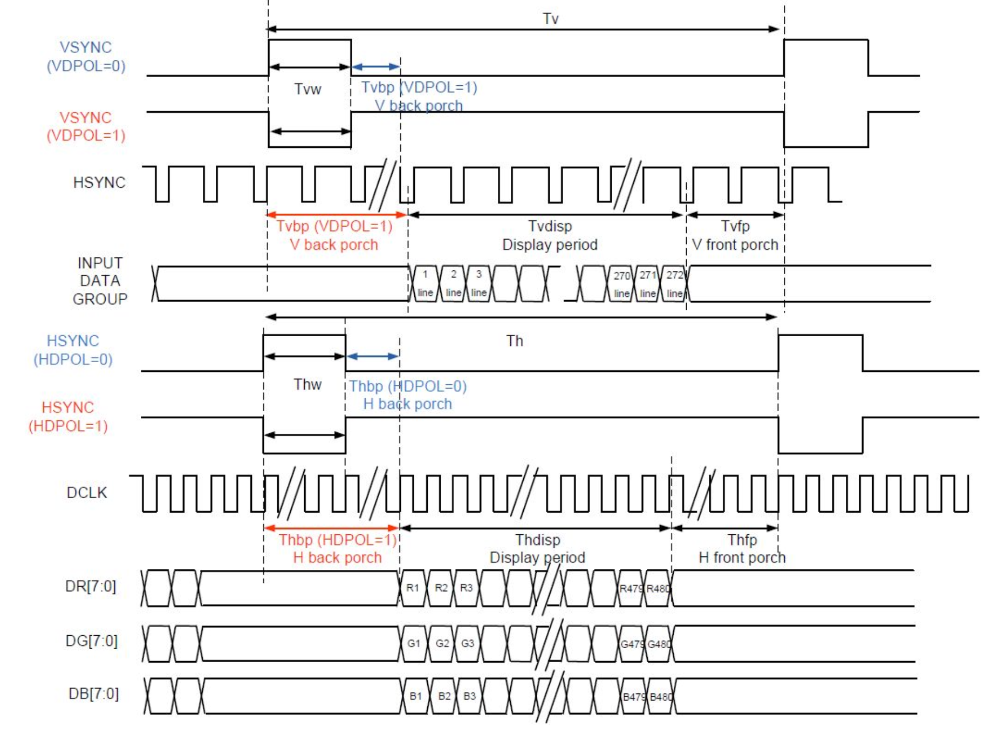
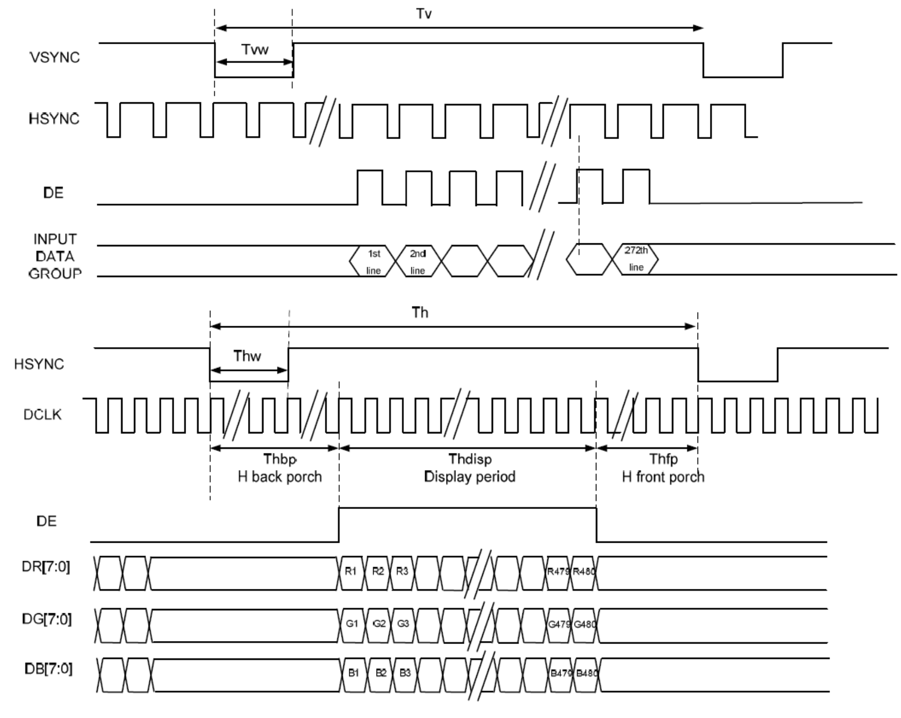

## 043026-N6(ML) LCD spec

### Interface PIN connections

| Pin No. | Symbol | Function                                                     |
| ------- | ------ | ------------------------------------------------------------ |
| 1       | LEDK   | Back light power supply negative                             |
| 2       | LEDA   | Back light power supply positive                             |
| 3       | GND    | Ground                                                       |
| 4       | VCC    | Power supply                                                 |
| 5-12    | R0-R7  | Red Data                                                     |
| 13-20   | G0-G7  | Green Data                                                   |
| 21-28   | B0-B7  | Blue Data                                                    |
| 29      | GND    | Ground                                                       |
| 30      | CLK    | Clock signal                                                 |
| 31      | DISP   | Display on/off                                               |
| 32      | HSYNC  | Horizontal sync input in RGB mode (short to GND if not used) |
| 33      | VSYNC  | Vertical sync input in RGB mode (short to GND if not used)   |
| 34      | DE     | Data enable                                                  |
| 35      | NC     | No Connection                                                |
| 36      | GND    | Ground                                                       |
| 37      | XR     | Touch panel X-right                                          |
| 38      | YD     | Touch panel Y-bottom                                         |
| 39      | XL     | Touch panel X-left                                           |
| 40      | YU     | Touch panel Y-up                                             |

### Parallel RGP Input Timing

| Item           | Symbol | Values (Min.) | Values (Typ.) | Values (Max.) | Unit | Remark |
| -------------- | ------ | ------------- | ------------- | ------------- | ---- | ------ |
| DCLK Frequency | Fclk   | 8             | 9             | 12            | MHz  |        |
| **Hsync**      |        |               |               |               |      |        |
| Period time    | Th     | 485           | 531           | 589           | DCLK |        |
| Display Period | Thdisp | -             | 480-          | -             | DCLK |        |
| Back Porch     | Thbp   | 3             | 43            | 43            | DCLK |        |
| Front Porch    | Thfp   | 2             | 4             | 75            | DCLK |        |
| **Vsync**      |        |               |               |               |      |        |
| Period time    | Tv     | 276           | 292           | 321           | H    |        |
| Display Period | Tvdisp | -             | 272           | -             | H    |        |
| Back Porch     | Tvbp   | 2             | 12            | 12            | H    |        |
| Front Porch    | Tvfp   | 2             | 4             | 37            | H    |        |

### Sync Mode

### Sync DE Mode

## Example

## Day 99 pixel pipeline（2026-10-03）

VRAMのwrite portは9Kでは31.5MHz（約33MHz）、20Kでは40.5MHzのMEMORY_CLKへ接続する。read portは両ボードとも9MHz PixelClkへ接続する。
font ROMとLCDはPixelClkに揃える。多bit addressを2FFで転送する旧CDC経路は使用しない。

VRAM addressをbeam座標から組合せ生成し、同期VRAM 1clock → 同期font ROM 1clock → RGB/DE登録の順で描画する。
font row・bit index・active validを同じpipelineで運び、DEはbeamに対し2edge遅延する。
画素はfont byteのMSBから左順。active幅480、active行272、周期531×292 pixelである。
reset時にpipeline validをクリアする。font memoryのREAD_MODE=0ではOCEによらずCEで読出す。

実font MIはmetadata上4096byte容量だが、収録データは128文字×16行=2048byte。
simulationはこの2048byteを読み、残る2048byteをvendor INITと同じゼロで埋める。
全4096byteのvendor INITとの一致を `tb_font_contract` で確認する。

`platform_clocks` は既存PLLと同じrPLL値を持つproject所有wrapperで、LOCKを公開する。
9K/20Kのpixel ODIVは48/64、memory ODIVは16で、board wrapperからparameterを渡す。
外部resetまたはいずれかのPLL lock喪失時に両domainへ非同期resetをassertし、各domainの2edge後に解除する。
CPU/RAM/VRAMのwriteはmemory reset中gateされ、LCD DEはpixel reset中0となる。

同一VRAM addressへの非同期read/write衝突のold/new値は保証しない。
CPUから表示中に書く場合、画面の一時的な変化は許容し、frame atomicityは提供しない。
simulationによる非同期位相検査は、実機metastability耐性・timing・連続安定動作の証明ではない。
旧 `sim/gowin_rpll*_stub.sv` と `tb_top.sv` はlegacy参考で、現行受入経路には使わない。

実行: `make test-ram`, `make test-font`, `make test-lcd`, `make test-clock`, `make test-reset`。
詳細な実行結果・未検証範囲は [Sol LCD実装結果](../../docs/REVIEW_SOL_LCD_RESULT_ja.md) を参照する。
