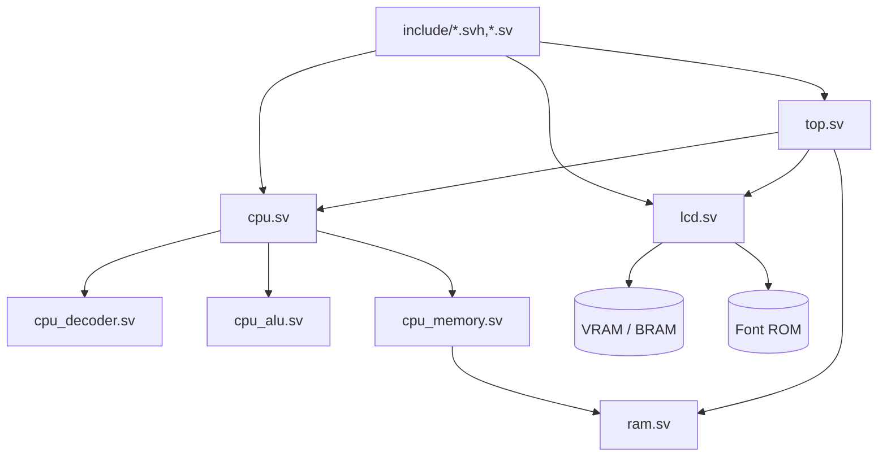

# Module Map (Code Reading Guide)

This document helps you navigate the _final integrated_ design in `day99_completed/` by showing where each major concept lives in code and how the pieces connect.

## Big picture



## Where to start reading

If you want the shortest “aha” path:

1. `src/top.sv` — system-level wiring and clock/reset
2. `src/cpu.sv` — overall CPU control flow (fetch/decode/execute)
3. `src/cpu_decoder.sv` — opcode → micro-ops / control signals
4. `src/cpu_alu.sv` — arithmetic/logic + flag generation
5. `src/cpu_memory.sv` — memory bus, stack, and read/write behavior
6. `src/lcd.sv` — LCD timing + character rendering
7. `src/ram.sv` — RAM/VRAM plumbing and memory-mapped regions

For the detailed architecture narrative, see `docs/README_architecture_en.md`.

## Key supporting files

- `include/consts.svh` — shared constants (avoid “magic numbers”) for modules
- `include/consts_pkg.sv` — shared constants usable from `package` code (Gowin-compatible)
- `include/boot_program.sv` — boot ROM contents (generated from `examples/`)
- `include/cpu_ifo_auto_generated.svh` — auto-generated debug/info helper
- `src/cpu/legacy/cpu_tasks.svh` — legacy reusable CPU helper tasks (not used by the current 2-process CPU)
- `src/cpu/legacy/state_*_tasks.sv` — legacy per-state helpers kept for reference (not used by the current 2-process CPU)

## Refactor policy (module splitting)

Goal: make CPU logic easier to read/maintain by splitting into formatter-friendly SystemVerilog files, where each split unit is valid SV on its own (no “case body includes”).

Rules:

1. **No `*.svinc` in the end state**: `*.svinc` is treated as a legacy format. New code must live in `*.sv`/`*.svh` as complete SV compilation units (`package`, `module`, `interface`, `class`).
2. **Prefer `package + function` for logic splitting**: use packages as “Go-like namespaces” and `function automatic` as the unit of reuse. Avoid `virtual interface` plumbing for core logic because tool support varies.
3. **2-process FSM for safety**: migrate CPU control to the standard `always_comb(next)` + `always_ff(cur<=next)` structure. This makes intent explicit, reduces accidental latches, and makes refactors safer.
4. **State bundled as a struct**: represent CPU internal state as a single `typedef struct packed cpu_ctx_t`, so package functions can operate on a single object instead of hundreds of `ref` arguments.
5. **Stepwise changes gated by sim**: after each milestone, run `make test` in `day99_completed/` (Verilator smoke test). The refactor should preserve behavior at each step.

Current opcode split (implemented):

```bash
src/cpu/legacy/
├── cpu_exec_transfers_pkg.sv
├── cpu_exec_flags_custom_pkg.sv
├── cpu_exec_branches_pkg.sv
├── cpu_exec_compare_pkg.sv
├── cpu_exec_logic_pkg.sv
├── cpu_exec_shifts_pkg.sv
├── cpu_exec_store_pkg.sv
├── cpu_exec_inc_dec_pkg.sv
├── cpu_exec_control_flow_pkg.sv
├── cpu_exec_load_store_pkg.sv
└── cpu_exec_adc_sbc_pkg.sv
```

Target layout (planned):

```bash
src/cpu/
├── cpu_types_pkg.sv        # enums + cpu_ctx_t (+ optional inputs/outputs structs)
├── cpu_helpers_pkg.sv      # pure helpers (flags, address calc, hex conversion)
├── cpu_fsm_pkg.sv          # step(cur,in) -> next (fetch/state machine)
├── cpu_exec_pkg.sv         # opcode dispatch (calls category packages)
├── cpu_exec_load_store_pkg.sv
├── cpu_exec_alu_pkg.sv
├── cpu_exec_shift_pkg.sv
├── cpu_exec_branch_pkg.sv
└── cpu_exec_control_pkg.sv
```

Notes:

- The first migration milestone is **category split of the opcode execution** (keep behavior, improve readability, keep files standalone SV). After that, migrate the top-level FSM to 2-process form.
- Generated `include/cpu_ifo_auto_generated.svh` can later be changed to emit a `package` (e.g. `cpu_show_info_rom_pkg.sv`) so even the generated “ROM” is formatter-friendly.

## State machine task helpers

The project previously used per-state task helpers (`src/cpu/state_*_tasks.sv`) dispatched by `state_machine.svh`. After the 2-process FSM migration, the active CPU implementation is driven by `cpu_fsm_next_pkg.sv` (`calc_cpu_next(cur,in) -> next`), and those per-state helpers have been moved under `src/cpu/legacy/` as a reference path.

## Exercises (small, high-signal)

1. Add a new CPU-visible debug register and expose it via the existing “info/debug” path.
2. Modify the memory map (e.g., reserve a small I/O page) and document the change in `docs/INSTRUCTIONS.md`.
3. Write a tiny program in `examples/` that uses a custom instruction (e.g., `WVS`) and verify behavior in simulation.
