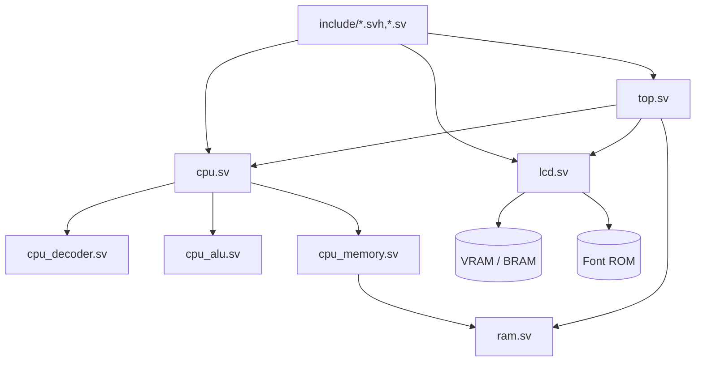

# Module Map (Code Reading Guide)

This document helps you navigate the *final integrated* design in `day99_completed/` by showing where each major concept lives in code and how the pieces connect.

## Big picture

## Where to start reading

If you want the shortest “aha” path:

1. `src/top.sv` — system-level wiring and clock/reset
2. `src/cpu.sv` — overall CPU control flow (fetch/decode/execute)
3. `src/cpu_decoder.sv` — opcode → micro-ops / control signals
4. `src/cpu_alu.sv` — arithmetic/logic + flag generation
5. `src/cpu_memory.sv` — memory bus, stack, and read/write behavior
6. `src/lcd.sv` — LCD timing + character rendering
7. `src/ram.sv` — RAM/VRAM plumbing and memory-mapped regions

For the detailed architecture narrative, see `docs/README_architecture_en.md`.

## Key supporting files

- `include/consts.svh` — shared constants (avoid “magic numbers”)
- `include/boot_program.sv` — boot ROM contents (generated from `examples/`)
- `include/cpu_ifo_auto_generated.sv` — auto-generated debug/info helper
- `src/cpu/*.svh` — instruction decode and state machine fragments

## Exercises (small, high-signal)

1. Add a new CPU-visible debug register and expose it via the existing “info/debug” path.
2. Modify the memory map (e.g., reserve a small I/O page) and document the change in `docs/INSTRUCTIONS.md`.
3. Write a tiny program in `examples/` that uses a custom instruction (e.g., `WVS`) and verify behavior in simulation.

