# 6502 CPU Architecture Comprehensive Guide

A detailed technical reference for the 6502 CPU core implemented in SystemVerilog on Tang Nano 9K/20K FPGAs. This document is structured to support progressive learning from basic concepts to advanced implementation details.

---

🌐 Available languages:
[English](./README_architecture_en.md) | [日本語](./README_architecture_ja.md)

## 📖 Learning Roadmap

**Beginner**: Start with [System Overview](#system-overview) and [Basic Architecture](#basic-architecture)
**Intermediate**: Study [CPU Implementation](#cpu-implementation) and [Memory System](#memory-system)
**Advanced**: Explore [Custom Instructions](#custom-instructions) and [Optimization Techniques](#optimization-techniques)

## 🎯 System Overview

This project demonstrates a complete computer system implementation on FPGA, serving as an educational platform for:

### Core Components

-   **6502 CPU**: Authentic 6502 microprocessor with custom extension instructions
-   **LCD Display System**: 480×272 pixel character-based text display
-   **Memory Hierarchy**: Integrated RAM, VRAM, and Font ROM subsystems
-   **Assembly Development**: cc65 toolchain for 6502 programming

### Learning Objectives

-   **Clock Domain Design**: Managing multiple clock frequencies (27MHz → 9MHz/40.5MHz)
-   **State Machine Architecture**: Complex CPU instruction execution pipeline
-   **Memory Controllers**: SDPB RAM, VRAM, and pROM interfaces
-   **Hardware/Software Integration**: Assembly programming with FPGA implementation

## 🏗️ Basic Architecture

### System Block Diagram

```mermaid
graph TB
    subgraph "Tang Nano FPGA"
        subgraph "Clock Generation"
            XTAL[27MHz Crystal] --> PLL40[40.5MHz PLL]
            XTAL --> PLL9[9MHz PLL]
        end

        subgraph "CPU Subsystem @ 40.5MHz"
            CPU[6502 CPU Core]
            RAM32[32KB SDPB RAM]
            BOOTROM[Boot Program<br/>Auto-generated]
        end

        subgraph "Display Subsystem @ 9MHz"
            LCD[LCD Controller]
            VRAM1[1KB VRAM SDPB]
            FONTROM[4KB Font pROM]
        end

        PLL40 --> CPU
        PLL40 --> RAM32
        PLL40 --> VRAM1
        PLL9 --> LCD

        CPU <--> RAM32
        CPU <--> VRAM1
        LCD <--> VRAM1
        LCD <--> FONTROM
        BOOTROM --> CPU
    end

    subgraph "External Devices"
        BUTTON[Reset Button]
        DISPLAY[480×272 LCD<br/>043026-N6#40;ML#41;]
    end

    BUTTON --> CPU
    LCD --> DISPLAY
```



### Development Environment Setup

```bash
# 1. Build (Tang Nano 9K default)
make                    # Basic build
make BOARD=20k         # Tang Nano 20K target

# 2. FPGA Programming
make download

# 3. Assembly Program Development
cd examples
make clean && make     # Build simple5.s (default)
cd .. && make download # Program FPGA

# 4. Custom Tool Paths (if needed)
make GWSH=/path/to/gw_sh PRG=/path/to/programmer_cli download
```

### Build Flow Understanding


## 🧠 Memory System

### Address Space Design

The system implements a sophisticated memory hierarchy optimized for both CPU access and display rendering:

```
CPU Address Space (64KB addressable):
┌─────────────────┬─────────────────┬──────────────────────────────────┐
│ 0x0000-0x00FF   │ Zero Page       │ Fast 8-bit addressing, 256B      │
│ 0x0100-0x01FF   │ Stack           │ Hardware stack operations, 256B  │
│ 0x0200-0x7BFF   │ Program RAM     │ Main memory, 30.5KB              │
│ 0x7C00-0x7FFF   │ Shadow VRAM     │ CPU-readable VRAM copy, 1KB      │
│ 0x8000-0xDFFF   │ (Unmapped)      │ Available for expansion          │
│ 0xE000-0xE3FF   │ Text VRAM       │ CPU-writable display, 1KB        │
│ 0xE400-0xEFFF   │ (Unmapped)      │ Future display expansion         │
│ 0xF000-0xFFFF   │ Font ROM        │ Not CPU-accessible, 4KB          │
└─────────────────┴─────────────────┴──────────────────────────────────┘
```

### Key Design Decisions

1. **Dual VRAM Access**: Shadow VRAM allows CPU to read display content while LCD controller has dedicated write access
2. **Memory-Mapped I/O**: VRAM appears as normal memory to CPU, hardware handles display timing
3. **Font ROM Isolation**: 4KB font data is LCD-controller-only, saving CPU address space

### File Organization

```
src/
├── top.sv              # System integration and clock management
├── cpu.sv              # Modular 6502 CPU core design
├── lcd.sv              # LCD timing and character rendering
├── gowin_rpll_9K/      # Tang Nano 9K PLL configurations
└── gowin_rpll_20K/     # Tang Nano 20K PLL configurations

include/
├── consts.svh          # System-wide constants and parameters
├── cpu_pkg.sv          # CPU-specific types and enumerations
├── cpu_tasks.sv        # Reusable CPU tasks and functions
└── boot_program.sv     # Auto-generated from assembly (examples/)
```

## ⚙️ CPU Implementation

### 6502 Core Architecture

The CPU implementation follows a modular design approach for maintainability:

```systemverilog
// Main CPU module structure
module cpu (
    // Clock and Reset
    input logic rst_n, clk,

    // Memory Interface
    input logic [7:0] dout,           // RAM read data
    output logic [7:0] din,           // RAM write data
    output logic [14:0] ada, adb,     // RAM addresses
    output logic cea, ceb,            // RAM enables

    // Video Memory Interface
    output logic [9:0] v_ada,         // VRAM address
    output logic v_cea,               // VRAM enable
    output logic [7:0] v_din,         // VRAM data

    // System Integration
    input logic vsync,                // LCD sync for WVS instruction
    input logic [7:0] boot_program[7680], // Program ROM
    input logic [15:0] boot_program_length
);
```

### State Machine Design

The CPU uses a multi-stage pipeline for instruction execution:


### Instruction Implementation Examples

**Load Immediate (LDA #$41):**

```systemverilog
8'hA9: begin  // LDA immediate
    ra = operands[7:0];              // Load value into accumulator
    flg_z = (ra == 8'h00);           // Update zero flag
    flg_n = ra[7];                   // Update negative flag
    fetch_opcode(2);                 // Next instruction (2 bytes)
end
```

**Store Absolute (STA $E000):**

```systemverilog
8'h8D: begin  // STA absolute
    automatic logic [15:0] addr = operands[15:0] & 16'hFFFF;
    sta_write(addr, ra);  // Handle RAM vs VRAM routing
    cea = 1;              // Enable RAM write
    v_cea = write_to_vram; // Enable VRAM if target is display
    fetch_opcode(3);      // Next instruction (3 bytes)
end
```

### 6502 Instruction Set Implementation

The CPU implements the complete standard 6502 instruction set with the following coverage:

**Implemented Instructions:**

-   **Load/Store**: LDA, LDX, LDY, STA, STX, STY (all addressing modes)
-   **Arithmetic**: ADC, SBC with decimal mode support
-   **Logic**: AND, ORA, EOR with all standard addressing modes
-   **Shifts/Rotates**: ASL, LSR, ROL, ROR (accumulator and memory)
-   **Increments/Decrements**: INC, DEC, INX, INY, DEX, DEY
-   **Comparisons**: CMP, CPX, CPY with flag setting
-   **Branches**: BEQ, BNE, BCC, BCS, BPL, BMI, BVC, BVS
-   **Jumps/Subroutines**: JMP (absolute/indirect), JSR, RTS
-   **Stack Operations**: PHA, PLA, PHP, PLP
-   **Register Transfers**: TAX, TAY, TXA, TYA, TSX, TXS
-   **Flag Operations**: CLC, SEC, CLV (CLD, SED, CLI, SEI not implemented)
-   **Miscellaneous**: NOP, BIT

**Not Implemented (Interrupt-Related):**

-   BRK, RTI, CLI, SEI - Interrupt handling not required for this design

### Addressing Modes

| Mode             | Example       | Description                                 |
| ---------------- | ------------- | ------------------------------------------- |
| **Immediate**    | `LDA #$41`    | Operand is the actual value                 |
| **Zero Page**    | `LDA $10`     | 8-bit address in zero page (0x00-0xFF)      |
| **Zero Page,X**  | `LDA $10,X`   | Zero page address plus X register           |
| **Zero Page,Y**  | `LDX $10,Y`   | Zero page address plus Y register           |
| **Absolute**     | `LDA $1234`   | Full 16-bit address                         |
| **Absolute,X**   | `LDA $1234,X` | Absolute address plus X register            |
| **Absolute,Y**   | `LDA $1234,Y` | Absolute address plus Y register            |
| **Indirect**     | `JMP ($1234)` | Jump to address stored at given address     |
| **(Indirect,X)** | `LDA ($10,X)` | Indirect address from zero page plus X      |
| **(Indirect),Y** | `LDA ($10),Y` | Indirect address from zero page, then add Y |
| **Relative**     | `BEQ $10`     | PC-relative offset for branches             |
| **Implied**      | `NOP`         | No operand required                         |
| **Accumulator**  | `ASL A`       | Operation on accumulator                    |

## 🎨 Display System

### LCD Controller Architecture

The LCD controller operates independently from the CPU, implementing a character-based text display:

```systemverilog
// Key parameters
localparam int CHAR_WIDTH = 8;    // pixels per character
localparam int CHAR_HEIGHT = 16;  // pixels per character
localparam int COLUMNS = 60;      // characters per row (480/8)
localparam int ROWS = 17;         // character rows (272/16)
```

### Character Rendering Pipeline

```mermaid
sequenceDiagram
    participant LCD as LCD Controller
    participant VRAM as Character VRAM
    participant FONT as Font ROM
    participant OUT as RGB Output

    LCD->>VRAM: Request character at (col, row)
    VRAM-->>LCD: Character code (0x41 = 'A')
    LCD->>FONT: Request font data (char * 16 + y_pixel)
    FONT-->>LCD: Font bitmap line (8 bits)
    LCD->>OUT: Generate RGB pixels (8 pixels)

    Note over LCD: Repeat for all 480×272 pixels
    Note over LCD: Hardware handles timing automatically
```



### Display Timing

The LCD controller generates precise timing for the 480×272 display:

```
Horizontal Timing (9MHz pixel clock):
├─ Back Porch: 43 pixels
├─ Active Area: 480 pixels
├─ Front Porch: 8 pixels
└─ Total: 531 pixels per line

Vertical Timing:
├─ Back Porch: 12 lines
├─ Active Area: 272 lines
├─ Front Porch: 8 lines
└─ Total: 292 lines per frame

Frame Rate: 9MHz ÷ (531 × 292) ≈ 58 FPS
```

### Font System

The display system uses the [Sweet16Font](https://github.com/kmar/Sweet16Font) (Boost licensed):

-   **Character Size**: 16×8 pixels (height × width)
-   **Character Set**: ASCII 0-127 (128 characters)
-   **Storage**: 4KB pROM (16 bytes × 256 character slots)
-   **Access**: LCD controller only (not CPU-addressable)

## 🔧 Custom Instructions

### Extension Instruction Set

Four custom instructions extend the standard 6502 for display and debugging:

**CVR (0xCF) - Clear VRAM:**

```systemverilog
8'hCF: begin  // CVR - Clear VRAM
    if (clear_vram_addr <= COLUMNS * ROWS) begin
        v_ada <= clear_vram_addr;
        v_din <= 8'h20;  // Space character
        v_cea <= 1;      // Enable VRAM write
        clear_vram_addr <= clear_vram_addr + 1;
    end else begin
        v_cea <= 0;
        fetch_opcode(1);
    end
end
```

**WVS (0xFF) - Wait VSync:**

```systemverilog
8'hFF: begin  // WVS - Wait for VSync
    if (vsync_stage == operands[7:0]) begin
        fetch_opcode(2);  // Done waiting
    end else if (vsync_sync && !vsync_meta) begin
        vsync_stage <= vsync_stage + 1;  // Count VSync pulses
    end
    // Synchronize VSync signal across clock domains
    {vsync_sync, vsync_meta} <= {vsync_meta, vsync};
end
```

**IFO (0xDF) - Debug Information:**

```systemverilog
8'hDF: begin  // IFO - Info/Debug
    // Display register and memory contents
    $display("PC=%04X A=%02X X=%02X Y=%02X SP=%02X", pc, ra, rx, ry, sp);
    $display("FLAGS: C=%b Z=%b V=%b N=%b", flg_c, flg_z, flg_v, flg_n);
    // Display specified memory range
    display_memory_range(operands[15:0]);
    fetch_opcode(2);
end
```

**HLT (0xEF) - CPU Halt:**

```systemverilog
8'hEF: begin  // HLT - Halt CPU
    // Transition CPU to halt state (LCD controller continues)
    state <= HALT;
    // Debug halt message
    $display("CPU HALTED at PC=%04X", pc);
end
```

### Cross-Clock Domain Design

The system carefully manages clock domain crossings:

```systemverilog
// VSync synchronization (LCD 9MHz → CPU 40.5MHz)
logic vsync_meta, vsync_sync;
always_ff @(posedge clk) begin
    {vsync_sync, vsync_meta} <= {vsync_meta, vsync};
end

// Usage in CPU for WVS instruction
if (vsync_sync && !vsync_meta) begin
    // Rising edge detected - count VSync pulse
    vsync_stage <= vsync_stage + 1;
end
```

## 🧪 Testing and Simulation

### Test Environment Setup

**DSIM Studio (Recommended):**

```bash
# Linux/Windows x64 only (macOS not supported)
# 1. Install DSIM Studio plugin in VSCode
# 2. Register and activate license
# 3. Open project file: lcd_cpu_bsram.dpf
# 4. Run "library configuration"
# 5. Execute testbench: tb_cpu
```

### Available Test Suites

**tb_cpu.sv** - Complete CPU Integration Tests:

-   Basic instruction execution
-   Memory access patterns
-   Custom instruction validation
-   Flag operation verification
-   Stack operations
-   Branch and jump logic
-   Interrupt handling (placeholder)
-   Complex program execution
-   Error condition handling

**tb_cpu_modules.sv** - Unit Tests:

-   Individual CPU module testing
-   ALU operation verification
-   Memory controller validation
-   Decoder logic testing
-   Register file operations

**tb_lcd.sv** - Display System Tests:

-   LCD timing validation
-   Character rendering verification
-   VRAM access patterns
-   Font ROM interface testing

### Writing Custom Tests

```systemverilog
// Example test structure
module tb_custom;
    // DUT instantiation
    cpu dut (
        .rst_n(rst_n),
        .clk(clk),
        // ... connect all signals
    );

    initial begin
        // Test initialization
        reset_system();
        load_test_program();

        // Execute test sequence
        run_cpu_cycles(100);

        // Verify results
        assert(dut.ra == expected_accumulator)
            else $error("Accumulator mismatch");

        $display("Test completed successfully");
        $finish;
    end
endmodule
```

## 💡 Development Tips

### Debugging Strategies

**1. Waveform Analysis:**

```systemverilog
// Add to testbench for signal capture
initial begin
    $dumpfile("simulation.vcd");
    $dumpvars(0, tb_cpu);
end
```

**2. Custom Debug Instructions:**

```systemverilog
8'hDF: begin  // IFO - Info/Debug
    $display("PC=%04X A=%02X X=%02X Y=%02X SP=%02X",
             pc, ra, rx, ry, sp);
    $display("Flags: C=%b Z=%b V=%b N=%b",
             flg_c, flg_z, flg_v, flg_n);
    fetch_opcode(2);
end
```

**3. Memory Monitoring:**

```systemverilog
// Watch for specific memory access
always @(posedge clk) begin
    if (cea && ada == 16'hE000) begin
        $display("VRAM write: %02X at time %t", din, $time);
    end
end
```

### Performance Optimization

**1. Clock Domain Optimization:**

-   Minimize cross-domain signals
-   Use proper synchronizers
-   Consider clock enable strategies

**2. Memory Access Patterns:**

-   Understand SDPB timing requirements
-   Optimize for burst accesses where possible
-   Consider dual-port usage patterns

**3. Logic Utilization:**

-   Monitor LUT and FF usage in synthesis reports
-   Consider pipeline vs. combinational trade-offs
-   Optimize critical path timing

### Common Pitfalls

**1. Reset Polarity:**

```systemverilog
// Tang Nano 9K vs 20K difference
// 9K:  wire rst_n = ResetButton;
// 20K: wire rst_n = !ResetButton;
```

**2. Clock Domain Crossing:**

```systemverilog
// Wrong: Direct assignment across domains
// cpu_signal <= lcd_signal;  // Timing violation!

// Correct: Proper synchronization
always_ff @(posedge cpu_clk) begin
    {sync_reg, meta_reg} <= {meta_reg, lcd_signal};
end
```

**3. Memory Initialization:**

```systemverilog
// Ensure proper boot sequence
initial begin
    // Load program before releasing reset
    wait(boot_program_loaded);
    rst_n <= 1'b1;
end
```

## 📚 Advanced Topics

### FPGA-Specific Optimizations

**1. Gowin Primitive Usage:**

-   SDPB (Simple Dual Port Block RAM) for memory controllers
-   pROM (Program ROM) for font storage
-   PLL (Phase-Locked Loop) for clock generation

**2. Resource Utilization:**

-   LUT (Look-Up Table) optimization for combinational logic
-   FF (Flip-Flop) placement for sequential elements
-   DSP slice usage for arithmetic operations

**3. Timing Closure:**

-   Critical path analysis and optimization
-   Clock skew management
-   Setup and hold time considerations

### CPU Architecture Extensions

**1. Instruction Set Extensions:**

```systemverilog
// Example: Adding a multiply instruction (0xDB)
8'hDB: begin  // MUL - Multiply A with operand
    automatic logic [15:0] result = ra * operands[7:0];
    ra = result[7:0];        // Store low byte in accumulator
    flg_c = result[15:8] != 0; // Set carry if overflow
    flg_z = (ra == 8'h00);   // Update zero flag
    flg_n = ra[7];           // Update negative flag
    fetch_opcode(2);
end
```

**2. Interrupt Implementation:**

```systemverilog
// Interrupt handling framework (not currently implemented)
logic irq_pending;
logic [15:0] irq_vector;

// In main state machine
if (irq_pending && !flg_i) begin
    // Save PC and status to stack
    // Jump to interrupt vector
    // Set interrupt disable flag
end
```

**3. Cache Design Considerations:**

```systemverilog
// Simple instruction cache example
logic [7:0] icache_data[16];
logic [11:0] icache_tags[16];
logic icache_valid[16];

// Cache lookup logic
wire [3:0] cache_index = pc[3:0];
wire cache_hit = icache_valid[cache_index] &&
                 icache_tags[cache_index] == pc[15:4];
```

### Display System Enhancements

**1. Sprite Rendering:**

```systemverilog
// Sprite overlay system
typedef struct {
    logic [8:0] x, y;    // Position
    logic [7:0] char;    // Character code
    logic [2:0] color;   // Color palette
    logic enabled;       // Sprite enable
} sprite_t;

sprite_t sprites[8];  // Support for 8 sprites
```

**2. Hardware Scrolling:**

```systemverilog
// Scrolling offset registers
logic [5:0] scroll_x;  // Horizontal scroll (0-59)
logic [4:0] scroll_y;  // Vertical scroll (0-16)

// Modify character position calculation
wire [5:0] char_col = ((x / CHAR_WIDTH) + scroll_x) % COLUMNS;
wire [4:0] char_row = ((y / CHAR_HEIGHT) + scroll_y) % ROWS;
```

**3. Color Palette Management:**

```systemverilog
// Programmable color palette
logic [15:0] color_palette[16];  // 16 colors, RGB565 format

// Color lookup based on character attributes
wire [3:0] color_index = char_attributes[3:0];
wire [15:0] pixel_color = color_palette[color_index];
```

## 📖 Reference Materials

### Instruction Set Reference

Complete 6502 instruction set documentation with cycle counts, flags affected, and addressing modes. See the main project documentation for detailed instruction tables.

### Memory Map Reference

| Address Range | Size   | Purpose     | Access   |
| ------------- | ------ | ----------- | -------- |
| 0x0000-0x00FF | 256B   | Zero Page   | CPU R/W  |
| 0x0100-0x01FF | 256B   | Stack       | CPU R/W  |
| 0x0200-0x7BFF | 30.5KB | Program RAM | CPU R/W  |
| 0x7C00-0x7FFF | 1KB    | Shadow VRAM | CPU R    |
| 0x8000-0xDFFF | 24KB   | Unmapped    | -        |
| 0xE000-0xE3FF | 1KB    | Text VRAM   | CPU W    |
| 0xE400-0xEFFF | 3KB    | Unmapped    | -        |
| 0xF000-0xFFFF | 4KB    | Font ROM    | LCD only |

### Register Reference

**CPU Registers:**

-   **PC**: Program Counter (16-bit)
-   **A**: Accumulator (8-bit)
-   **X**: X Index Register (8-bit)
-   **Y**: Y Index Register (8-bit)
-   **SP**: Stack Pointer (8-bit, points into 0x0100-0x01FF)

**Status Flags:**

-   **C**: Carry flag
-   **Z**: Zero flag
-   **I**: Interrupt disable (not used)
-   **D**: Decimal mode (not used)
-   **B**: Break flag (not used)
-   **V**: Overflow flag
-   **N**: Negative flag

## 🤝 Contributing

### Code Standards

Follow the established coding conventions:

-   Use `localparam` for constants
-   Prefix internal signals with module name
-   Document complex state machines
-   Use meaningful signal names
-   Add module headers explaining functionality

### Testing Requirements

All new features should include:

-   Unit tests for individual components
-   Integration tests for system-level functionality
-   Waveform verification for timing-critical paths
-   Documentation updates

### Recommended Reading

-   **6502 Documentation**: Original MOS Technology manuals and programming guides
-   **FPGA Design**: "Digital Design and Computer Architecture" by Harris & Harris
-   **SystemVerilog**: "SystemVerilog for Design" by Sutherland, Davidmann & Flake
-   **Tang Nano Documentation**: Gowin FPGA user guides and application notes

---

This comprehensive guide provides the foundation for understanding, using, and extending the Tang Nano 6502 CPU project. Begin with the basics and progressively work through more complex topics as you become familiar with the codebase and FPGA development workflow.
